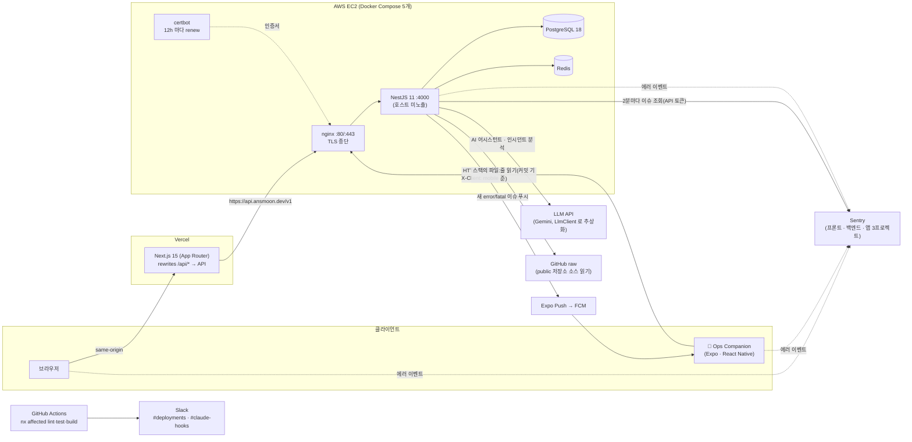
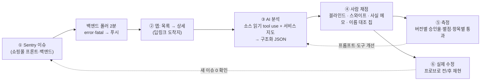

<br>

<br>


# E-커머스 쇼핑몰 + 운영 앱 (Ops Companion)

구매자·판매자·관리자 세 역할의 오픈마켓을 **Next.js + NestJS 모노레포**로 만들어 **Vercel + AWS EC2(nginx/HTTPS)** 에 운영하고, 그 운영 중 생기는 에러(Sentry)를 **AI 가 분석하고 사람이 폰에서 채점하는 React Native 운영 앱**까지 붙인 개인 프로젝트입니다.
2025-10 부터 혼자 만들었고, 이 문서는 **2026-09-28 기준 저장소의 실제 상태**만 적습니다 — 화면에서 시연할 수 있는 것, 실측한 수치만.

| 무엇 | 어디서 보나 | 비고 |
|---|---|---|
| 쇼핑몰 웹 | https://shopping-mall-frontend-dusky.vercel.app | 로그인 화면 **"관리자 페이지 체험하기"** 로 데모 관리자 진입(계정 정보 불필요) |
| 백엔드 API | https://api.ansmoon.dev/v1/health | nginx + Let's Encrypt. 응답의 `version` 이 배포된 커밋 SHA, DB·Redis 중 하나라도 죽으면 503 |
| 운영 앱(안드로이드) | [APK 설치 링크](https://github.com/ansm0403/E-commerce_shopping_mall/releases/download/ops-companion-v1.0.0-4/ops-companion-preview-4.apk) · [설치 안내](ops-companion/README.md#설치해서-써-보기-포트폴리오-방문자용) | 스토어 미배포(EAS preview 빌드). 로그인 화면 **"데모 계정으로 체험하기"**. iOS 미지원 |
| 저장소 | https://github.com/ansm0403/E-commerce_shopping_mall | 브랜치 → PR → main. main 푸시 = Vercel 자동 배포 |

코드 규모(2026-09-28, `git ls-files` 의 `.ts/.tsx` 줄 수):

| backend/src | frontend/src | ops-companion | shared/src |
|---:|---:|---:|---:|
| 33,648 | 17,508 | 4,395 | 865 |

> 옛 README(2026-06-14 판 — 스택을 고른 이유, EC2 인스턴스 선정 과정, 초기 설계 결정 서술)는 [docs/history/README-2026-06-14.md](docs/history/README-2026-06-14.md) 에 그대로 보관했습니다.

---

## 1. 아키텍처



- **웹의 API 경로는 same-origin** 입니다. 브라우저는 Vercel 도메인의 `/api/*` 만 부르고 Next.js `rewrites()` 가 `https://api.ansmoon.dev/v1/*` 로 넘깁니다. 그래서 refreshToken 쿠키(httpOnly, `sameSite: lax`)와 CSP 를 nginx 도입 전후로 바꿀 필요가 없었습니다.
- **앱은 nginx 를 직접** 부릅니다. 앱에는 쿠키를 구워 줄 중간 서버가 없어서, 요청 헤더 `X-Client: mobile` 이 있으면 백엔드가 refreshToken 을 응답 body 로 줍니다(헤더가 없으면 웹 동작 불변).
- **비밀값(LLM 키 · Sentry API 토큰 · GitHub 접근)은 전부 백엔드에만** 있습니다. 앱·브라우저는 어느 것도 직접 부르지 않습니다.

---

## 2. 기술 스택

| 영역 | 무엇 | 왜 이걸 골랐나(한 구절) |
|---|---|---|
| 프론트 | **Next.js 15 (App Router) · React 19 · TanStack Query 5 · axios · Tailwind · ECharts** | RSC prefetch → `HydrationBoundary` 로 첫 화면 TTFB/LCP 를 같이 잡고, 서버 상태는 전부 Query 로(전역 스토어 없음) |
| 백엔드 | **NestJS 11 · TypeORM 0.3 · PostgreSQL 18 · Redis(ioredis)** | 모듈러 모놀리식. 스키마는 **마이그레이션으로만** 변경, TTL 이 필요한 것(인증 코드·레이트리밋·캐시)은 Redis |
| 인증 | JWT access(15분, `jti` 필수) + refresh(7일, 해시 저장 + Redis 블랙리스트) | 로그아웃 직후 재발급 토큰이 문자열까지 같아 401 나던 운영 버그를 `jti` 로 해소 |
| 결제 | PortOne V2 + 웹훅 | 결제 완료 ↔ 취소 동시 도달 시 `SELECT … FOR UPDATE` 로 직렬화(옛 README "유령 결제") |
| 모노레포 | **Nx 21 · Yarn 4(berry)** · `@shopping-mall/shared`(공용 타입) | `nx affected` 로 CI 가 바뀐 프로젝트만 돌린다. 백엔드는 shared 를 **타입으로만** import(운영 이미지에 워크스페이스 링크가 없음) |
| 운영 앱 | **Expo SDK 57 · React Native 0.86 · Expo Router · Reanimated · Gesture Handler · expo-updates** | 워크스페이스에는 있지만 Nx 타깃이 아니라 Expo CLI 로 실행. JS 만 바뀌면 EAS Update 로 재설치 없이 반영 |
| AI | `LlmClient` 인터페이스(현재 Gemini `@google/genai`, 추후 Claude) | tool use · 스트리밍 · usage 가 프로바이더에 묶이지 않게. 무료 티어라 캐싱·상한 설계가 필요했다 |
| 인프라 | Docker(멀티스테이지) · Docker Hub · AWS EC2 t3.small · **nginx + certbot(Let's Encrypt)** · Vercel | EC2 안에서 빌드하면 OOM 이라 로컬 빌드 → push → EC2 pull. 4000 은 호스트에 열지 않는다 |
| 관측성 | **Sentry**(프론트·백엔드·앱, 소스맵 업로드) · UptimeRobot · GitHub Actions → Slack | 백엔드 이벤트에 `release`=커밋 SHA, 스택은 `--enable-source-maps` 로 원본 좌표 |

---

## 3. 주요 기능 — 화면에서 시연할 수 있는 범위

각 항목은 **화면 경로 → 백엔드 엔드포인트(전역 prefix `/v1`) → 있으면 e2e** 순서입니다. 백엔드만 있고 화면이 없는 것은 "API 만"이라고 적었고, 화면이 자리만 잡힌 것은 "stub" 이라고 적었습니다.

### 구매자

- **회원/인증** — `/login` `/register` `/verify-email` → `POST /auth/register|login|refresh|logout`, `GET /auth/me`, 이메일 인증(SMTP + Redis TTL), 로그인 IP 당 10회/5분 제한, 세션 목록·개별 해제. 로그인 화면의 데모 관리자 버튼은 `POST /auth/demo-login`.
- **상품 탐색** — `/`(홈) `/products` `/products/[id]` → `GET /products`(카테고리·키워드·정렬·커서 페이지네이션), `GET /categories`(계층 + 카테고리별 스펙 JSONB 6종). 상품 상세에 **AI 리뷰 요약** 카드 — `GET /products/:id/review-summary`(public, `product_summaries` 캐시 + 리뷰 변경 시 stale → 다음 열람에 백그라운드 재생성, LLM 키 없으면 no-op).
- **장바구니 → 주문 → 결제** — `/cart` `/checkout` `/checkout/complete` → `POST /orders`, `POST /payments/verify`, `POST /payments/webhook`. 주문 상태 `PENDING_PAYMENT → PAID → PREPARING → SHIPPED → DELIVERED → COMPLETED`, 판매자 단위로 **Shipment 분리**. 결제 완료 확정은 **브라우저의 verify 와 PortOne 서버의 웹훅 두 경로**가 같은 검증(PortOne 재조회 + 금액 대조)과 같은 `SELECT … FOR UPDATE` 가드를 공유합니다. 웹훅은 운영 콘솔에 등록돼 있고(2026-09-28), 실제 결제에서 웹훅이 verify 보다 24ms 먼저 도착해도 주문이 한 상태로 정착하는 것을 감사 로그로 확인했습니다.
- **마이페이지** — `/my/orders`(취소·구매확정) `/my/reviews` `/my/seller-apply`(판매자 신청·상태·반려 사유·재신청). stub: `/my`(인덱스) · `/my/inquiries` · `/my/wishlist` · `/my/password`. 문의는 백엔드(`/inquiries` 작성·조회·삭제, `/seller/inquiries` 답변)만 있고 **프론트 화면이 없다**(상품 상세 탭에도 작성 폼 없음). 위시리스트는 상품 상세의 토글만 있고 목록 화면은 stub.

### 판매자 (`/seller/*`, SELLER 역할 — `SellerGuard`)

- **상품 등록/관리** — `/seller/products`(승인 상태 탭 · 게시/숨김 토글 · 수정/삭제) `/seller/products/new` `/seller/products/[id]/edit`(반려 재제출) → `POST /products`(생성) → `POST /products/:id/images`(이미지 FormData), `PATCH /products/:id/status`, `GET /products/my/:id`. e2e [seller-product-lifecycle.e2e.spec.ts](backend-e2e/src/backend/seller-product-lifecycle.e2e.spec.ts)(등록 → 승인=게시 → 노출 → 주문 → 토글 → 반려 → 재제출).
- **주문/배송** — `/seller/orders`(출고 대기 탭 + 운송장 입력) → `GET /seller/orders`, `PATCH /seller/orders/:orderNumber/ship`.
- **정산** — `/seller/settlements`(요약 카드 + 내역) → `GET /seller/settlements`, `GET /seller/settlements/summary`. 정산은 구매확정 이벤트(`order.completed`)로 셀러별 PENDING 자동 생성(수수료 10%, 멱등).
- stub: `/seller`(대시보드) · `/seller/inquiries`(문의 답변 — API 는 `seller/inquiries` 에 있음).

### 관리자 (`/admin/*`, ADMIN 역할 — `middleware.ts` 쿠키 검사 + `AdminGuard` 가 `/auth/me` 로 역할 확인)

| 화면 | 하는 일 | 백엔드 | e2e |
|---|---|---|---|
| `/admin/dashboard` | KPI 4종(전일 대비) · 주문 추이 · 보안(로그인 실패/잠금) · 결제 전환 퍼널 — ECharts, 차트별 staleTime 1~10분 | `GET /admin/dashboard/kpi|order-trend|security|funnel`(Redis 캐시) | — |
| `/admin/sellers` | 판매자 신청 승인/반려(사유 필수). 승인 = 상태 변경 + SELLER 역할 부여 한 트랜잭션 | `GET /seller/applications`, `PATCH …/:id/approve|reject` | [seller-approval](backend-e2e/src/backend/seller-approval.e2e.spec.ts) |
| `/admin/products` | 상품 승인/반려. **승인 = 게시**(DRAFT → PUBLISHED + 캐시 무효화) | `GET /admin/products`, `PATCH …/:id/approve|reject` | [admin-product-approval](backend-e2e/src/backend/admin-product-approval.e2e.spec.ts) |
| `/admin/orders` · `/admin/orders/[orderNumber]` | 상태 필터 목록, 배송건별/전체 배송 완료 처리 | `GET /admin/orders`, `GET …/:orderNumber`, `PATCH …/:orderNumber/deliver` | [seller-edge-cases](backend-e2e/src/backend/seller-edge-cases.e2e.spec.ts)(배송 왕복 → 정산 생성 단언) |
| `/admin/settlements` | 확정 → 지급 2단계 전이 | `GET /admin/settlements`, `PATCH …/:id/confirm|pay`(데모 계정 차단) | 위 e2e |
| `/admin/audit-logs` | 트리아지 3버킷 요약 + 포렌식 검색(필터·표·페이지네이션). `@Auditable()` 데코레이터 + 인터셉터로 36종 액션 자동 기록 | `GET /admin/audit-logs` | — |
| `/admin/assistant` | **AI 어시스턴트** — 아래 절 | `POST /admin/assistant/stream`(SSE) | — |
| `/admin/ops-app` | **운영 앱 소개·설치 QR·"테스트 에러 보내기"·연동 추적기·딥링크** — §4 | `GET /ops/incidents`(앱과 같은 API) | — |
| `/admin/categories` | stub | `admin/categories` 컨트롤러는 있음 | — |

### 관리자 AI 어시스턴트 (`/admin/assistant`)

관리자가 자연어로 묻으면("지난달 카테고리별 매출", "지난주 의심스러운 로그인") LLM 이 **tool use** 로 기존 NestJS 서비스를 호출해 실제 DB 로 답합니다. SSE 스트리밍 + 멀티턴(대화 DB 영속화).

- **도구 6종**: `get_sales_summary` · `get_order_stats` · `query_audit_logs` · `get_product_info`(정형) + `summarize_reviews` · `summarize_inquiries`(비정형 — 상품/카테고리(하위 포함)·기간 필터로 좁혀 요약).
- **PII**: 도구 결과는 직렬화 인터셉터를 거치지 않아 `@Exclude()` 가 무력 → 디스패처에서 마스킹/projection/`scrubText`.
- **프롬프트 캐싱**: system 을 정적/동적으로 분리하고 usage 를 노출해 측정. Gemini 무료 티어는 explicit 캐싱이 불가(캐시 storage 쿼터 0)라 진짜 절감은 Claude `cache_control` 전환 몫 — [ex-ai-assistant.md §8-12](docs/roadmap/ex-ai-assistant.md).
- **평가 루프**: 골든셋 20문항(easy 6 / medium 6 / hard 3 / trap 5) + 규칙 러너([backend/eval/run-eval.ts](backend/eval/run-eval.ts)) + LLM-judge([run-judge.ts](backend/eval/run-judge.ts)). 프롬프트 1줄 수정 후 재측정 — 아래 표([§8-15](docs/roadmap/ex-ai-assistant.md)).

| 지표 | 수정 전 | 수정 후 |
|---|---|---|
| 도구 선택 정확도(규칙) | 16/17 = 94.1% | **17/17 = 100%** |
| trap 태도 통과(judge) | 5/5 | 5/5 |
| 충실성(judge) | 15/15 | 15/15 |
| PII 전역 불변식 위반 | 0 | 0 |

### 관측성 · 보안

- **Sentry 3프로젝트**(프론트 `@sentry/nextjs` · 백엔드 `@sentry/nestjs` · 앱 `@sentry/react-native`). DSN 없으면 전부 no-op. 백엔드는 `release = 배포 커밋 SHA` + `node --enable-source-maps` 로 스택이 `backend/src/main.ts:60` 꼴, 프론트는 Vercel 빌드에서 Debug ID 번들 업로드, 앱은 EAS 빌드에서 업로드. 프론트 axios 실패는 TanStack Query 가 "처리된 예외"로 삼켜 Sentry 자동 포착을 타지 않는다 — 명시적 `reportApiError`([블로그 글](docs/blog/sentry-axios-silent-failure.md)).
- **알림 통로**: CI 결과 → Slack `#deployments`, Claude Code 훅 → `#claude-hooks`. Sentry → Slack 통합은 Team 플랜 전용이라 2026-09-16 이후 **없음** — 장애 알림은 **운영 앱 푸시**뿐. 외부 감시 UptimeRobot(`/v1/health`, 5분, 탐지 5분 33초 실측). 전체 지도와 사각지대는 [ex-observability-map.md](docs/roadmap/ex-observability-map.md).
- **보안**: Helmet + CSP(`worker-src 'self' blob:` 포함), 전역 레이트리밋 100req/60s, 로그인 10회/5분, `ClassSerializerInterceptor` + `@Exclude()`, 데모 계정은 `DemoAccountGuard` 로 쓰기 차단, nginx 뒤 `TRUST_PROXY_HOPS=1`. PortOne 웹훅은 **Standard Webhooks 서명 검증**(HMAC-SHA256, 원문 body 기준, [webhook-signature.ts](backend/src/payment/webhook-signature.ts)) + nginx 발신 IP 제한(`52.78.5.241` 만 allow) 두 겹으로 발신자를 확인하고, 본문은 믿지 않고 PortOne 에 재조회해 대조합니다. 운영 확인: 외부 IP 의 POST 는 nginx 가 403, PortOne 콘솔 호출 테스트는 서명 검증을 지나 200.

---

## 4. Ops Companion — RN 운영 앱

> **한 문장**: 쇼핑몰 운영 에러(Sentry)를 **AI 가 분석**하고, **사람이 폰에서 스와이프로 채점**하며, 그 채점을 **측정 도구로 설계하고 도구 자체를 검증**한 앱.
> 웹 관리자 페이지의 모바일 이식이 아니라 푸시 → 딥링크, 생체 잠금, 제스처 채점처럼 웹으로 안 되는 것에 초점을 뒀습니다. 설계 [ops-companion-design.md](docs/roadmap/ops-companion-design.md) · 실행법 [ops-companion/README.md](ops-companion/README.md).



### 화면과 백엔드

| 앱 화면 | 하는 일 | 백엔드(`/v1/ops`, admin 전용) |
|---|---|---|
| S1 로그인 | JWT + SecureStore, `X-Client: mobile`, 401 시 refresh 1회, **"데모 계정으로 체험하기"** | `POST /auth/login` · `/auth/demo-login` |
| S2 목록 | 최근 24h(데모 14d) 인시던트 + Release Health 카드 | `GET /incidents`(Sentry Web API 프록시, 5필드 축약, Redis 60s) · `GET /release-health` |
| S3 상세 | 스택·breadcrumb(PII 마스킹) · 푸시/딥링크 `opscompanion://incidents/<id>` 도착지 | `GET /incidents/:id` |
| S4 AI 분석 | 원인·조치·심각도·확신도 카드, "AI 가 읽은 코드" 칩, 운영 메모(있을 때), **이름 대조 칩**, 사람 채점 요약 | `POST /incidents/:id/analysis`(저장분 우선, force 시 재생성, 분당 LLM 호출 상한 12 예약형) |
| S5 평가 | 스와이프 승인/반려 + 별점, **블라인드**(응답에서 프롬프트 버전 제거), 사실 메모 + 확인 항목 4개, 낙관적 업데이트 | `GET /analyses/pending` · `POST /analyses/:id/review`(upsert) · `GET /analyses/stats` |
| S6 프로필 | 푸시 등록 상태 · 생체 잠금 토글 · Sentry 테스트 | `POST /devices` |
| (관리자 스크립트) | 인시던트별 사실 메모 등록 — 코드 조각은 서버가 그 커밋에서 읽어 저장 | `PUT /incidents/:id/note` |

AI 분석의 재료: 스택트레이스 + `read_source(path, start, end)` 도구(GitHub raw, 허용 폴더 `backend/src`·`frontend/src`·`ops-companion/(app|src)`, 80줄/회·3회/분석, `.env*` 거절) + **서비스 지도**(배포 구성 사실 4줄 — "그 도메인은 서버 자신"처럼 코드에 없는 지식). 응답은 관대하게 파싱하고 엄격하게 검증, 위반 시 사유를 실어 1회 교정 재시도. 분석·채점·메모는 `ops_analyses` `ops_reviews` `ops_incident_notes` 에 남고 **메모는 LLM 입력에 절대 들어가지 않습니다**(단위 테스트로 고정).

### 실측 — 무엇을 재서 무엇을 알았나

같은 인시던트를 프롬프트/도구 구성만 다르게 분석한 뒤 블라인드로 채점했습니다. 각 행의 출처는 [학습 노트](docs/learning/ops-companion/README.md) 편 번호와 절입니다.

| Phase(편) | 잰 것 | 결과 | 출처 |
|---|---|---|---|
| 4 (5편) | few-shot(승인된 분석 3개) v2 vs 예시 없는 v1, test 6건 | v1 5/6 · v2 4/6 — few-shot 이 승인율을 올리지 못했다 | [5편](docs/learning/ops-companion/05-review-loop.md) 0-3 |
| 5 (6편) | 소스 읽기 도구(v3) · CORS 함정 인시던트 | test 6건 6/6 이지만 **도구 호출 0회**(번들 좌표라 읽을 파일이 없었다). CORS 는 `main.ts` 를 읽고도 오답 0/2 → **서비스 지도(v3.1)** 로 정답 1/1 | [6편](docs/learning/ops-companion/06-source-reading.md) 0-3 |
| 6 (7편) | 프론트 소스맵 업로드 후 **도구 유무만 다른** 7건 × 2팔 = 14장 | 승인 7/7 = 7/7(천장) · 별점 3.43 → 4.29 · 쌍별 5승 1무 1패 · 도구 팔은 7건 모두 실제 파일을 읽음. ⚠ 평가자가 "정답을 몰라 임의 승인한 건이 많다"고 진술 | [7편](docs/learning/ops-companion/07-frontend-sourcemaps-and-eval-set.md) 0-3 |
| 7 (8편) | 카드에 **사실 메모 + 확인 항목 4개**를 붙여 같은 14장 재채점 | 승인 7/7 = 7/7 그대로 · 별점 3.43 → 3.43 / 4.29 → 4.00 · 항목 ②(지어낸 식별자) ✗ **0건** — 정답이 카드에 있어도 사람은 이름 대조를 하지 않았다 | [8편](docs/learning/ops-companion/08-guided-review.md) 0-3 |
| 8 (9편) | 조치 코드의 이름을 **기계가 실제 소스와 대조**(칩) + 분석대로 **실제 수정** | 칩: 코드 안 읽은 팔 **4/7** 잡힘(`FRONTEND_URL` `ProductItem` `currentId` `DEFAULT_IMAGE_URL`) · 읽은 팔 **0**. 프로브: 수정 전 **5/5 깨짐 → 수정 후 5/5 OK**, 고치는 도중 Sentry·메모·AI 어디에도 없던 **네 번째 호출 지점** 발견. 운영 배포 후 새 이슈 0 | [9편](docs/learning/ops-companion/09-closing-the-loop.md) 0-3 |
| 웹 → 앱 연동 | 웹 버튼으로 낸 진짜 에러가 앱에 뜨기까지 | 첫 확인(20초 이내)에 앱 목록 노출 · 딥링크가 앱 상세로 직행 · AI 가 그 페이지 소스를 읽고 "의도된 테스트 에러"로 답함 | [설계 §9](docs/roadmap/ops-companion-design.md) "웹 → 앱 연동 확인" · [부록 §7](docs/learning/ops-companion/appendix-public-demo.md) |

**읽을 때 주의(과장 방지)**

- 표본은 **인시던트 7건 · 평가자 1명**입니다. 위 수치는 "증명"이 아니라 "확인/관찰"입니다.
- 사실 메모 7건의 **초안은 AI(Claude)가 썼고** 사람이 검토했습니다.
- few-shot(v2) 은 현재 운영 분석(v3.1)에서 **쓰이지 않습니다**. "판정이 자동으로 AI 를 개선한다"가 아니라 "판정 데이터를 모아 버전별로 비교했다"입니다.
- 이름 대조 칩은 단어 대조라 **못 잡는 것**이 있습니다(이름은 전부 실재하는데 코드를 다시 쓴 답, 파일에 다른 뜻으로 있는 이름). 한계는 9편 0-3 표에 적었습니다.
- 통계 화면은 앱에 없습니다(채점 중 블라인드를 지키려고). 수치는 [backend/eval/ops-review-set.ts](backend/eval/ops-review-set.ts) 의 `stats --after 54` · `chips --after 54` 출력입니다.

### 설치해서 써 보기

1. 안드로이드 폰에서 [APK](https://github.com/ansm0403/E-commerce_shopping_mall/releases/download/ops-companion-v1.0.0-4/ops-companion-preview-4.apk)(GitHub Release 자산, versionCode 4, 약 108MB) 설치 → 로그인 화면 **"데모 계정으로 체험하기"**. 보이는 것은 **실제 운영 Sentry 데이터**(최근 14일). 조회·AI 분석(시간당 6건)·채점은 되고, 재분석·메모·푸시는 데모 계정에서 꺼져 있습니다(경계는 백엔드가 토큰 `isDemo` 로 판단 — [표](ops-companion/README.md#설치해서-써-보기-포트폴리오-방문자용)).
2. **웹에서 에러를 내고 앱에서 확인하기**: 쇼핑몰 웹 로그인 → **관리자 페이지 체험하기** → 관리자 메뉴 **운영 앱**(`/admin/ops-app`) → **테스트 에러 보내기**. 페이지가 앱과 같은 API 를 20초마다 물어 "앱 목록에 노출 ✓" 를 보여주면, 앱(폰에서는 "앱에서 열기" 딥링크)에서 `[방문자 테스트 XXXX]` 를 열어 AI 분석 → 채점 → 분석 화면의 "내 판정"까지 볼 수 있습니다. 광고 차단기가 Sentry 터널까지 막으므로 그 경우 페이지가 붉은 안내를 띄웁니다.
3. 개발자로 실행하려면 `cd ops-companion && yarn start`(Expo Go) — 푸시는 개발 빌드부터, 자세한 건 [ops-companion/README.md](ops-companion/README.md).

### 학습 노트 (RN 을 처음 접한다는 가정으로 코드를 다시 푼 9편)

| 편 | 제목 | Phase |
|---|---|---|
| [1](docs/learning/ops-companion/01-rn-first-app.md) | RN 첫 앱 — 로그인 · 목록 · SecureStore · 401 자동 갱신 | 0 |
| [2](docs/learning/ops-companion/02-push-and-deeplink.md) | 푸시 알림과 딥링크 — Expo Push/FCM, 3상태 라우팅, 개발 빌드 | 1 |
| [3](docs/learning/ops-companion/03-observability-and-biometrics.md) | 소스맵 · beforeSend · Release Health · 생체 잠금 | 2 |
| [4](docs/learning/ops-companion/04-ai-analysis.md) | AI 분석 — 스키마를 어겨도 깨지지 않게 | 3 |
| [5](docs/learning/ops-companion/05-review-loop.md) | 평가 루프 — 블라인드 채점, few-shot, 숫자로 확인 | 4 |
| [6](docs/learning/ops-companion/06-source-reading.md) | 소스 코드를 읽는 분석 — 도구 하나, 그리고 서비스 지도 | 5 |
| [7](docs/learning/ops-companion/07-frontend-sourcemaps-and-eval-set.md) | 프론트 소스맵과 새 평가 세트 | 6 |
| [8](docs/learning/ops-companion/08-guided-review.md) | 채점 안내 — 사실 메모 + 확인 항목 | 7 |
| [9](docs/learning/ops-companion/09-closing-the-loop.md) | 고리 닫기 — 이름 대조는 코드가, 결정은 사람이, 실제로 고친다 | 8 |
| [부록](docs/learning/ops-companion/appendix-public-demo.md) · [인프라 이야기](docs/learning/ops-companion/infra-story.md) | 외부 배포(APK · 데모 계정 · 웹→앱 연동) · Metro/EAS/FCM/Sentry 가 맞물리는 지도 | — |

---

## 5. 인프라 · 배포

**형상** — EC2 한 대에 Docker Compose 5개(postgres · redis · backend · nginx · certbot). 보안그룹은 22/80/443 만 열고 4000·5432·6379 는 호스트에 노출하지 않습니다. `nginx/default.conf` 가 80(ACME + 301) / 443(TLS 종단 + 프록시), `location = /v1/payments/webhook` 은 PortOne 발신 IP 만 allow, certbot 사이드카가 12시간마다 renew, nginx 는 6시간마다 reload. 왜 이렇게 했는지와 함정 6건은 [03-infra-nginx.md](docs/roadmap/03-infra-nginx.md), 복붙 절차는 [런북](docs/roadmap/03-infra-nginx-runbook.md).

**배포 절차**(백엔드) — EC2 안에서 빌드하면 t3.small 이 OOM 이라 로컬에서 빌드합니다.

```bash
# [로컬] 이미지 2태그(:latest + :<sha>) 빌드·푸시. GIT_SHA 가 /v1/health 의 version 이 된다
docker build --build-arg GIT_SHA=$(git rev-parse --short HEAD) -t ansmoon/shopping-mall-backend:latest .
# [EC2]
docker compose -f docker-compose.prod.yaml pull backend
docker compose -f docker-compose.prod.yaml run --rm backend node backend/dist/migrate.js   # 마이그레이션 있을 때만(새 이미지 안의 스크립트라 exec 가 아니라 run)
docker compose -f docker-compose.prod.yaml up -d
docker compose -f docker-compose.prod.yaml exec nginx nginx -t && \
docker compose -f docker-compose.prod.yaml exec nginx nginx -s reload      # 빠뜨리면 502
curl -s https://api.ansmoon.dev/v1/health                                   # version == 새 sha
```

프론트는 main 푸시로 Vercel 이 자동 배포합니다(`API_PROXY_TARGET`, `SENTRY_*` 는 Vercel 환경변수). 앱은 네이티브가 바뀌면 `eas build -p android --profile preview`, JS 만 바뀌면 `eas update --channel preview`.

**DB 스키마는 마이그레이션으로만** — `synchronize` 는 전면 off. 엔티티 수정 → `nx run @shopping-mall/backend:migration:generate --name=<이름>` → `src/database/migrations/index.ts` 에 **명시적 등록**(글롭은 nx 단일 번들이라 조용히 실패) → `migration:run`. 현재 6개(초기 스키마 + 운영 앱 5개). 도입 경위(운영 백엔드가 2개월 뒤처져 있던 것을 발견 → DB 리셋)는 [ex-db-migration.md](docs/roadmap/ex-db-migration.md).

**CI**([.github/workflows/ci.yml](.github/workflows/ci.yml)) — Node 24, Postgres 17 + Redis 서비스 컨테이너, `yarn nx affected -t lint / test / build`, 결과를 Slack `#deployments` 로.

---

## 6. 로컬 실행

아래 순서는 2026-09-28 에 그대로 따라가며 확인했습니다(Windows 11 · Node 22.22 · Yarn 4.10.3 · Docker Desktop). 결과: 백엔드 `/v1/health` 200(`database: ok, redis: ok`), 프론트 홈 200, 프론트 프록시 `/api/categories` 200.

```bash
# 0. 사전 준비: Node 20 이상, Docker Desktop, Corepack
corepack enable && corepack prepare yarn@4.10.3 --activate

# 1. 의존성
yarn install

# 2. 환경변수 — 예시 파일을 복사해 값을 채운다
cp backend/.env.example backend/.env       # 아래 "최소 값" 참고
cp frontend/.env.example frontend/.env     # 기본값 그대로 동작

# 3. 인프라 (PostgreSQL 15432 · Redis 6379)
docker compose -f docker-compose.local.yaml up -d

# 4. 마이그레이션 (처음 한 번, 이후엔 pending 없으면 아무 일도 안 함)
yarn nx run @shopping-mall/backend:migration:run

# 5. 앱 실행 (터미널 2개)
yarn nx serve backend      # http://localhost:4000/v1/health
yarn nx dev frontend       # http://localhost:3000

# 6. (선택) 운영 앱 — 같은 Wi-Fi 의 안드로이드 + Expo Go, .env 의 API 주소는 PC 의 LAN IP
cd ops-companion && cp .env.example .env && yarn start
```

`backend/.env` 최소 값 — 로컬 compose 의 계정과 **포트 15432** 에 맞춥니다.

```dotenv
PORT=4000
POSTGRES_HOST=localhost
POSTGRES_PORT=15432
POSTGRES_USER=sangmoon
POSTGRES_PASSWORD=postgres
POSTGRES_DB=sangmoon
REDIS_HOST=localhost
REDIS_PORT=6379
JWT_SECRET=change-me
JWT_REFRESH_SECRET=change-me-too
FRONTEND_URL=http://localhost:3000        # 필수 — 없으면 부팅 거부(이메일 링크 생성용)
CORS_ORIGINS=http://localhost:3000
MAIL_HOST=smtp.naver.com                  # 회원가입 인증 메일. 없으면 가입 메일만 실패
MAIL_PORT=587
MAIL_USER=
MAIL_PASSWORD=
DEMO_ADMIN_EMAIL=demo-admin@local.test    # 시드가 만드는 데모 관리자
DEMO_ADMIN_PASSWORD=change-me
DEMO_LOGIN_ENABLED=true
PORTONE_API_SECRET=                       # 결제 검증. 없으면 결제 단계만 실패
# 전부 선택 — 비어 있으면 해당 기능만 no-op/503: SENTRY_DSN, LLM_PROVIDER/GEMINI_API_KEY/GEMINI_MODEL(AI 어시스턴트·리뷰 요약·앱 분석),
# SENTRY_AUTH_TOKEN/SENTRY_ORG_SLUG(운영 앱 인시던트), OPS_*(푸시·분석 상한·소스 읽기). 설명은 backend/.env.example
```

그 밖의 명령:

| 명령 | 용도 |
|---|---|
| `yarn nx build shared` | 공용 타입을 바꿨을 때(소비 측은 `dist/` 를 읽는다) |
| `yarn nx run @shopping-mall/backend:migration:generate --name=<이름>` · `migration:show` · `migration:revert` | 마이그레이션 (cwd 는 nx 가 backend 로 맞춘다) |
| `yarn nx run @shopping-mall/backend:seed` · `seed:full` · `seed:reset` | 빌드된 `dist/main.js` 를 `NODE_SEED=true` 로 실행해 데모 관리자·역할·카테고리(+상품·주문 30일치) 시드 — [데이터 가이드](docs/roadmap/ex-db-migration-data-guide.md) |
| `yarn nx test frontend` | 프론트 단위 5 파일 40건(jsdom + Testing Library) — authClient **동시 401 → refresh 1회·큐 재시도** 인터셉터, JWT payload 판독, 셀러 신청 화면 4분기(미신청·심사 중·승인·반려) 렌더링, API 실패 Sentry 리포터, 홈 렌더 스모크 |
| `yarn nx test backend` · `yarn nx e2e backend-e2e` | 단위(spec 32 파일, ops 9) · HTTP e2e 5 파일(**이미 떠 있는 4000 을 대상**으로 돈다, `e2e-` 접두 계정을 만들고 스스로 정리) |
| `node scripts/probe/probe.mjs` | 프론트 프로브 — 헤드리스 Chrome 으로 API 응답만 깨뜨려 5개 케이스 재현(서버 무접촉, [README](scripts/probe/README.md)) |
| `cd backend && node -r ts-node/register/transpile-only eval/run-eval.ts` · 같은 방식으로 `eval/run-judge.ts` · `eval/ops-review-set.ts list|test|stats|chips|notes` | AI 어시스턴트 골든셋·judge / 운영 앱 평가 세트(백엔드 4000 + LLM 키 필요) |

> 로컬 Node 22 에서는 `nx test backend` 가 `jest.config.ts` 파싱에서 실패합니다(CI 의 Node 24 는 정상, `nx test frontend` 는 Node 22 에서도 정상). 로컬 우회는 `node node_modules/jest/bin/jest.js --config '{...}'` 처럼 인라인 config 로.

---

## 7. 문서 지도

| 문서 | 내용 |
|---|---|
| [CLAUDE.md](CLAUDE.md) | 컨벤션과 현재 구현 상태의 "지속 컨텍스트"(가장 자주 갱신) |
| [docs/roadmap/README.md](docs/roadmap/README.md) | 로드맵 목차 — 셀러·관리자 코어 Step 0~7, 계획 외 트랙(`ex-`) |
| [01-seller-core](docs/roadmap/01-seller-core.md) · [02-admin-core](docs/roadmap/02-admin-core.md) · [02-2-buyer-mypage](docs/roadmap/02-2-buyer-mypage.md) | 셀러/관리자/구매자 화면을 기존 백엔드에 연결한 기록 |
| [03-infra-nginx](docs/roadmap/03-infra-nginx.md) · [런북](docs/roadmap/03-infra-nginx-runbook.md) | nginx/HTTPS 도입 — 결정 16개, 클라이언트 IP 문제, 함정 6건 |
| [ex-db-migration](docs/roadmap/ex-db-migration.md) · [배포 런북](docs/roadmap/ex-db-migration-deploy-runbook.md) · [데이터 가이드](docs/roadmap/ex-db-migration-data-guide.md) | DB 리셋 + TypeORM 마이그레이션 도입 |
| [ex-sentry-slack](docs/roadmap/ex-sentry-slack.md) · [ex-observability-map](docs/roadmap/ex-observability-map.md) · [블로그: Sentry 가 API 실패를 못 잡던 문제](docs/blog/sentry-axios-silent-failure.md) | 관측성 — 연동 트러블슈팅, 장애 시나리오 10건 매트릭스 |
| [ex-ai-assistant](docs/roadmap/ex-ai-assistant.md) · [ex-audit-log-admin](docs/roadmap/ex-audit-log-admin.md) · [ex-review-frontend](docs/roadmap/ex-review-frontend.md) | AI 어시스턴트(Phase 0~7 + eval), 감사 로그 뷰어, 리뷰 프론트 |
| [ops-companion-design](docs/roadmap/ops-companion-design.md) · [학습 노트 9편](docs/learning/ops-companion/README.md) · [scripts/probe](scripts/probe/README.md) | 운영 앱 — 설계·결정(§9 Phase 표) / 코드 해설 / 프로브 |
| [docs/history/README-2026-06-14.md](docs/history/README-2026-06-14.md) | 옛 README — 스택 선택 이유, EC2 선정, 초기 설계 결정 서술 |

---

## 8. 부록 — ERD 요약 · API 요약

### ERD (주요 관계)

```
User ──M:M── Role(buyer/seller/admin)
 ├─1:1─ Cart ─1:M─ CartItem ─M:1─ Product
 ├─1:1─ Seller ─1:M─ Product / Settlement / Shipment
 ├─1:M─ Order ─1:M─ OrderItem(sellerId nullable) ─M:1─ Product
 │        ├─1:1─ Payment
 │        └─1:M─ Shipment (판매자 단위)
 ├─1:M─ Review / Inquiry / WishListItem ─M:1─ Product
 ├─1:M─ RefreshToken
 └─1:M─ AuditLog(actor)

Product ─M:1─ Category(self-referential) · M:M Tag · 1:M ProductImage · 1:1 ProductSummary(AI 리뷰 요약 캐시)
        카테고리별 스펙 테이블 6종(beauty/book/clothing/food/living/shoes, JSONB)

AI 어시스턴트: AssistantConversation ─1:M─ AssistantMessage
운영 앱:      OpsDeviceToken · OpsPollState · OpsPushLog · OpsAnalysis(tool_calls, project) ─1:M─ OpsReview(UNIQUE analysis+reviewer+guided) · OpsIncidentNote
```

### API 요약 (전역 prefix `/v1`)

| 영역 | 엔드포인트 | 권한 |
|---|---|---|
| 인증 | `POST /auth/register|login|demo-login|refresh|logout|logout-all` · `GET /auth/me|sessions|verify-email` · `DELETE /auth/sessions/:tokenId` | Public / User |
| 상품·카테고리 | `GET /products` `GET /products/:id` `GET /products/:id/review-summary` `GET /categories` · `POST /products` `PATCH /products/:id` `PATCH /products/:id/status` `POST /products/:id/images` `GET /products/my/:id` `DELETE /products/:id` | Public / Seller |
| 장바구니·주문·결제 | `/cart` CRUD · `POST /orders` `GET /orders` `GET /orders/:orderNumber` `PATCH /orders/:orderNumber/cancel|confirm` · `POST /payments/verify` `POST /payments/:id/cancel` `POST /payments/webhook` | Buyer / webhook 은 서명 검증 + nginx IP 제한 |
| 리뷰·문의·찜 | `/reviews` · `/inquiries`(API 만 — 프론트 화면 없음) · `/wishlist`(토글만 화면 있음) | User |
| 판매자 | `POST /seller/apply` `GET /seller/me` · `GET /seller/orders` `PATCH /seller/orders/:orderNumber/ship` · `GET /seller/settlements` `GET /seller/settlements/summary` · `/seller/inquiries` | Buyer / Seller |
| 관리자 | `GET /seller/applications` `PATCH /seller/applications/:id/approve|reject` · `GET /admin/products` `PATCH /admin/products/:id/approve|reject` · `GET /admin/orders` `GET /admin/orders/:orderNumber` `PATCH /admin/orders/:orderNumber/deliver` · `GET /admin/settlements` `PATCH /admin/settlements/:id/confirm|pay` · `GET /admin/audit-logs` · `GET /admin/dashboard/kpi|order-trend|security|funnel` · `/admin/categories` `/admin/payments` | Admin |
| AI 어시스턴트 | `POST /admin/assistant/chat` `POST /admin/assistant/stream`(SSE) `GET /admin/assistant/conversations/:id/messages` | Admin |
| 운영 앱 | `GET /ops/incidents` `GET /ops/incidents/:id` `POST /ops/incidents/:id/analysis` `PUT /ops/incidents/:id/note` `GET /ops/analyses/pending` `POST /ops/analyses/:id/review` `GET /ops/analyses/stats` `GET /ops/release-health` `POST /ops/devices` | Admin(데모 계정은 일부 403) |
| 상태 | `GET /health`(readiness — DB·Redis 확인, 실패 시 503, `version`) | Public |

---

## 개발자

| 이름 | 담당 |
|---|---|
| 안상문 | 프론트엔드(Next.js) · 백엔드(NestJS) · 운영 앱(React Native) · 인프라(AWS EC2 / nginx / Vercel / Docker) 단독 |
