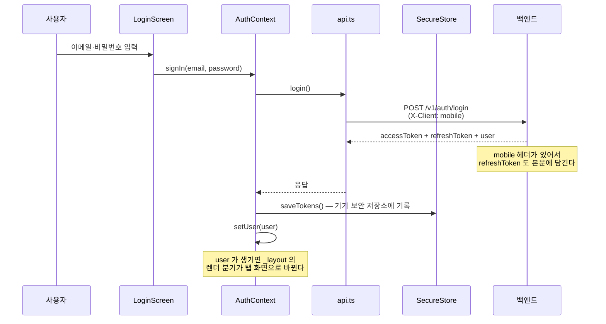
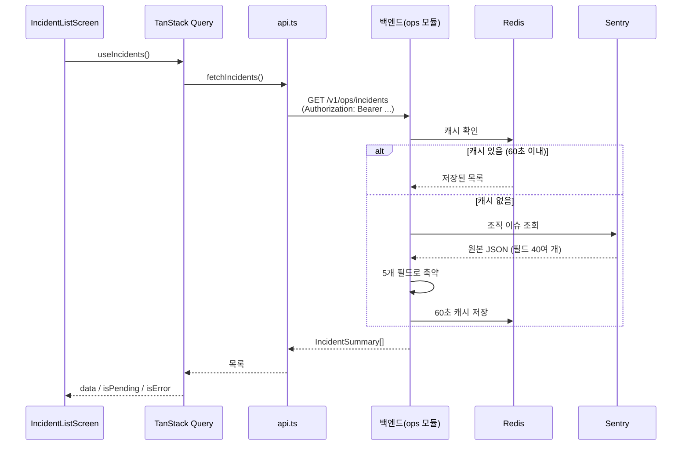
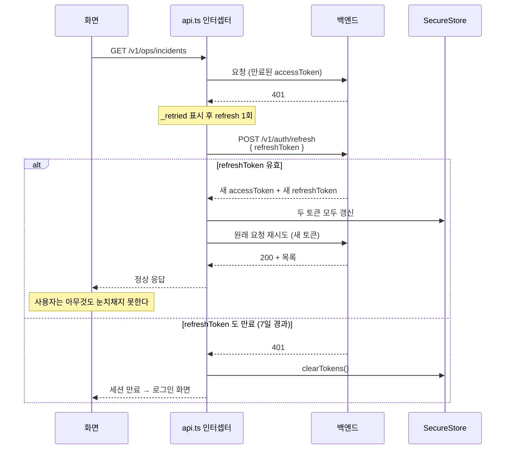

# RN 첫 앱 — 개념부터 우리 코드까지

> 대상: **React Native 를 처음 접한다고 가정**. React(웹)와 백엔드 지식은 있다고 본다.
> 원본 설계: [`docs/roadmap/ops-companion-design.md`](../../roadmap/ops-companion-design.md) §2·§4·§5.5·§5.6·§6·§7
> 짝지어 읽을 코드: [ops-companion/](../../../ops-companion/) — 특히 [api.ts](../../../ops-companion/src/lib/api.ts) · [token-storage.ts](../../../ops-companion/src/lib/token-storage.ts) · [AuthContext.tsx](../../../ops-companion/src/contexts/AuthContext.tsx) · [_layout.tsx](../../../ops-companion/app/_layout.tsx)
> 작성 시점: 2026-09-18 (커밋 `1b662a5`)

---

<br>

# 0장. 30초 요약 — 무엇을 왜 만들었나

## 0-1. 한 문장

**쇼핑몰 서비스에 장애가 났을 때, 휴대폰으로 그 장애 목록을 보는 관리자용 앱이다.**

```
쇼핑몰(웹·백엔드)에서 에러 발생
   ↓
Sentry(에러 수집 SaaS)에 쌓임
   ↓
우리 백엔드가 Sentry API 를 대신 조회 → 필요한 5개 필드만 추려서 내려줌
   ↓
휴대폰 앱이 그 목록을 보여줌   ← ★ 이번에 만든 것
```

## 0-2. 왜 앱을 별도로 만드나

세 가지 이유가 겹쳐 있다.

1. **실용**: 장애는 PC 앞에 없을 때 난다. Sentry 웹사이트를 모바일 브라우저로 여는 것보다 앱이 빠르다.
2. **학습**: 안상문님의 첫 React Native 프로젝트다. 이후 Phase 에서 푸시 알림, 딥링크, AI 분석까지 확장한다.
3. **포트폴리오**: "AI 가 장애를 분석 → 사람이 평가 → 그 데이터로 프롬프트 개선"이라는 순환 고리를 보여주는 것이 최종 목표다. 이번은 그 1단계 뼈대다.

## 0-3. 왜 앱이 Sentry 를 직접 부르지 않나

이게 이 앱 구조의 핵심 결정이다.

Sentry API 를 호출하려면 **인증 토큰**이 필요하다. 그 토큰을 앱에 넣으면, 앱은 사용자 기기에 설치되는 프로그램이라 **분해해서 토큰을 꺼낼 수 있다.** 그래서 토큰은 백엔드 환경변수에만 두고, 앱은 우리 백엔드에게 물어본다.

```
❌ 앱 ──(Sentry 토큰 들고)──→ Sentry     : 토큰이 앱 안에 있음 = 유출 위험
✅ 앱 ──(우리 로그인 토큰)──→ 우리 백엔드 ──(Sentry 토큰)──→ Sentry
```

덤으로 얻는 것이 두 개 있다. 백엔드가 응답을 5개 필드로 줄여주니 **앱이 받는 데이터가 가볍고**, 백엔드가 60초 캐시를 두니 **화면을 계속 당겨 새로고침해도 Sentry 를 때리지 않는다.**

## 0-4. 결과 — 지금 어디까지 됐나

앱에 화면 세 개가 있다.

| 화면 | 하는 일 |
|---|---|
| 로그인 | 이메일·비밀번호로 로그인. 토큰을 기기 보안 저장소에 넣는다 |
| 인시던트 목록 | 최근 24시간 장애 목록. 당겨서 새로고침 |
| 프로필 | 내 계정·권한·앱 버전 확인, 로그아웃 |

기기 없이 확인할 수 있는 것은 전부 통과했다.

| 검사 | 무엇을 보는가 | 결과 |
|---|---|---|
| `tsc` 타입 검사 | 타입이 맞는가 | 통과 (앱 파일 12개) |
| `expo export` | 실제로 앱 번들이 만들어지는가 | 안드로이드 번들 생성 성공 |
| `expo-doctor` | 설정·버전 호환이 맞는가 | 21개 중 20개 통과 |

남은 한 건은 저장소 루트의 `package-lock.json` 경고인데, 2026-04 부터 있던 파일이라 이 앱과 무관하다.

**아직 확인 못 한 것**: 실제 안드로이드 기기에서의 동작이다. 이건 사람이 직접 해야 하고, 7장에 절차가 있다.

<br>

---

<br>

# 1장. 용어 — 웹 개발자가 알아야 할 8개

React Native 세계의 단어들을 웹 기준으로 대응시킨다. 이 8개만 알면 2장을 읽을 수 있다.

## 1-1. React Native

**React 문법으로 진짜 앱 화면을 만드는 기술이다.** 웹처럼 브라우저에서 도는 게 아니라, 우리가 쓴 `<View>` 가 안드로이드의 진짜 화면 요소로 바뀐다.

그래서 **HTML 태그를 못 쓴다.** `<div>` 는 없고 `<View>` 를 쓴다. 대응은 이렇다.

| 웹 | React Native | 비고 |
|---|---|---|
| `<div>` | `<View>` | 상자 |
| `<span>`, `<p>` | `<Text>` | **모든 글자는 `<Text>` 안에 있어야 한다.** 이걸 어기면 앱이 죽는다 |
| `<button>` | `<Pressable>` | 누를 수 있는 것 |
| `<input>` | `<TextInput>` | |
| `<ul>` 반복 | `<FlatList>` | 목록. 화면에 보이는 것만 그려서 긴 목록이 빠르다 |
| CSS 파일 | `StyleSheet.create({...})` | 아래 1-2 |

## 1-2. StyleSheet

CSS 대신 **자바스크립트 객체로 스타일을 쓴다.**

```tsx
const styles = StyleSheet.create({
  row: { flexDirection: 'row', padding: 16, borderRadius: 12 },
});
// 사용: <View style={styles.row}>
```

웹 CSS 와 다른 점 세 가지만 기억하면 된다.

- 속성 이름이 카멜케이스다. `background-color` → `backgroundColor`
- 단위가 없다. `padding: 16` 은 그냥 숫자다
- **기본이 세로 배치다.** 웹의 flex 는 기본이 가로(`row`)지만 RN 은 기본이 세로(`column`)다. 가로로 놓으려면 `flexDirection: 'row'` 를 직접 써야 한다

## 1-3. Expo

**React Native 를 쉽게 쓰게 해주는 도구 모음이다.**

순수 React Native 로 시작하면 안드로이드 스튜디오와 Xcode 를 직접 다뤄야 한다. Expo 는 그 과정을 감춰주고, 카메라·보안저장소·알림 같은 기능을 `expo-` 로 시작하는 패키지로 제공한다. 설계 문서가 "bare RN 금지, Expo 사용"이라고 못박은 이유다.

우리가 쓰는 Expo 패키지는 세 개다. `expo-router`(화면 이동), `expo-secure-store`(토큰 저장), `expo-constants`(앱 버전 읽기).

## 1-4. Metro

**React Native 전용 번들러다.** 웹의 webpack/Vite 자리에 있다. 우리가 쓴 여러 `.tsx` 파일을 하나로 묶어 기기로 보낸다.

이 앱에서 Metro 설정을 따로 건드린 이유가 있는데, 3-9 에서 다룬다.

## 1-5. Expo Go

**앱을 설치하지 않고 실행해보는 앱이다.** Play 스토어에서 Expo Go 를 깔고 QR 을 찍으면, 우리가 짠 코드가 그 안에서 돈다. 개발 중에는 이걸로 충분하고, 나중에 실제 설치 파일(APK)을 만들 때 EAS Build 를 쓴다.

## 1-6. Expo Router

**폴더 구조가 곧 화면 주소가 되는 방식이다.** Next.js 의 App Router 와 같은 개념이라, 웹 프론트를 만들어 본 경험이 그대로 통한다.

```
app/_layout.tsx              → 모든 화면을 감싸는 껍데기
app/(auth)/login.tsx         → 로그인 화면
app/(tabs)/profile.tsx       → 프로필 화면
```

괄호 폴더 `(auth)`, `(tabs)` 는 **주소에는 안 나타나고 묶음 역할만 한다.** Next.js 의 라우트 그룹과 똑같다. 우리 쇼핑몰 프론트의 `(main)`, `(admin)` 과 같은 문법이다.

## 1-7. SecureStore

**OS 가 제공하는 보안 저장소다.** 안드로이드는 Keystore, iOS 는 Keychain 을 쓴다.

웹에서 토큰을 `localStorage` 에 넣듯, 앱에서는 여기 넣는다. 앱에도 `AsyncStorage` 라는 간편한 저장소가 있지만 **평문으로 저장되므로 토큰을 넣으면 안 된다.** 설계 문서가 §7 에 못박은 규칙이다.

## 1-8. SafeAreaView

**노치(카메라 구멍)나 홈 바에 화면이 가리지 않게 여백을 넣어주는 컴포넌트다.** 웹에는 없는 개념이다. 화면 바깥 틀에 이걸 쓰면 기기마다 알아서 여백이 잡힌다.

<br>

---

<br>

# 2장. 지도 — 파일이 어떻게 놓여 있고, 앱은 어디서 시작하나

## 2-1. 폴더

```
ops-companion/
├── app/                          ← 화면. 파일 경로가 곧 화면 주소
│   ├── _layout.tsx               ← 앱 전체 껍데기 + 로그인 여부 분기
│   ├── (auth)/login.tsx          ← 로그인 화면
│   └── (tabs)/
│       ├── _layout.tsx           ← 하단 탭 두 개 정의
│       ├── incidents/index.tsx   ← 인시던트 목록
│       └── profile.tsx           ← 프로필
├── src/                          ← 화면이 아닌 것들
│   ├── lib/config.ts             ← 환경변수 읽기
│   ├── lib/token-storage.ts      ← 토큰 저장/읽기 (SecureStore)
│   ├── lib/api.ts                ← 서버 통신 전부
│   ├── lib/sentry.ts             ← 이 앱 자신의 에러 수집
│   ├── contexts/AuthContext.tsx  ← "지금 로그인한 사람" 전역 상태
│   ├── features/incidents/queries.ts  ← 목록 데이터 가져오기
│   └── theme.ts                  ← 색·간격 상수
├── app.json                      ← 앱 이름, 아이콘, 패키지명 등 설정
├── metro.config.js               ← 번들러 설정 (모노레포 때문에 필요)
└── .env.example                  ← 환경변수 예시
```

`app/` 과 `src/` 를 나눈 기준은 간단하다. **화면이면 `app/`, 아니면 `src/`.** Expo Router 가 `app/` 안의 모든 파일을 화면으로 취급하기 때문에, 화면이 아닌 코드를 거기 두면 안 된다.

## 2-2. 앱이 켜지는 순서

```
package.json 의 "main": "expo-router/entry"
   ↓
app/_layout.tsx  실행 ─ Sentry 켜기, Provider 3개 씌우기
   ↓
AuthContext 가 SecureStore 에서 토큰 꺼내 /auth/me 로 확인
   ↓
   ├─ 토큰 있고 유효함  → app/(tabs)/  (인시던트 목록)
   └─ 없거나 만료       → app/(auth)/login.tsx
```

여기서 짚을 것은 **부팅 중에는 로딩 화면을 보여준다**는 점이다. 토큰 확인은 서버 왕복이라 몇백 밀리초가 걸리는데, 그 사이 아무 처리도 안 하면 로그인 상태인데도 로그인 화면이 한 번 번쩍이고 지나간다. 그래서 `isBooting` 플래그를 둔다.

<br>

---

<br>

# 3장. 코드 읽기 — 파일 하나씩

## 3-1. config.ts — 환경변수

[`src/lib/config.ts`](../../../ops-companion/src/lib/config.ts)

```ts
export const API_BASE_URL =
  process.env.EXPO_PUBLIC_API_BASE_URL ?? 'https://api.ansmoon.dev/v1';

export const CLIENT_HEADER = { 'X-Client': 'mobile' } as const;
```

**`EXPO_PUBLIC_` 접두어가 중요하다.** 이 접두어가 붙은 환경변수만 앱 코드에서 읽을 수 있고, 대신 **빌드할 때 앱 안에 그대로 박힌다.** Next.js 의 `NEXT_PUBLIC_` 과 같은 개념이다.

그래서 여기에는 **공개돼도 되는 값만** 둔다. 0-3 에서 말한 Sentry 토큰 같은 비밀값은 절대 넣지 않는다.

`CLIENT_HEADER` 는 이 앱의 정체를 백엔드에 알리는 표식이다. 왜 필요한지는 3-3 에서 설명한다.

## 3-2. token-storage.ts — 토큰을 어디에 두는가

[`src/lib/token-storage.ts`](../../../ops-companion/src/lib/token-storage.ts)

두 가지를 한다. **SecureStore 에 저장**하고, **메모리에도 사본을 둔다.**

```ts
let accessToken: string | null = null;   // 메모리 사본

export async function loadTokens() {     // 앱 켜질 때 1회
  [accessToken, refreshToken] = await Promise.all([
    SecureStore.getItemAsync(ACCESS_KEY),
    SecureStore.getItemAsync(REFRESH_KEY),
  ]);
  ...
}

export function getAccessToken() {       // 매 요청마다 (동기)
  return accessToken;
}
```

**왜 메모리 사본을 두나.** SecureStore 읽기는 OS 를 거치는 비동기 작업이다. 모든 API 요청마다 이걸 기다리면 느려진다. 그래서 앱이 켜질 때 한 번만 읽어 메모리에 들고, 요청할 때는 메모리 값을 쓴다. 앱을 껐다 켜면 다시 SecureStore 에서 복원한다.

**토큰이 두 개인 이유.**

| 토큰 | 수명 | 역할 |
|---|---|---|
| accessToken | 15분 | 매 요청에 붙이는 출입증 |
| refreshToken | 7일 | 출입증이 만료됐을 때 새로 받아오는 교환권 |

accessToken 을 짧게 두는 이유는 유출되더라도 15분 뒤엔 쓸모없어지기 때문이다. 대신 15분마다 로그아웃되면 못 쓰니까, refreshToken 으로 조용히 갱신한다. 그 코드가 3-3 이다.

## 3-3. api.ts — 서버 통신의 전부 (이 앱에서 가장 중요한 파일)

[`src/lib/api.ts`](../../../ops-companion/src/lib/api.ts)

### ① 요청 인터셉터 — 토큰 자동 첨부

```ts
api.interceptors.request.use((config) => {
  const token = getAccessToken();
  if (token) config.headers.set('Authorization', `Bearer ${token}`);
  return config;
});
```

인터셉터는 **모든 요청이 나가기 직전에 거치는 관문**이다. 여기서 토큰을 붙이므로, 화면 코드에서는 토큰을 신경 쓸 필요가 없다. 쇼핑몰 웹 프론트의 [axios-http-client.ts](../../../frontend/src/lib/axios/axios-http-client.ts) 와 같은 구조다.

### ② X-Client: mobile — 이 앱만의 사정

axios 인스턴스를 만들 때 이 헤더를 기본값으로 넣었다.

```ts
export const api = axios.create({
  baseURL: API_BASE_URL,
  headers: { 'Content-Type': 'application/json', ...CLIENT_HEADER },
});
```

**왜 필요한가.** 웹에서 refreshToken 은 httpOnly 쿠키로 오간다. 브라우저가 알아서 저장하고 알아서 보내주며, 자바스크립트가 읽을 수 없어 안전하다.

그런데 **앱에는 그 쿠키를 구워줄 중간 서버가 없다.** 웹은 Vercel 서버가 백엔드의 쿠키를 받아 자기 도메인 쿠키로 다시 구워주지만, 앱은 백엔드에 직접 붙는다.

그래서 백엔드에 분기를 하나 넣었다. **`X-Client: mobile` 헤더가 있으면 refreshToken 을 응답 본문에도 담아준다.** 헤더가 없으면 지금까지와 똑같이 동작하므로 웹은 아무 영향이 없다. 이 백엔드 작업이 이번 트랙의 0-A 단계였고, 이미 운영에 배포돼 있다.

### ③ 응답 인터셉터 — 401 이면 조용히 갱신

앱에서 제일 중요한 사용자 경험이다. **15분마다 로그아웃되면 온콜 앱으로 못 쓴다.**

```ts
api.interceptors.response.use(
  (response) => response,
  async (error) => {
    const config = error.config;
    if (error.response?.status !== 401 || !config || config._retried) {
      return Promise.reject(error);       // 401 이 아니거나 이미 재시도했으면 포기
    }
    config._retried = true;                // 무한 반복 방지 표시
    const newToken = await refreshAccessToken();
    if (!newToken) {                       // 갱신도 실패 = 세션 끝
      await clearTokens();
      onSessionExpired?.();                // → 로그인 화면으로
      return Promise.reject(error);
    }
    config.headers = { ...config.headers, Authorization: `Bearer ${newToken}` };
    return api.request(config);            // 원래 요청 재시도
  },
);
```

읽는 순서대로 풀면 이렇다.

1. 401(인증 실패)이 아니면 그대로 에러를 넘긴다
2. **`_retried` 표시**가 이미 있으면 포기한다. 이게 없으면 갱신 → 또 401 → 갱신 → … 무한 반복에 빠진다
3. refresh 를 한 번 시도한다
4. 실패하면 토큰을 지우고 로그인 화면으로 돌린다
5. 성공하면 **새 토큰으로 원래 요청을 다시 보낸다.** 사용자는 아무것도 눈치채지 못한다

### ④ 동시 401 잠금 — 초보가 놓치기 쉬운 부분

화면 두 곳이 동시에 요청을 보냈고 둘 다 401 을 받으면 어떻게 될까. refresh 가 두 번 나간다.

문제는 **refreshToken 이 1회용**이라는 점이다. 백엔드는 갱신할 때마다 새 refreshToken 을 주고 옛것을 무효화한다. 그래서 두 번째 refresh 는 이미 죽은 토큰을 들고 가서 실패하고, 사용자는 멀쩡한데 로그아웃된다.

해결은 **진행 중인 refresh 를 공유**하는 것이다.

```ts
let refreshPromise: Promise<string | null> | null = null;

async function refreshAccessToken() {
  if (refreshPromise) return refreshPromise;   // ★ 이미 누가 하고 있으면 그걸 같이 기다린다
  refreshPromise = (async () => {
    ...
    finally { refreshPromise = null; }
  })();
  return refreshPromise;
}
```

먼저 도착한 요청만 실제로 refresh 를 보내고, 나머지는 그 결과를 함께 기다린다. 쇼핑몰 웹 프론트도 같은 방식으로 되어 있다.

한 가지 더. refresh 요청만은 `api` 인스턴스가 아니라 **별도 axios 로 보낸다.**

```ts
const { data } = await axios.post(`${API_BASE_URL}/auth/refresh`, { refreshToken: token }, {...});
```

`api` 를 쓰면 인터셉터가 만료된 accessToken 을 붙이고, 그 요청이 또 401 을 받으면 다시 refresh 를 부르는 재귀에 빠지기 때문이다.

### ⑤ 로그아웃

```ts
export async function logout(): Promise<void> {
  const refreshToken = getRefreshToken();
  try {
    await api.post('/auth/logout', refreshToken ? { refreshToken } : {});
  } catch {
    // 네트워크 실패로 서버 로그아웃이 안 되더라도 로컬 토큰은 반드시 지운다
  }
  await clearTokens();
}
```

**refreshToken 을 본문에 실어 보내는 게 핵심이다.** 웹은 쿠키가 자동으로 가서 서버가 그 토큰을 무효화하지만, 앱은 직접 보내지 않으면 서버 쪽 토큰이 **7일간 살아남는다.** 기기에서 지워도 서버에는 남아 있는 상태다.

`catch` 가 비어 있는 것도 의도된 것이다. 네트워크가 끊겨 서버에 못 알려도, 기기에서 토큰을 지우는 것은 반드시 해야 한다.

## 3-4. AuthContext.tsx — 지금 로그인한 사람

[`src/contexts/AuthContext.tsx`](../../../ops-companion/src/contexts/AuthContext.tsx)

React Context 로 `user`, `signIn`, `signOut` 을 앱 전체에 공급한다. 웹의 `AuthContext` 와 역할이 같다.

RN 이라서 다른 부분은 **부팅 절차**다.

```tsx
useEffect(() => {
  (async () => {
    try {
      const { accessToken } = await loadTokens();   // SecureStore 에서 복원
      if (!accessToken) return;                     // 없으면 로그인 화면으로
      const me = await fetchMe();                   // 서버에 물어서 검증
      setUser(me);
    } catch {
      await clearTokens();                          // 못 쓰는 토큰이면 정리
    } finally {
      setIsBooting(false);
    }
  })();
}, []);
```

이 열 줄이 **"앱을 껐다 켜도 로그인이 유지된다"** 의 구현 전부다. 토큰이 만료됐어도 3-3 의 인터셉터가 갱신을 시도하므로, 7일 안에 다시 열면 로그인 상태로 시작한다.

`cancelled` 플래그도 있는데, 확인이 끝나기 전에 화면이 사라지면 결과를 버리기 위한 것이다. 사라진 컴포넌트의 상태를 바꾸면 경고가 뜬다.

## 3-5. _layout.tsx — 로그인 여부로 화면을 가른다

[`app/_layout.tsx`](../../../ops-companion/app/_layout.tsx)

```tsx
return (
  <Stack screenOptions={{ headerShown: false }}>
    {user ? <Stack.Screen name="(tabs)" /> : <Stack.Screen name="(auth)/login" />}
  </Stack>
);
```

**여기가 설계 문서가 강조한 부분이다.** 로그인 성공 후 `router.push('/incidents')` 같은 **이동 명령을 쓰지 않는다.** 대신 `user` 가 있으면 탭 화면만, 없으면 로그인 화면만 등록한다.

차이가 왜 중요한가. 이동 명령 방식이면 로그아웃했을 때 "이전 화면이 뒤에 남아 있다가 뒤로 가기로 다시 보이는" 문제가 생긴다. 렌더 분기 방식이면 **등록되지 않은 화면은 아예 존재하지 않으므로** 그런 상태가 만들어지지 않는다.

이 파일은 Provider 를 씌우는 자리이기도 하다. 바깥부터 순서대로다.

```
SafeAreaProvider     ← 노치 여백 계산
  QueryClientProvider ← 서버 데이터 캐시
    AuthProvider      ← 로그인 상태
      RootNavigator   ← 실제 화면
```

## 3-6. queries.ts — 서버 데이터는 전부 여기를 거친다

[`src/features/incidents/queries.ts`](../../../ops-companion/src/features/incidents/queries.ts)

```ts
export function useIncidents() {
  return useQuery({
    queryKey: ['incidents'],
    queryFn: fetchIncidents,
    staleTime: 60_000,
    retry: 1,
  });
}
```

TanStack Query 는 쇼핑몰 웹에서 쓰던 그 라이브러리다. 로딩·에러·캐시를 알아서 관리해준다.

**`staleTime: 60_000`(1분)의 근거**가 재미있다. 백엔드가 Sentry 응답을 Redis 에 60초 캐시한다. 그보다 자주 요청해봐야 **같은 값**을 받는다. 그래서 앱도 1분으로 맞췄다. 앞단과 뒷단의 캐시 시간을 맞추는 것은 실무에서 자주 보는 패턴이다.

`retry: 1` 은 실패해도 한 번만 다시 시도하라는 뜻이다. 401 은 인터셉터가 이미 처리하므로 쿼리가 반복해서 조를 이유가 없다.

## 3-7. 화면 세 개

### 로그인 — [`app/(auth)/login.tsx`](../../../ops-companion/app/%28auth%29/login.tsx)

에러 메시지를 상태 코드별로 나눈 부분만 보면 된다.

```ts
if (status === 401) return '이메일 또는 비밀번호가 올바르지 않습니다.';
if (status === 429) return '로그인 시도가 많습니다. 5분 뒤에 다시 시도해주세요.';
```

**429 안내가 특히 중요하다.** 백엔드는 로그인 시도를 IP 당 10회/5분으로 제한한다. 그런데 앱은 웹과 달리 **진짜 IP 로 기록된다.** 웹은 Vercel 서버를 거쳐서 오지만 앱은 직접 오기 때문이다. 개발 중에 비밀번호를 반복해서 틀리면 본인 IP 가 5분간 잠긴다.

`KeyboardAvoidingView` 도 RN 특유의 것이다. 키보드가 올라올 때 입력창이 가리지 않게 화면을 밀어준다. 웹에는 필요 없는 처리다.

### 인시던트 목록 — [`app/(tabs)/incidents/index.tsx`](../../../ops-companion/app/%28tabs%29/incidents/index.tsx)

화면 상태 네 가지를 각각 그린다. 설계 문서 §4.3 의 요구사항이다.

| 상태 | 보이는 것 |
|---|---|
| 로딩 | 동그라미 스피너 |
| 에러 | 사유 + "다시 시도" 버튼 |
| 빈 목록 | "조용합니다 / 최근 24시간 동안 기록된 인시던트가 없습니다" |
| 정상 | 목록 |

빈 목록에 "조용합니다"라고 쓴 건 의도적이다. 운영 앱에서 장애가 0건인 것은 **좋은 소식**이라 그렇게 읽히도록 했다.

당겨서 새로고침은 `RefreshControl` 컴포넌트다. 웹에는 없는 모바일 고유 패턴이다.

```tsx
refreshControl={<RefreshControl refreshing={isRefetching} onRefresh={refetch} />}
```

시각은 "3분 전" 형식으로 바꿔 보여준다. 급할 때는 절대 시각보다 상대 시각이 빨리 읽히기 때문이다.

### 프로필 — [`app/(tabs)/profile.tsx`](../../../ops-companion/app/%28tabs%29/profile.tsx)

로그아웃 후 캐시를 비우는 한 줄이 있다.

```ts
await signOut();
queryClient.clear();
```

이게 없으면 다음 사람이 로그인했을 때 **이전 사용자가 보던 목록이 잠깐 보인다.** TanStack Query 가 캐시를 들고 있기 때문이다.

## 3-8. sentry.ts — 앱 자신의 에러 수집

[`src/lib/sentry.ts`](../../../ops-companion/src/lib/sentry.ts)

이 앱에는 Sentry 가 **두 가지 역할**로 나온다. 헷갈리기 쉬우니 구분해두자.

| 역할 | 방향 | 이 파일과의 관계 |
|---|---|---|
| A. 쇼핑몰 장애를 **본다** | 백엔드가 Sentry 에서 읽어옴 → 앱이 표시 | 무관 |
| B. 이 앱 자신의 에러를 **보낸다** | 앱 → Sentry | **이 파일** |

```ts
export function initSentry(): void {
  if (!SENTRY_DSN) return;          // 키 없으면 아무것도 안 함
  Sentry.init({
    dsn: SENTRY_DSN,
    enabled: !__DEV__,              // 개발 중에는 전송 안 함
    tracesSampleRate: 0,
  });
}
```

**키가 없으면 그냥 넘어간다.** 이건 이 저장소의 일관된 관례다. 백엔드의 Sentry, AI 클라이언트, 이메일 모듈이 전부 같은 방식이라, 키 없이도 개발할 수 있다.

`enabled: !__DEV__` 는 개발 중 에러를 보내지 않겠다는 뜻이다. **무료 플랜의 월 5,000건 한도를 조직 전체가 나눠 쓰기 때문이다.** 개발하면서 나는 에러까지 올리면 쇼핑몰 쪽 몫까지 잡아먹는다.

## 3-9. metro.config.js — 모노레포라서 필요한 설정

[`metro.config.js`](../../../ops-companion/metro.config.js)

```js
config.watchFolders = [workspaceRoot];
config.resolver.nodeModulesPaths = [
  path.resolve(projectRoot, 'node_modules'),
  path.resolve(workspaceRoot, 'node_modules'),
];
```

**왜 필요한가.** 이 앱은 쇼핑몰 저장소 안에 들어 있다. Yarn 워크스페이스 설정 때문에 패키지 상당수가 **앱 폴더가 아니라 저장소 루트의 `node_modules` 에 설치된다.**

그런데 Metro 는 기본적으로 자기 폴더만 본다. 그래서 두 가지를 알려줘야 한다.

- `watchFolders`: 루트까지 파일 변경을 감시해라
- `nodeModulesPaths`: 앱 폴더와 루트 양쪽에서 패키지를 찾아라

이걸 빼먹으면 "모듈을 찾을 수 없다"는 에러가 실행 시점에 난다.

<br>

---

<br>

# 4장. 흐름 세 가지

## 4-1. 로그인



## 4-2. 인시던트 목록 조회



## 4-3. 토큰이 만료됐을 때 (앱의 핵심 경험)



<br>

---

<br>

# 5장. 웹과 무엇이 달랐나

쇼핑몰 웹 프론트를 만들어봤다면, 아래 표가 차이의 전부다.

| 주제 | 웹 (Next.js) | 앱 (React Native) |
|---|---|---|
| 화면 요소 | `<div>`, `<span>` | `<View>`, `<Text>` |
| 스타일 | CSS / emotion | `StyleSheet.create` |
| 라우팅 | App Router (`app/`) | Expo Router (`app/`) — **거의 같다** |
| 토큰 저장 | accessToken → localStorage | accessToken → **SecureStore** |
| refreshToken | **httpOnly 쿠키** (자동) | **본문으로 주고받음** (직접) |
| 중간 서버 | Vercel BFF 있음 | **없음. 백엔드에 직통** |
| CORS | 신경 써야 함 | **무관** (앱은 Origin 을 안 보냄) |
| 클라이언트 IP | Vercel IP 로 기록 | **진짜 IP 로 기록** (레이트리밋 주의) |
| 새로고침 | 브라우저 새로고침 | 당겨서 새로고침(`RefreshControl`) |
| 서버 데이터 | TanStack Query | **TanStack Query — 같다** |

정리하면 **화면 그리는 문법과 토큰 보관 방식이 다르고, 데이터 다루는 방식은 거의 같다.** 그래서 웹 경험이 절반 이상 그대로 쓰인다.

<br>

---

<br>

# 6장. 실제로 밟은 함정 네 개

문서에 없던, 만들면서 걸린 것들이다.

## 6-1. 최신 버전을 그냥 깔면 안 된다

Sentry 패키지의 npm 최신 버전은 8.27 인데, 실제로 설치된 것은 **7.11** 이다.

```bash
npx expo install @sentry/react-native    # ← SDK 호환 버전을 골라준다
npm install @sentry/react-native         # ← 최신을 깐다. 깨질 수 있다
```

Expo 는 SDK 버전마다 호환되는 패키지 버전 표를 갖고 있고, `expo install` 이 그걸 보고 고른다. **RN 에서는 `npm install` 대신 `expo install` 을 쓰는 게 기본이다.**

## 6-2. Reanimated 4 는 짝꿍 패키지를 따로 깔아야 한다

애니메이션 라이브러리 `react-native-reanimated` 4 버전은 `react-native-worklets` 를 **따로 설치**해야 한다. 자동으로 안 깔린다. 안 깔고 실행하면 앱이 켜지자마자 죽는다.

이런 것은 `npx expo-doctor` 가 잡아주니, 설정을 바꾼 뒤엔 한 번씩 돌려보는 습관이 좋다.

## 6-3. 좋아 보이는 설정이 권장값 위반일 수 있다

Metro 설정에 중복 패키지를 막는 옵션(`disableHierarchicalLookup`)을 넣었는데, `expo-doctor` 가 "Expo 권장값과 다르다"고 잡았다. 빼고 다시 번들해보니 문제없이 돌아서 제거했다.

**교훈**: 번들러 설정은 필요한 최소한만 건드린다. 모노레포 때문에 꼭 필요한 두 줄만 남겼다.

## 6-4. `.env.example` 이 커밋에서 사라질 뻔했다

저장소 루트 `.gitignore` 에 `.env.*` 규칙이 있어서, 예시 파일인 `.env.example` 까지 묻혔다. 앱 폴더의 `.gitignore` 에 예외를 넣어 되살렸다.

```
.env
!.env.example
```

**교훈**: 새 폴더를 만들면 의도한 파일이 실제로 커밋됐는지 `git status` 로 확인한다.

<br>

---

<br>

# 7장. 실행과 확인

## 7-1. 실행

```bash
cd ops-companion
cp .env.example .env     # 기본값이 운영 백엔드라 그대로 써도 된다
yarn start               # QR 코드가 뜬다
```

안드로이드 기기에 Play 스토어에서 **Expo Go** 를 설치하고 QR 을 찍는다. PC 와 기기가 **같은 Wi-Fi** 에 있어야 한다. 안 붙으면 `yarn start --tunnel` 을 쓴다.

## 7-2. 확인 항목 (Phase 0 완료 기준)

설계 문서가 정한 게이트다. 이걸 통과해야 다음 단계로 간다.

- [ ] 관리자 계정으로 로그인된다
- [ ] 인시던트 목록이 보인다
- [ ] 당겨서 새로고침이 된다
- [ ] **15분이 지나도 계속 쓸 수 있다** (자동 갱신 확인 — 앱을 열어둔 채 20분 뒤 새로고침)
- [ ] 앱을 완전히 종료했다 다시 열어도 로그인 상태다
- [ ] 로그아웃하면 로그인 화면으로 돌아가고, 다시 열어도 로그인 화면이다

**로그인은 IP 당 10회/5분 제한이 있다.** 비밀번호를 반복해서 틀리지 않도록 주의한다.

## 7-3. 안 될 때

| 증상 | 확인할 것 |
|---|---|
| QR 을 찍어도 연결 안 됨 | PC 와 기기가 같은 Wi-Fi 인가. 안 되면 `--tunnel` |
| 로그인이 401 | 계정·비밀번호. 관리자 권한 계정인가 |
| 로그인이 429 | 5분 기다린다 |
| 목록이 403 | 그 계정에 관리자 권한이 없다 |
| 목록이 503 | 백엔드에 Sentry 키가 설정되지 않았다 |
| 목록이 502 | 백엔드는 떴는데 Sentry 조회에 실패했다 |

<br>

---

<br>

# 8장. 다음은 무엇인가

Phase 0 이 끝나면(위 체크리스트 통과) 다음은 **Phase 1: 푸시 알림과 딥링크**다.

- 백엔드가 주기적으로 Sentry 를 확인하다가 새 장애가 생기면 앱에 푸시를 보낸다
- 푸시를 누르면 해당 장애 상세 화면으로 바로 이동한다(딥링크)
- 앱이 꺼져 있을 때 누른 경우가 가장 까다로워서, 그 처리에 시간이 든다

그 전에 백엔드 쪽에서 먼저 할 일이 두 가지 남아 있다. 설계 문서 §11-1 이 "착수 전 처리"로 적어둔 것이다.

1. **쇼핑몰 프론트의 API 실패를 Sentry 로 보내기** — 지금은 프론트 에러가 Sentry 에 안 잡혀서, 앱 목록에 백엔드 에러만 뜬다
2. **`/v1/health` 가 DB·Redis 까지 확인하게 하기** — 지금은 DB 만 죽은 상황을 아무도 감지하지 못한다

이 둘을 하면 앱에 보이는 장애 목록이 비로소 완전해진다.
