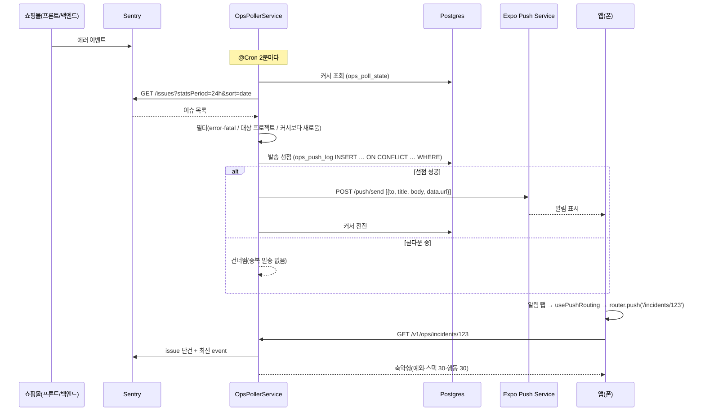
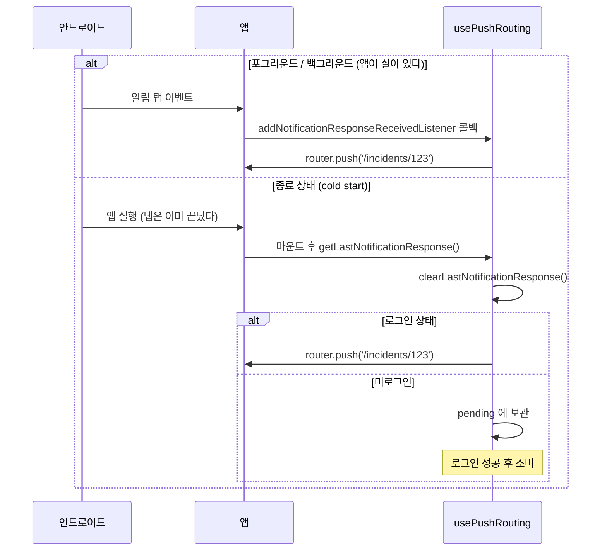

# 푸시 알림과 딥링크 — 앱이 먼저 말을 거는 쪽으로

> 대상: [1편](./01-rn-first-app.md)을 읽었다고 본다. 1편에서 설명한 용어(Expo Router, SecureStore, Metro 등)는 다시 풀지 않는다.
> 원본 설계: [`docs/roadmap/ops-companion-design.md`](../../roadmap/ops-companion-design.md) §3.3·§4.2·§4.3 S3·§5.1·§5.3·§9 Phase 1
> 짝지어 읽을 코드: [ops-poller.service.ts](../../../backend/src/ops/ops-poller.service.ts) · [expo-push.client.ts](../../../backend/src/ops/expo-push.client.ts) · [notifications.ts](../../../ops-companion/src/lib/notifications.ts) · [usePushRouting.ts](../../../ops-companion/src/features/push/usePushRouting.ts) · [\[id\].tsx](../../../ops-companion/app/%28tabs%29/incidents/%5Bid%5D.tsx)
> 작성 시점: 2026-09-20 (커밋 `6352975`)

---

<br>

# 0장. 30초 요약

## 0-1. 한 문장

**장애가 나면 폰이 먼저 울고, 그 알림을 누르면 해당 장애 화면으로 바로 들어간다.**

1편의 앱은 내가 열어야 보이는 앱이었다. 이번 것은 앱이 나를 부른다.

```
쇼핑몰에서 에러 발생 → Sentry 에 쌓임
   ↓  (우리 백엔드가 2분마다 확인)
"error 레벨 + 쇼핑몰 프로젝트 + 처음 보는 이슈" 만 골라냄
   ↓
Expo Push Service → 폰 알림                     ← ★ 이번에 만든 것
   ↓  (알림 탭)
앱이 꺼져 있었어도 켜지면서 그 인시던트 상세로 직행   ← ★ 이번에 만든 것
```

## 0-2. 왜 폴링인가 (webhook 이 아니고)

Sentry 가 우리를 불러 주면 제일 간단하다. 그런데 그 기능(서드파티 통합)은 **유료 플랜**이고, 실제로 2026-07 체험이 끝나면서 Slack 연동이 조용히 끊긴 적이 있다. 그래서 방향을 뒤집어 **우리가 2분마다 Sentry 에 물어보기로** 했다.

잃는 것은 최대 2분의 지연뿐인데, 얻는 것이 많다.

- 외부에서 호출되는 공개 엔드포인트를 만들지 않는다 → **서명 검증 문제 자체가 사라진다.**
- 이슈 묶음(그룹핑)을 Sentry 가 이미 해 두었으니 우리가 지문 설계를 안 해도 된다.
- Sentry 의 플랜 정책이 바뀌어도 흔들리지 않는다.

## 0-3. 결과

| 무엇이 되는가 | 검증 |
|---|---|
| 인시던트 상세 화면(스택트레이스·직전 행동 기록) | ✅ 실기기(Expo Go, 로컬 백엔드) |
| 기기 푸시 토큰 등록(`POST /v1/ops/devices`) | ✅ 백엔드 e2e 32건 · 앱 쪽은 개발 빌드에서 확인 |
| 폴링 → 발송 판정(레벨·프로젝트·멱등·쿨다운) | ✅ 단위 41건 + **실데이터 스모크**(0-4) |
| 딥링크 — 포그라운드·백그라운드 | ✅ 실기기(개발 빌드). 알림 탭 → 인시던트 상세 진입 |
| 딥링크 — 종료(cold start) | ⏳ preview 빌드로 확인 예정(6-10) |
| **Sentry 이슈 → 폰 푸시 → 탭 → 상세 진입** | ✅ 실기기(2026-09-20) — 아래 |

**실기기 통과 기록(2026-09-20)**. 로컬 백엔드 + 개발 빌드 + 실제 안드로이드 기기.

```
[OpsPollerService] 푸시 발송: 이슈 1건 → 알림 1통
```

| 무엇을 봤나 | 값 |
|---|---|
| 알림 제목·내용 | `🚨 e-commerse-backend` / `Error: listen EADDRINUSE: address already in use :::4000` |
| 발송 기록(`ops_push_log`) | incident `7736291868` · user 1 · push_count 1 |
| 기기 토큰 | `disabled_at` 없음(살아 있는 토큰으로 인정) |
| 커서 전진 | `04:14:00` → `04:14:53`(처리한 이슈의 lastSeen) |
| 알림 탭 | 인시던트 상세 화면으로 진입 |

남은 것은 **종료 상태(cold start) 확인**이다. 개발 빌드는 앱이 죽었다 켜질 때 PC 의 Metro 에서
번들을 다시 받아야 해서, 이 시나리오는 번들이 내장된 preview 빌드로 확인하는 것이 정직하다(6-10).

## 0-4. 기기 없이 루프를 한 번 돌려봤다

폰이 없어도 파이프라인 전체를 시험할 방법이 있었다. **없는 기기의 토큰을 DB 에 넣어 두는 것**이다.

폴링 커서를 이틀 전으로 돌리고 가짜 토큰(`ExponentPushToken[fake-smoke-test-0001]`)을 넣자, 백엔드가 실제 Sentry 이슈 4건을 후보로 골라 Expo 에 4통을 보냈고, Expo 는 전부 `DeviceNotRegistered`(그런 기기 없음)를 돌려줬다. 그 응답을 받아 앱은 토큰을 발송 대상에서 빼고, 발송 기록도 되돌렸다.

**이 시험이 버그를 하나 잡았다**(6-3). 단위 테스트는 통과하던 종류였다.

<br>

---

<br>

# 1장. 이번 편에서 새로 나온 용어

## 1-1. 푸시 알림 (remote notification)

서버가 보내서 폰에 뜨는 알림이다. 앱이 꺼져 있어도 도착한다. 앱이 스스로 예약해 띄우는 **로컬 알림**과 다르다.

받는 원리는 이렇다. 폰은 항상 OS 제조사의 서버와 연결을 하나 유지하고 있다. 안드로이드는 **FCM**(Firebase Cloud Messaging), iOS 는 **APNs** 다. 서버가 알림을 보내려면 그 회사 서버에 부탁해야 하고, 그러려면 자격증명이 필요하다.

## 1-2. Expo Push Service

우리가 FCM·APNs 와 직접 이야기하지 않게 해 주는 중개소다. 우리는 `ExponentPushToken[...]` 이라는 주소 하나만 알고 Expo 에 HTTP 요청을 보내면, Expo 가 안드로이드면 FCM 으로, iOS 면 APNs 로 옮겨 준다.

덕분에 **백엔드에 구글 서비스 계정 키를 둘 필요가 없다.** FCM 자격증명은 Expo 프로젝트에 한 번 올려두면 된다. 비밀값을 우리 서버에서 한 겹 덜어내는 셈이라, 앱에 Sentry 토큰을 넣지 않은 것과 같은 방향의 결정이다([1편 0-3](./01-rn-first-app.md#0-3-왜-앱이-sentry-를-직접-부르지-않나)).

## 1-3. 푸시 토큰 (Expo push token)

"이 폰의 이 앱"을 가리키는 주소다. 앱을 지웠다 다시 깔거나 기기를 바꾸면 값이 달라진다. 사용자 계정이 아니라 **기기**에 붙는다는 점이 중요하다. 그래서 한 사람이 폰과 태블릿을 쓰면 토큰이 두 개고, 둘 다 울려야 한다.

## 1-4. 알림 채널 (notification channel) — 안드로이드만

"이 알림은 얼마나 시끄러운가"를 정하는 묶음이다. 소리·진동·화면 위 표시 여부가 채널 단위로 정해지고, 사용자가 설정에서 채널별로 끌 수 있다. 안드로이드 8부터 **채널 없는 알림은 아예 표시되지 않는다.**

우리는 `incidents` 채널 하나를 쓴다. 백엔드가 보내는 메시지의 `channelId` 와 앱이 만든 채널 이름이 **같아야** 설정이 적용된다.

## 1-5. 개발 빌드 (development build)

Expo Go 대신, 내 프로젝트 전용으로 만든 설치 파일(APK)이다.

이번 Phase 에서 이게 필수가 됐다. **SDK 53 부터 안드로이드 Expo Go 에서 원격 푸시가 빠졌기 때문이다.** 공식 문서가 이렇게 못박고 있다.

> Push notifications (remote notifications) functionality provided by `expo-notifications` is unavailable in Expo Go on Android from SDK 53. A development build is required to use push notifications.

개발 빌드를 한 번 설치하면 그 뒤로는 1편과 똑같다. `yarn start` 로 Metro 를 띄우고 QR 을 찍으면 JS 만 갈아 끼운다. 네이티브 패키지를 새로 추가할 때만 다시 빌드한다.

## 1-6. cold start (종료 상태에서 시작)

앱이 완전히 죽어 있는 상태에서 알림을 탭해 앱이 켜지는 경우다. 3상태 중 이것만 처리 방식이 다르다(3-5).

## 1-7. 멱등 (idempotent)

같은 작업을 여러 번 해도 결과가 한 번과 같은 성질이다. 푸시에서는 "같은 장애로 알림이 두 번 오지 않는다"는 뜻이다. 쇼핑몰의 정산 리스너가 쓰는 것과 같은 접근이다.

<br>

---

<br>

# 2장. 지도 — 무엇이 늘었나

## 2-1. 백엔드

```
backend/src/ops/
├── ops.controller.ts          # + GET /incidents/:id, POST /devices
├── ops.service.ts             # + 상세 축약, 기기 등록(upsert)
├── ops-poller.service.ts      # ★ 신규: 2분마다 Sentry 확인 → 발송 판정
├── expo-push.client.ts        # ★ 신규: Expo Push Service 클라이언트
├── sentry-api.client.ts       # + 이슈 단건·최신 이벤트 조회
├── dto/incident-detail.dto.ts # ★ 신규: 상세 응답 모양
├── dto/register-device.dto.ts # ★ 신규: 토큰 등록 입력 검증
└── entity/                    # ★ 신규: 표 3개
    ├── ops-device-token.entity.ts
    ├── ops-poll-state.entity.ts
    └── ops-push-log.entity.ts
```

표 세 개가 각각 다른 질문에 답한다.

| 표 | 답하는 질문 | 없으면 |
|---|---|---|
| `ops_device_tokens` | 누구의 어느 기기에 보낼까 | 보낼 곳을 모른다 |
| `ops_poll_state` | Sentry 를 어디까지 봤나 | 매 주기마다 같은 이슈를 새 것으로 오인해 **푸시가 무한 반복된다** |
| `ops_push_log` | 이 장애를 이 사람에게 이미 보냈나 | 중복 발송을 막을 수 없다 |

## 2-2. 앱

```
ops-companion/
├── app/
│   ├── _layout.tsx                   # + 알림 표시 설정, PushProvider, 딥링크 훅
│   └── (tabs)/incidents/
│       ├── _layout.tsx               # ★ 신규: 목록 → 상세 스택
│       └── [id].tsx                  # ★ 신규: S3 상세 화면
├── src/
│   ├── lib/notifications.ts          # ★ 신규: 채널·권한·토큰 등록
│   ├── lib/format.ts                 # ★ 신규: 시각 표기(1편의 목록 화면에서 분리)
│   └── features/push/
│       ├── PushContext.tsx           # ★ 신규: 등록 상태를 앱 전체에 하나만
│       └── usePushRouting.ts         # ★ 신규: 딥링크 3상태
└── eas.json                          # ★ 신규: 개발 빌드 설정
```

<br>

---

<br>

# 3장. 코드 읽기

## 3-1. 폴링 — "새로운 것"을 어떻게 아는가

[`ops-poller.service.ts`](../../../backend/src/ops/ops-poller.service.ts) 의 핵심은 **커서**다. 마지막으로 처리한 이슈의 `lastSeen`(마지막 발생 시각)을 DB 에 적어 두고, 다음 주기에는 그보다 새로운 것만 본다.

```ts
@Cron('0 */2 * * * *')
async handleCron(): Promise<void> {
  try {
    const outcome = await this.poll();
    ...
  } catch (err) {
    this.logger.error(`폴링 실패: ${(err as Error).message}`);
  }
}
```

`try/catch` 가 왜 있나. 스케줄러가 부른 함수에서 예외가 밖으로 나가면 처리되지 않은 거부(unhandled rejection)가 되고, Node 프로세스 전체가 위험해진다. Sentry 가 잠깐 500 을 준다고 백엔드가 죽으면 안 된다.

첫 실행은 특별하게 다룬다.

```ts
const cursor = await this.pollState.findOne({ where: { source: 'sentry' } });
if (!cursor) {
  await this.pollState.save(this.pollState.create({ source: 'sentry', lastSeenAt: now }));
  return { status: 'seeded', candidates: 0, sent: 0 };
}
```

커서가 없는데 그냥 폴링하면 **지난 24시간 이슈가 한꺼번에 폰을 울린다.** 그래서 첫 주기는 "지금"을 커서로 심고 아무것도 보내지 않는다.

## 3-2. 누구에게 보낼지 고르는 규칙

```ts
private isPushTarget(issue: SentryIssueListItem, since: Date): boolean {
  if (!OpsPollerService.PUSH_LEVELS.has(issue.level)) return false;
  const slug = issue.project?.slug;
  if (!slug || !this.projectSlugs.includes(slug)) return false;

  const lastSeen = Date.parse(issue.lastSeen);
  return Number.isFinite(lastSeen) && lastSeen > since.getTime();
}
```

세 조건이다. **레벨이 error·fatal**, **지정한 프로젝트**, **커서보다 새로움**.

두 번째 조건에 함정이 하나 숨어 있다. 대상 프로젝트에서 **앱 자신(`ops-companion`)을 뺐다.** 안 빼면 이런 고리가 생긴다.

```
앱이 크래시 → Sentry 에 기록 → 폴링이 발견 → 앱에 푸시
   → 알림 탭 → 앱 켜짐 → 또 크래시 → ...
```

## 3-3. 멱등과 쿨다운을 SQL 한 문장으로

가장 공들인 부분이다. "이미 보냈나"와 "재발인데 다시 보낼 때가 됐나"를 한 번에 판정한다.

```sql
INSERT INTO ops_push_log (incident_id, user_id, last_pushed_at, push_count)
VALUES ($1, $2, $3, 1)
ON CONFLICT (incident_id, user_id) DO UPDATE
  SET last_pushed_at = EXCLUDED.last_pushed_at,
      push_count = ops_push_log.push_count + 1,
      "updatedAt" = now()
  WHERE ops_push_log.last_pushed_at < $4
RETURNING id
```

읽는 법은 이렇다.

- 처음 보는 (이슈, 사용자) 짝이면 **INSERT** 가 되고 `RETURNING` 이 행을 하나 돌려준다 → 보낸다.
- 이미 있으면 `DO UPDATE` 로 가는데, `WHERE` 조건(마지막 발송이 쿨다운 기준보다 전)이 거짓이면 **아무 행도 안 바뀌고** `RETURNING` 이 빈다 → 보내지 않는다.

애플리케이션 코드에서 "조회 → 판단 → 쓰기" 세 단계로 나누면 그 사이에 다른 요청이 끼어들 수 있다. 한 문장이면 DB 가 유니크 제약으로 순서를 잡아 주므로 그 틈이 없다.

발송에 **실패하면 되돌린다**. 선점만 하고 알림이 안 갔으면 쿨다운 6시간 동안 침묵하게 되므로, 한 통도 못 간 짝은 기록을 지워 다음 주기에 다시 시도한다.

## 3-4. Expo 에 보내는 쪽

[`expo-push.client.ts`](../../../backend/src/ops/expo-push.client.ts) 는 `https://exp.host/--/api/v2/push/send` 에 배열을 POST 한다. 응답의 `data` 배열은 **보낸 순서와 1:1** 이다. 이 성질이 3-3 의 되돌리기와 맞물린다(6-3 에서 이것 때문에 버그가 났다).

알림 문안은 백엔드가 만든다.

```ts
return {
  to,
  title: `${issue.level === 'fatal' ? '🔥' : '🚨'} ${project}`,
  body: count > 1 ? `${issue.title} (${count}회)` : issue.title,
  data: { incidentId: String(issue.id), url: `/incidents/${issue.id}` },
  channelId: OpsPollerService.CHANNEL_ID,
  priority: 'high',
};
```

`data.url` 을 백엔드가 정해 주는 것이 포인트다. 앱은 그 문자열을 그대로 화면 이동에 넘기면 되고, "incidentId 로 경로를 어떻게 조립하지" 같은 분기가 앱에서 사라진다.

## 3-5. 딥링크 3상태 — 앱 쪽에서 가장 까다로운 곳

[`usePushRouting.ts`](../../../ops-companion/src/features/push/usePushRouting.ts) 전체가 이 문제만 다룬다.

```ts
// 상태 3) 종료 상태에서 탭해 앱이 켜진 경우. 리스너보다 먼저 확인해야 한다.
const last = Notifications.getLastNotificationResponse();
if (last?.notification) {
  go(toPath(last.notification));
  Notifications.clearLastNotificationResponse();
}

// 상태 1)·2) 앱이 살아 있는 동안의 탭.
const subscription = Notifications.addNotificationResponseReceivedListener((response) => {
  go(toPath(response.notification));
});
```

**왜 두 가지가 필요한가.** 리스너는 "앞으로 일어날 탭"을 듣는다. 그런데 앱이 죽어 있었다면 탭은 **앱이 켜지기 전에 이미 끝났다.** 리스너를 아무리 일찍 달아도 그 이벤트는 오지 않는다. 그래서 OS 가 보관해 둔 "마지막 탭"을 직접 꺼내 읽는다.

`clearLastNotificationResponse()` 를 부르는 이유도 같다. 지우지 않으면 다음에 앱을 열 때 그 알림이 또 읽혀 같은 화면으로 끌려간다.

미로그인 처리도 여기 있다.

```ts
const go = (path: string | null) => {
  if (!path) return;
  if (isSignedIn) router.push(path as never);
  else pending.current = path;
};
```

로그아웃 상태에서 알림을 탭하면 갈 화면이 존재하지 않는다(라우트가 `Stack.Protected` 로 빠져 있다 — [1편 6-5](./01-rn-first-app.md#6-5-조건부-stackscreen-으로는-화면이-안-바뀐다)). 목적지를 `pending` 에 넣어 두고, 로그인 성공으로 `isSignedIn` 이 참이 되는 순간 소비한다.

## 3-6. 권한과 토큰 — 순서가 있다

[`notifications.ts`](../../../ops-companion/src/lib/notifications.ts) 의 순서는 임의가 아니다.

```ts
await ensureAndroidChannel();          // ① 채널 먼저
const existing = await Notifications.getPermissionsAsync();
let granted = existing.granted;
if (!granted && existing.canAskAgain) {
  granted = (await Notifications.requestPermissionsAsync()).granted;   // ② 권한
}
if (!granted) return { status: 'denied' };
...
const { data: token } = await Notifications.getExpoPushTokenAsync({ projectId });  // ③ 토큰
await registerDevice(token, ...);                                                  // ④ 등록
```

- **① 이 ② 보다 먼저**인 이유: 안드로이드 13+ 는 채널이 하나라도 있어야 권한 대화상자를 띄운다.
- **`canAskAgain` 을 보는** 이유: 이미 거절한 사용자에게 다시 요청하면 OS 가 대화상자 없이 조용히 거절한다. 그때는 "설정에서 켜 주세요" 를 안내하는 편이 맞다.
- **③ 에 `projectId` 가 필요한** 이유: Expo 가 "어느 프로젝트의 앱인가"로 토큰을 발급한다. `app.json` 의 `extra.eas.projectId` 에 있다.

실패를 이유별로 구분해 돌려주는 것도 의도다.

```ts
export type PushRegistration =
  | { status: 'registered'; token: string }
  | { status: 'denied' }
  | { status: 'unsupported'; reason: 'expo-go' | 'simulator' | 'no-project-id' }
  | { status: 'error'; message: string };
```

알림이 안 올 때 **권한 문제인지 개발 빌드 문제인지** 폰만 보고 알 수 있어야 한다. 프로필 탭이 이 값을 한 줄로 보여준다.

## 3-7. 상세 화면 — 백엔드가 미리 깎아서 준다

Sentry 의 최신 이벤트 원본은 수십 KB 이고 요청 헤더·쿠키·사용자 IP 까지 들어 있다. 앱은 그중 예외·스택·직전 행동만 그린다. 그래서 백엔드가 [`toDetail`](../../../backend/src/ops/ops.service.ts) 에서 **화이트리스트 방식**으로 옮긴다 — 필요한 것만 고르고 나머지는 읽지도 않는다.

두 가지 가공이 눈에 보이는 차이를 만든다.

```ts
frames: frames.slice(-OpsService.MAX_FRAMES).reverse().map(...)
```

스택은 원본이 "오래된 호출 → 최근 호출" 순서인데, 사람이 궁금한 것은 **마지막에 터진 자리**다. 그래서 뒤집어서 보낸다. 앱은 받은 순서대로 그리면 된다.

```ts
message = `${method} ${path}${status ? ` → ${status}` : ''}`;
```

`xhr` 종류의 행동 기록은 `message` 가 비어 있고 `data` 에 method·url·status_code 가 흩어져 있다. 백엔드가 한 줄로 합쳐 주므로 앱에 해석 코드가 없다. 이때 쿼리스트링은 떼어낸다 — 검색어나 토큰이 실릴 수 있다.

## 3-8. 탭 안에 스택을 하나 더

[`incidents/_layout.tsx`](../../../ops-companion/app/%28tabs%29/incidents/_layout.tsx) 는 여덟 줄쯤이지만 중요한 한 줄이 있다.

```ts
export const unstable_settings = { anchor: 'index' };
```

**탭**은 옆으로 나란한 화면이고, **스택**은 위로 쌓이는 화면이다. 목록에서 한 건을 누르면 상세가 목록 위에 쌓여야 뒤로 가기가 목록으로 돌아온다.

`anchor` 가 없으면 딥링크로 상세에 **바로** 들어왔을 때 스택에 상세 한 장만 있어서 **뒤로 가기가 앱을 닫는다.** anchor 는 "이 스택의 바닥은 목록이다"를 선언해, Expo Router 가 목록을 밑에 깔아 주게 한다.

<br>

---

<br>

# 4장. 흐름

## 4-1. 장애 발생부터 상세 화면까지



## 4-2. 알림 탭 — 앱 상태에 따른 갈림길



<br>

---

<br>

# 5장. 1편과 달라진 점

| 항목 | 1편(Phase 0) | 이번(Phase 1) |
|---|---|---|
| 실행 방식 | Expo Go 로 QR | **개발 빌드 APK** 설치 후 QR(원격 푸시 때문) |
| 앱이 말을 거는 방향 | 내가 열면 조회 | 서버가 먼저 알림을 보낸다 |
| 화면 구조 | 탭 2개, 각 탭에 화면 1개 | 인시던트 탭 **안에 스택**(목록 → 상세) |
| DB | 표 없음(무상태 프록시) | 표 3개(기기·커서·발송 기록) |
| 백엔드 주기 작업 | 없음 | `@Cron` 2분 폴링 |

<br>

---

<br>

# 6장. 실제로 밟은 함정

## 6-1. Expo Go 로는 이 Phase 를 확인할 수 없다

가장 먼저 확인해야 했던 것이고, 결과가 일정을 바꿨다. 안드로이드 Expo Go 는 SDK 53 부터 원격 푸시를 지원하지 않는다(1-5). 권한 요청과 채널 생성까지는 되니 "코드가 잘못됐나" 하고 헤매기 쉽다.

그래서 코드보다 **문서 확인을 먼저** 했고, 개발 빌드에 딸려오는 준비물(Expo 계정, EAS 프로젝트, Firebase 프로젝트, FCM 키)을 먼저 정리했다.

## 6-2. 토큰 속 사용자 id 는 `id` 가 아니라 `sub` 다

기기 등록을 처음 붙였을 때 500 이 났다.

```
QueryFailedError: null value in column "user_id" of relation "ops_device_tokens" violates not-null constraint
```

`@User('id')` 로 읽었는데 이 프로젝트의 토큰 payload 는 사용자 id 를 `sub` 에 담는다(JWT 표준 필드다). `@User('sub')` 로 고쳤다. 다른 컨트롤러가 전부 `sub` 를 쓰고 있었으니, **새 코드를 쓸 때 옆 파일을 먼저 봤으면** 없었을 실수다.

## 6-3. 한 기기가 한 주기에 알림 여러 개를 받는다

스모크 시험(0-4)에서 발견했다. 알림 4통이 전부 실패했는데 발송 기록은 3건이 남았다.

원인은 짝짓기 방식이었다. 발송 선점을 **토큰**을 키로 기억했는데, 같은 폰에 이슈 4건을 보내면 토큰이 같아서 앞의 3건이 덮였다. 결과적으로 마지막 이슈만 되돌려지고, 나머지 3건은 "보냈다"고 기록된 채 **쿨다운 6시간 동안 다시 울리지 않는** 상태가 됐다.

메시지 **인덱스**로 짝짓도록 고쳤다. Expo 응답이 보낸 순서와 1:1 이라는 성질(3-4)을 쓴 것이다.

```ts
const claims: Array<{ incidentId: string; userId: number }> = [];
...
for (const [index, result] of results.entries()) {
  const claim = claims[index];
```

**교훈**: 단위 테스트는 기기 1대·이슈 1건으로 짰기 때문에 통과했다. 실제 데이터로 한 번 돌려본 것이 이 버그를 잡았다.

## 6-4. `string | null` 컬럼은 타입을 적어야 한다

마이그레이션 생성이 이렇게 죽었다.

```
DataTypeNotSupportedError: Data type "Object" in "OpsPollStateEntity.lastIssueId" is not supported
```

TypeScript 가 `string | null` 같은 합집합 타입을 리플렉션으로 넘길 때 `Object` 로 알려준다. TypeORM 은 그걸 보고 "무슨 컬럼인지 모르겠다"고 한다. `@Column({ type: 'varchar', nullable: true })` 처럼 명시하면 된다.

## 6-5. 키스토어는 내가 만들지 않는다

Firebase 콘솔과 expo.dev 마법사가 각각 다른 것을 요구해 헷갈렸다.

- Firebase 의 **build.gradle 플러그인 추가** 안내 → **건너뛴다.** 우리는 `android/` 폴더를 들고 있지 않고(CNG), `app.json` 의 `android.googleServicesFile` 만 있으면 EAS 가 빌드할 때 처리한다.
- expo.dev 의 **키스토어 업로드** 화면 → 채우지 않는다. `eas build` 를 걸면 EAS 가 만들어 준다(`✔ Created keystore`).

**정리**: 안드로이드 앱 서명(키스토어)과 푸시 자격증명(FCM 키)은 **별개**다. 마법사가 둘을 이어 놓아서 같은 것처럼 보인다.

## 6-6. 첫 EAS 빌드가 214MB 를 올렸다

모노레포 전체가 올라갔고, 그중 `docs/` 가 97MB(포트폴리오 이미지)였다. `.easignore` 로 `docs/` 를 빼서 **18MB** 로 줄였다.

주의할 점이 있다. `.easignore` 가 있으면 EAS 는 **`.gitignore` 를 무시하고 이 파일만** 본다. 그래서 `node_modules` 같은 기존 규칙을 전부 옮겨 적어야 한다. 그리고 워크스페이스 폴더(`backend/` `frontend/`)는 통째로 빼면 안 된다 — 루트 `package.json` 의 workspaces 목록과 맞지 않아 설치가 죽는다.

## 6-7. 개발 서버 로그를 파이프에 물리면 에러를 못 본다

6-2 의 500 을 추적할 때, 백그라운드로 띄운 `nx serve backend | tail` 의 출력이 버퍼에 갇혀 에러가 보이지 않았다. 파일로 리다이렉트해서 띄우자 바로 보였다.

곁들여 하나 더. `taskkill` 로 node 만 죽이면 `nx serve` 의 감시자가 되살려서 **서버 트리가 두 개**가 된다([1편에 없던 것](./01-rn-first-app.md), 메모리에 기록). 포트 4000 을 두 프로세스가 다투면 원인 파악이 어려워진다.

## 6-8. 앱을 켤 때의 초기 경로가 실행 환경마다 다르다

개발 빌드를 처음 열자 **Unmatched Route**(그런 화면 없음)가 떴다. Expo Go 에서는 없던 일이다.

원인은 초기 경로였다. 라이브러리 소스(`expo-router/build/fork/extractPathFromURL.js`)를 열어 확인했다.

| 실행 방식 | 앱에 들어오는 URL | 해석된 경로 |
|---|---|---|
| Expo Go | `exp://192.168.0.5:8081` | **빈 문자열** → 루트의 첫 화면으로 간다 |
| 개발 빌드 | `opscompanion://expo-development-client/?url=http://192.168.0.5:8081` | 안쪽 url 을 다시 풀어 → **`/`** |

`/` 는 "루트의 index 화면"을 뜻한다. 그런데 `app/` 에 `index.tsx` 가 없었다(화면이 `/login`,
`/incidents`, `/profile` 뿐이었다). Expo Go 는 빈 경로를 줬기 때문에 Phase 0 에서 드러나지 않았다.

→ [`app/index.tsx`](../../../ops-companion/app/index.tsx) 를 두고 로그인 여부로 갈라 보낸다.
`Stack.Protected` 가 라우트를 가리므로(1편 6-5) 미로그인 상태에서 `/incidents` 로 보낼 수 없어,
이 갈림길이 필요하다.

**교훈**: 컨테이너(Expo Go ↔ 개발 빌드)를 바꾸면 **앱에 들어오는 입력**이 바뀐다. 코드가 아니라
입력이 달라진 것이므로, 같은 코드가 한쪽에서만 깨질 수 있다.

## 6-9. 흰 화면의 원인이 앱이 아니라 번들러였다

6-8 을 고치자 이번엔 **아무 메시지 없는 흰 화면**이 됐다. 앱 코드를 아무리 봐도 단서가 없었다.

단서는 Metro 로그에 있었다.

```
Failed to construct transformer: Error: Failed to start watch mode.
```

번들을 직접 요청해 보니 확정됐다.

```
HTTP 500  "Metro has encountered an error: Cannot read properties of undefined (reading 'get')"
          at metro/src/node-haste/DependencyGraph.js
```

**앱이 받을 JS 가 애초에 만들어지지 않고 있었다.** 앱은 500 을 받고 보여줄 것이 없어 흰 화면만 띄웠다.

왜 감시가 실패했나. 모노레포라 `watchFolders` 를 저장소 루트로 열어 뒀는데(1편 3-9), 루트의
`.yarn/cache` 가 **2.9GB** 까지 자라 파일 목록 만들기가 240초 제한
(`@expo/metro-file-map` `Watcher.js` `MAX_WAIT_TIME`)을 넘겼다. 캐시가 커진 시점이 이번에
`expo-notifications`·`expo-dev-client` 를 설치한 때다. 즉 **개발 빌드와 무관한 환경 문제**였고
Expo Go 로도 같은 증상이 났을 것이다.

→ [`metro.config.js`](../../../ops-companion/metro.config.js) 에 `blockList` 를 뒀다. 이 값은 모듈 해석에서
빼는 동시에 파일맵 크롤링에서도 빠진다(`metro/src/node-haste/DependencyGraph/createFileMap.js` 의
`getIgnorePattern` → `ignorePattern`). 고친 뒤 번들 요청이 **200 / 10.5MB / 1.2초**가 됐다.

**교훈**: 흰 화면은 폰을 보지 말고 **번들이 만들어지는지** 먼저 가른다(7-4 의 curl 한 줄).

## 6-10. 개발 빌드로는 cold start 를 정직하게 시험할 수 없다

개발 빌드는 JS 를 PC 에서 받아온다(1편 1-5 · 이 편 3-8 아래). 그래서 앱을 완전히 종료한 뒤
알림을 탭하면, 앱이 켜지면서 **Metro 에 다시 붙어 번들을 받아야** 한다. PC 가 꺼져 있거나 다른
Wi-Fi 면 런처에서 멈추고 딥링크가 날아간다.

DoD 의 "앱이 꺼져 있어도" 장면은 번들이 APK 안에 들어간 **preview 빌드**로 찍는 것이 맞다.

```bash
eas build --platform android --profile preview
```

## 6-11. `sound: 'default'` 는 기본 소리가 아니다

실기기 콘솔에 이런 에러가 찍혔다.

```
expo-notifications: Custom sound 'default' not found in native app
```

알림 채널의 `sound` 는 "기본 소리를 써라"가 아니라 **앱에 번들된 사운드 파일 이름**을 받는 자리다.
네이티브 코드가 그대로 말해 준다(`NotificationsChannelManager.java`).

```java
if (!args.containsKey(SOUND_KEY)) {
  return Settings.System.DEFAULT_NOTIFICATION_URI;   // 키가 없으면 → 기본 소리
}
```

즉 **키를 넣지 않는 것**이 기본 소리다. 동작은 정상이었지만(채널 생성·등록 성공) 에러 로그는
진짜 문제를 가리므로 지웠다.

<br>

---

<br>

# 7장. 실행과 확인

## 7-1. 처음 한 번 — 개발 빌드

```bash
cd ops-companion
eas build --platform android --profile development
```

끝나면(10~20분) 폰으로 빌드 페이지를 열어 APK 를 설치한다. Expo Go 와 **별개 앱**으로 깔린다.

FCM 키는 빌드와 무관하게 언제든 올릴 수 있고, **푸시를 보내는 순간**에만 필요하다.

- Firebase 콘솔 → 프로젝트 설정 → 서비스 계정 → 새 비공개 키 생성
- expo.dev → 프로젝트 → Credentials → Android → `dev.ansmoon.opscompanion` → Service Credentials → FCM V1 service account key → 업로드

## 7-2. 평소 실행

```bash
cd ops-companion
yarn start        # 설치된 개발 빌드 앱으로 QR 을 찍는다
```

`.env` 의 `EXPO_PUBLIC_API_BASE_URL` 은 번들을 만들 때 박히므로, 로컬 백엔드를 붙이려면 PC 의 LAN IP 를 넣고 `--clear` 로 다시 띄운다. 푸시는 백엔드 → Expo → 폰 방향이라 **로컬 백엔드로도 그대로 동작한다.**

## 7-3. 확인 항목 (Phase 1 완료 기준)

- [x] 프로필 탭의 "푸시 알림" 이 `켜짐` 이다(= 기기 토큰이 백엔드에 등록됐다)
- [x] Sentry 에 있는 error 이슈가 후보가 되면 2분 안에 폰 알림이 온다
- [x] 알림을 탭하면 해당 인시던트 상세로 들어간다
- [ ] **앱을 완전히 종료한 뒤** 탭해도 상세로 들어간다 (cold start — preview 빌드로 확인)
- [ ] 로그아웃 상태에서 탭하면 로그인 화면이 뜨고, 로그인 후 그 상세로 이동한다
- [x] 같은 장애가 계속 발생해도 알림이 6시간에 한 번만 온다(`ops_push_log` 쿨다운)
- [x] 상세 화면에 스택트레이스와 직전 행동 기록이 보인다

## 7-4. 안 될 때

| 증상 | 확인할 것 |
|---|---|
| 프로필에 "Expo Go 는 원격 푸시를 받지 못합니다" | 개발 빌드가 아니라 Expo Go 로 열었다 |
| 프로필에 "기기 설정에서 알림을 허용해주세요" | 안드로이드 설정 → 앱 → 알림 |
| 등록은 됐는데 알림이 안 온다 | ① FCM 키를 expo.dev 에 올렸나 ② 백엔드 로그에 `Expo push 거부` 가 있나 ③ 이슈 레벨이 error·fatal 인가 ④ 쿨다운 6시간 안에 이미 보냈나 |
| `DeviceNotRegistered` | 앱을 지웠다 깐 뒤의 옛 토큰이다. 앱을 다시 열면 새 토큰으로 등록된다 |
| 알림은 오는데 탭하면 목록만 나온다 | payload 의 `data.url` 확인. 백엔드 `toMessage` 가 만든다 |
| **흰 화면** (아무 메시지 없음) | 번들러 고장을 먼저 의심한다(6-9). PC 에서 아래를 실행해 200 인지 본다 |
| 완전 종료 후 탭이 런처에서 멈춤 | 개발 빌드의 한계다(6-10). preview 빌드로 확인한다 |
| 데모를 다시 찍고 싶다 | `OPS_PUSH_COOLDOWN_HOURS` 를 줄이거나 해당 `ops_push_log` 행을 지운다 |

```bash
# 흰 화면 진단 — 200 이면 앱 코드 문제, 500 이면 번들러 문제
# (서버 루트가 모노레포 루트이므로 경로에 앱 폴더가 들어간다)
curl -s -o /dev/null -w "%{http_code}
"   "http://localhost:8081/ops-companion/node_modules/expo-router/entry.bundle?platform=android&dev=true"
```

<br>

---

<br>

# 8장. 다음은 무엇인가

Phase 2 는 **관측성 심화와 보안 UX** 다.

- **소스맵**: 지금 상세 화면의 스택은 `chunks/5585-2589ad.js:1:55048` 처럼 압축된 좌표다. 소스맵을 올리면 원본 파일·줄 번호로 복원된다.
- **Release Health**: 릴리즈별 crash-free 비율. 목록 화면 상단 요약 카드의 데이터 원천이다.
- **beforeSend**: 노이즈 필터와 PII 마스킹. 앱도 조직 공용 월 5,000건 쿼터를 나눠 쓰므로 방어 장치다.
- **생체 인증**: 지문으로 앱 잠금 해제. 서버와 무관하게 기기 안에서만 일어난다.
