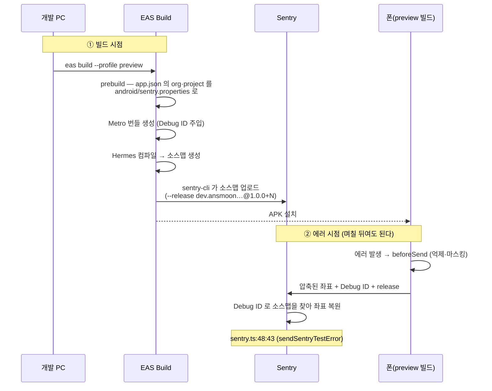
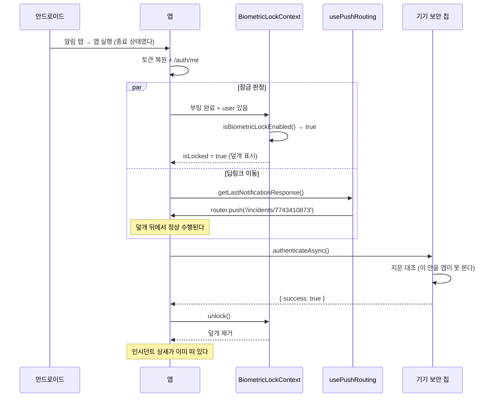

# 관측성 심화와 생체 인증 — 에러를 읽을 수 있게, 세션을 잠글 수 있게

> 대상: [1편](./01-rn-first-app.md)·[2편](./02-push-and-deeplink.md)을 읽었다고 본다. 거기서 설명한 용어(Metro, 개발 빌드, SecureStore, 딥링크 3상태 등)는 다시 풀지 않는다.
> 원본 설계: [`docs/roadmap/ops-companion-design.md`](../../roadmap/ops-companion-design.md) §6(Sentry 계측 계획) · §4.3 S1·S2 · §7(보안 원칙) · §9 Phase 2
> 짝지어 읽을 코드: [sentry.ts](../../../ops-companion/src/lib/sentry.ts) · [scrub.ts](../../../ops-companion/src/lib/scrub.ts) · [biometrics.ts](../../../ops-companion/src/lib/biometrics.ts) · [BiometricLockContext.tsx](../../../ops-companion/src/features/security/BiometricLockContext.tsx) · [ReleaseHealthCard.tsx](../../../ops-companion/src/features/observability/ReleaseHealthCard.tsx) · [ops.service.ts](../../../backend/src/ops/ops.service.ts)
> 작성 시점: 2026-09-21 (커밋 `5e8ea91`)

---

<br>

# 0장. 30초 요약

## 0-1. 한 문장

**에러가 원본 코드 위치로 복원되고, 쓸모없는 에러는 나가기 전에 걸러지고, 앱은 지문으로 잠긴다.**

2편까지 앱은 "장애를 받아 보는 도구"였다. 이번 것은 **그 도구 자신을 관측하고 지키는** 이야기다.

## 0-2. 무엇이 문제였나

1편·2편을 마친 시점에 이런 상태였다.

- 앱에서 에러가 나면 Sentry 에 `index.android.bundle:1:452103` 이라고 찍혔다. **어느 파일 몇 번째 줄인지 알 수 없다.**
- 렌더 루프 안에서 에러가 한 번 터지면 초당 수십 건이 나간다. 조직 전체가 **월 5,000건**을 나눠 쓰는데 방어 장치가 없었다.
- 에러 메시지에 사용자 이메일이나 토큰이 섞여 나가도 막을 데가 없었다.
- "이번 빌드가 저번보다 안정적인가"를 물을 방법이 없었다.
- 폰을 책상에 두고 자리를 뜨면 누구나 운영 데이터를 볼 수 있었다.

## 0-3. 결과

| 무엇이 되는가 | 검증 |
|---|---|
| 프로덕션 빌드 에러가 **원본 파일:줄:칸**으로 복원 | ✅ 실기기(preview 빌드). `sentry.ts:48:43` = `new Error(` 의 여는 괄호 |
| 같은 에러 60초 1건 + 실행당 20건 상한 | ✅ 실기기. 테스트 이벤트 3건이 **이슈 1개**로 묶임 |
| 나가는 텍스트에서 이메일·전화·토큰 마스킹 | ✅ 단위 규칙 + 실기기(`user = id:1`, 이메일 없음) |
| 에러에 `screen`·`appVersion` 태그 | ✅ 실기기. `screen = (tabs)/profile` (실제 경로가 아니라 **패턴**) |
| 릴리즈별 crash-free 세션 비율 (백엔드 + 앱 카드) | ✅ 백엔드 단위 27건 + 실기기 카드 `100% / 1.0.0+1 / 16세션` |
| 지문으로 앱 잠금, 백그라운드 60초 후 재잠금 | ✅ 실기기 |
| **푸시 탭 → 잠금 → 지문 → 인시던트 상세 직행** | ✅ 실기기 (앱 완전 종료 상태에서) |
| 운영 배포 | ✅ `5e8ea91`. health version 단언, `/ops/release-health` 401, 회귀 없음 |

마지막 줄에서 두 번째가 이번 설계의 요점이다. **잠금을 풀면 목적지에 이미 도착해 있다.** 목록으로 떨어졌다가 다시 찾아 들어가는 것이 아니다. 왜 그렇게 되는지는 3-6 에 있다.

## 0-4. 서버는 하나도 안 늘었다

생체 인증은 보통 "서버 인증"과 헷갈린다. 이번에 추가된 것을 세어 보면 분명해진다.

| | 추가된 것 |
|---|---|
| DB 테이블·컬럼 | **0** |
| 마이그레이션 | **0** |
| 새 비밀값 | **1** (Sentry 업로드 토큰 — 빌드 서버에만) |
| 서버 요청(생체 인증 과정에서) | **0** |

지문 대조는 기기 보안 칩 안에서만 일어나고, 앱이 받는 것은 `true`/`false` 뿐이다(1-7).

<br>

---

<br>

# 1장. 이번 편에서 새로 나온 용어

## 1-1. 소스맵 (source map)

**압축된 좌표를 원본 좌표로 되돌리는 대응표**다.

폰에서 도는 JS 는 사람이 쓴 것과 다르다. TypeScript 가 지워지고, 1,100개 파일이 하나로 합쳐지고, 변수 이름이 짧게 줄어든다(minify). 그래서 에러가 나면 이런 좌표만 남는다.

```
index.android.bundle:1:452103
```

한 줄짜리 파일의 452,103번째 글자. 이걸로는 아무것도 못 한다.

소스맵은 **"합친 결과의 이 위치는 원래 어느 파일 몇 줄이었다"** 를 통째로 적어 둔 파일이다. 우리 앱의 소스맵은 11MB 인데, 번들이 3.8MB 인 것에 비하면 크다. 대응표가 본문보다 클 수 있다는 게 직관에 반하지만, 위치 하나하나를 다 적으니 당연하다.

## 1-2. Debug ID

**번들과 소스맵을 짝지어 주는 고유 표식**이다.

소스맵을 Sentry 에 올려 두는 것만으로는 부족하다. 에러가 도착했을 때 **"이 에러는 어느 번들에서 났고, 그 번들의 소스맵은 어느 것인가"** 를 알아야 한다. 빌드를 여러 번 하면 번들도 소스맵도 여러 개가 되기 때문이다.

Debug ID 는 빌드할 때 번들과 소스맵 **양쪽에 같은 값**을 심는 방식으로 이 문제를 푼다.

```
번들   ─┬─ debug_id: f73d7e2c-b9e9-46bb-86f3-b6f5ee055a2c
소스맵 ─┘         (같은 값)
```

에러가 오면 Sentry 가 그 값으로 짝을 찾는다. 이 값을 심는 일은 Metro 설정 한 줄이 한다(3-1).

## 1-3. 릴리즈 (release)

**"어느 빌드에서 일어난 일인가"를 가리키는 이름표**다. Sentry 는 모든 에러와 세션에 이 이름표를 붙인다.

쇼핑몰과 RN 앱은 이름 짓는 방식이 다르다. 이 차이가 Phase 2 의 결정 하나를 좌우했다(1-4).

| | 릴리즈 이름 | 어떻게 정해지나 |
|---|---|---|
| 쇼핑몰 프론트·백엔드 | `f54ba5ec90783a8c…` | **git 커밋 SHA**. 배포마다 저절로 갈린다 |
| **RN 앱** | `dev.ansmoon.opscompanion@1.0.0+1` | **패키지명 @ 버전 + versionCode**. 네이티브 빌드 정보에서 나온다 |

앱은 자기가 어느 커밋으로 만들어졌는지 모른다. APK 안에 git 이 없기 때문이다. 그래서 네이티브 정보에 기댄다.

## 1-4. versionCode — 안드로이드의 두 번째 버전

안드로이드 앱에는 버전이 **두 개** 있다.

| | 값 | 누구를 위한 것 |
|---|---|---|
| `version` | `1.0.0` | **사람**. 스토어에 보이는 이름표 |
| `versionCode` | `1` | **기계**. 정수 하나. 큰 쪽이 새 것 |

안드로이드는 `1.0.0` 같은 글자를 이해하지 못해서, 정수 하나로만 "이게 더 새 빌드다"를 판단한다. 스토어는 같은 `versionCode` 로 업데이트를 올리지 못하게 막는다.

이 프로젝트는 스토어에 올리지 않으므로 versionCode 가 무의미해 보이지만, 실제로는 **Sentry 가 빌드를 구분하는 유일한 수단**이다(1-3 표의 `+1` 이 이 값이다). 그래서 `eas.json` 의 preview 프로필에 `autoIncrement` 를 켰다 — 켜지 않으면 모든 빌드가 Sentry 에서 한 덩어리가 되고, Release Health 라는 기능 자체가 성립하지 않는다.

## 1-5. 세션 (session)과 crash-free

**세션**은 앱을 한 번 열어서 쓰는 동안이다. 앱이 켜질 때 하나 시작되고, 백그라운드로 오래 내려가거나 종료되면 끝난다.

**crash-free sessions** 는 그중 크래시 없이 끝난 비율이다. 에러 "건수"와 다른 지표이고, 이 차이가 핵심이다.

```
에러 100건이 한 사람에게서만 발생   → 심각도 낮음
에러   1건이지만 열 때마다 죽음      → 치명적
```

건수는 이 둘을 구분하지 못하고, 비율은 구분한다. 온콜 담당자가 먼저 봐야 하는 것은 뒤쪽이다.

세션은 우리가 계측한 것이 아니다. `@sentry/react-native` 의 `enableAutoSessionTracking` 이 기본으로 켜져 있어서 **이미 보내고 있었다.** Phase 2 에서 한 일은 수집이 아니라 **읽어서 보여주기**다.

## 1-6. 태그 (tag)

**에러에 붙는 꼬리표**다. `이름 = 값` 한 쌍이고, **앱 화면에는 나타나지 않는다.** Sentry 웹에서만 보인다.

에러 한 건만 보려면 스택트레이스로 충분하다. 태그는 **모아서 볼 때** 쓴다. Sentry 검색창에 `screen:"(tabs)/profile"` 을 치면 그 화면에서 난 에러만 걸러진다. 스택트레이스로는 그 집계가 안 된다.

SDK 가 자동으로 붙이는 태그가 이미 18개쯤 있다(`device`, `os`, `release`, `level`…). 우리가 더한 것은 **우리만 아는 것 3개**다.

## 1-7. 기기 보안 칩 — 생체 정보가 앱에 오지 않는 이유

지문 이미지는 앱에 전달되지 않는다. 폰 안의 별도 보안 영역(Android StrongBox / iOS Secure Enclave)에 등록 정보가 갇혀 있고, 대조도 거기서 일어난다.

```
[앱]  "이 사람이 주인인지 확인해 줘"
  ↓
[보안 칩]  지문 센서 입력 ↔ 저장된 등록 정보 대조     ← 이 안을 앱이 들여다볼 수 없다
  ↓
[앱]  true / false 만 받음
```

그래서 생체 인증에 **서버가 필요 없다.** 우리 백엔드도, Sentry 도, DB 도 이 과정에 관여하지 않는다.

<br>

---

<br>

# 2장. 지도 — 무엇이 늘었나

## 2-1. 앱

```
ops-companion/
├── app.json                          # + Sentry org·project, expo-local-authentication
├── eas.json                          # + DSN, preview autoIncrement
├── metro.config.js                   # getDefaultConfig → getSentryExpoConfig
├── app/
│   ├── _layout.tsx                   # + useScreenTag, 잠금 덮개
│   └── (tabs)/
│       ├── incidents/index.tsx       # + 상단 요약 카드
│       └── profile.tsx               # + 생체 잠금 토글
└── src/
    ├── lib/
    │   ├── sentry.ts                 # + beforeSend, 태그, release override 제거
    │   ├── scrub.ts                  # ★ 신규: 나가는 텍스트 마스킹
    │   └── biometrics.ts             # ★ 신규: 기기 능력·인증 창·설정 저장
    └── features/
        ├── observability/            # ★ 신규
        │   ├── useScreenTag.ts       #   화면 태그
        │   ├── queries.ts            #   crash-free 쿼리
        │   └── ReleaseHealthCard.tsx #   S2 상단 카드
        └── security/                 # ★ 신규
            ├── BiometricLockContext.tsx  # 언제 잠글지
            ├── LockScreen.tsx            # 덮개 화면
            └── BiometricToggle.tsx       # 켜기/끄기
```

## 2-2. 백엔드

```
backend/src/ops/
├── ops.controller.ts          # + GET /release-health
├── ops.service.ts             # + getReleaseHealth, toReleaseHealth, buildNumberOf
├── sentry-api.client.ts       # + getSessionsByRelease
└── dto/release-health.dto.ts  # ★ 신규
```

**표는 하나도 늘지 않았다.** Phase 1 이 표 세 개를 더한 것과 대조된다. Release Health 는 Sentry 가 이미 가진 값을 읽어 오는 것이고, 생체 인증은 기기 안에서 끝난다.

<br>

---

<br>

# 3장. 코드 읽기

## 3-1. 소스맵 — 세 조각이 맞물려야 한다

소스맵 업로드는 한 곳을 고쳐서 되는 일이 아니다. 세 조각이 각각 다른 파일에 있다.

| 조각 | 어디에 | 하는 일 |
|---|---|---|
| org·project | `app.json` | prebuild 가 `android/sentry.properties` 로 떨어뜨린다 |
| Debug ID | `metro.config.js` | 번들과 소스맵에 같은 표식을 심는다 |
| 업로드 | SDK 의 `sentry.gradle` | 빌드 끝에 `sentry-cli` 로 올린다 |

**① `app.json` — 어디로 올릴지**

```json
[
  "@sentry/react-native",
  { "organization": "ansmoon", "project": "ops-companion" }
]
```

이게 없으면 빌드할 때마다 경고가 뜬다. SDK 소스가 그렇게 하고 있다(`plugin/build/withSentry.js`).

> `Missing config for organization, project. Environment variables will be used as a fallback during the build.`

이 플러그인에는 `authToken` 옵션도 있는데 **절대 쓰지 않는다.** app.json 은 저장소에 커밋되고 prebuild 때 APK 안으로 들어간다. SDK 자신도 경고를 박아 뒀다.

> `Detected unsecure use of 'authToken' in Sentry plugin configuration.`

**② `metro.config.js` — 짝짓기 열쇠**

바꾼 것은 첫 줄 하나다.

```js
const { getSentryExpoConfig } = require('@sentry/react-native/metro');
const config = getSentryExpoConfig(projectRoot);   // 전에는 getDefaultConfig
```

내부에서 Expo 의 `getDefaultConfig` 를 그대로 부른 뒤, 번들 끝에 Debug ID 를 심는 직렬화기만 얹는다. 2편에서 넣은 `blockList`·`watchFolders` 설정은 그대로 살아 있다.

로컬에서 결과를 확인할 수 있다.

```bash
npx expo export --platform android --source-maps
```

나온 `.map` 파일을 열면 `debug_id` 가 들어 있고, `sources` 배열에 우리 파일 경로가 원본 그대로 있다.

```
debug_id = f73d7e2c-b9e9-46bb-86f3-b6f5ee055a2c
sources 총 1932 / 우리 코드 19
  /ops-companion/src/lib/sentry.ts
  /ops-companion/src/contexts/AuthContext.tsx
  ...
```

**③ 업로드는 SDK 가 한다**

`sentry.gradle` 에 이 조건이 박혀 있다.

```groovy
androidComponents.onVariants(androidComponents.selector().all()) { v ->
    if (!v.name.toLowerCase().contains("debug")) {
```

**debug 가 아닌 빌드에서만** 올린다. 그래서 개발 빌드로는 복원을 확인할 수 없고 **preview 빌드가 필요하다**(6-2).

## 3-2. 릴리즈 이름은 적지 않는 것이 맞다

[`sentry.ts`](../../../ops-companion/src/lib/sentry.ts) 에서 한 줄을 **지웠다.**

```diff
- release: APP_VERSION,     // '1.0.0'
```

지운 이유가 이번 편에서 가장 미묘한 부분이다.

`release` 를 적지 않으면 SDK 가 네이티브 빌드 정보로 채운다. `@sentry/react-native` 의 `integrations/release.js` 를 열면 순서가 보인다.

```js
else if (typeof options?.release === 'string') {
  event.release = options.release;          // init 옵션이 우선
}
...
const nativeRelease = await NATIVE.fetchNativeRelease();
event.release = `${nativeRelease.id}@${nativeRelease.version}+${nativeRelease.build}`;
```

그런데 **소스맵을 올리는 Gradle 은 이 옵션을 모른다.** 네이티브 정보로 `--release` 를 정한다. 그래서 `'1.0.0'` 으로 덮어쓰면 이렇게 어긋난다.

```
에러가 말하는 릴리즈  :  1.0.0
소스맵이 올라간 릴리즈 :  dev.ansmoon.opscompanion@1.0.0+1
                          ↑ 짝이 안 맞는다
```

실제로 이 흔적이 Sentry 에 남아 있다. 고치기 전 테스트는 `1.0.0`, 고친 뒤는 전체 이름이다.

```
dev.ansmoon.opscompanion@1.0.0+1   2026-09-20T19:43   ← 고친 뒤
1.0.0                              2026-09-19T18:00   ← 고치기 전
```

같은 이름이 Release Health 에도 쓰이므로, 어긋나면 crash-free 수치도 갈라진다.

## 3-3. beforeSend — 나가기 직전의 관문

[`sentry.ts`](../../../ops-companion/src/lib/sentry.ts) 의 `beforeSend` 는 Sentry 로 이벤트가 나가기 직전에 불린다. `null` 을 돌려주면 그 이벤트는 사라진다.

```ts
function beforeSend(event: ErrorEvent): ErrorEvent | null {
  const scrubbed = scrubEvent(event);

  // 연결 확인 버튼은 "눌렀는데 안 왔다" 가 되면 확인 도구로서 쓸모가 없다. 억제에서 뺀다.
  if (scrubbed.tags?.[TEST_TAG] === 'true') return scrubbed;

  if (sentCount >= MAX_EVENTS_PER_SESSION) return null;

  const key = signatureOf(scrubbed);
  const now = Date.now();
  const previous = lastSentAt.get(key);
  if (previous !== undefined && now - previous < DEDUPE_WINDOW_MS) return null;

  lastSentAt.set(key, now);
  sentCount += 1;
  return scrubbed;
}
```

**왜 Sentry 서버의 그룹핑으로 충분하지 않은가.** Sentry 는 같은 에러를 "이슈" 하나로 묶어 준다. 그런데 **묶여도 이벤트 수는 쿼터를 그대로 깎는다.** 화면에 하나로 보일 뿐 5,000건 한도는 똑같이 닳는다. 그래서 보내기 전에 앱에서 먼저 센다.

`signatureOf` 가 무엇을 열쇠로 삼는지가 중요하다.

```ts
const frame = first?.stacktrace?.frames?.filter((f) => f.in_app).pop();
return [ first?.type, first?.value, frame ? `${frame.filename}:${frame.lineno}` : '' ].join('|');
```

예외 종류·메시지에 더해 **우리 코드의 첫 프레임**을 넣는다. 같은 메시지라도 다른 화면에서 터진 것은 다른 문제이기 때문이다.

상한을 두 겹으로 둔 이유도 있다. 60초 창은 **같은 에러의 연타**를 막고, 실행당 20건은 **장애가 길어질 때**를 막는다. 웹의 탭 단위(10건)보다 넉넉한 것은 앱이 며칠씩 켜져 있기 때문이다.

## 3-4. 마스킹 — 앱은 토큰을 손에 들고 다닌다

[`scrub.ts`](../../../ops-companion/src/lib/scrub.ts) 의 규칙은 절반이 백엔드 [`scrub-text.ts`](../../../backend/src/common/utils/scrub-text.ts) 와 **같다**(이메일·한국 전화번호). 나머지 절반은 앱에만 있다.

| 패턴 | 왜 앱에만 필요한가 |
|---|---|
| `Bearer …` | 요청 헤더가 에러 메시지에 섞여 나갈 수 있다 |
| JWT (`eyJ….….…`) | SecureStore 에서 꺼낸 토큰이 로그에 찍힐 수 있다 |
| `ExponentPushToken[…]` | 유출되면 남이 이 폰으로 알림을 쏠 수 있다 |

JWT 패턴이 `eyJ` 로 시작하는 이유는, 그게 `{"` 를 base64 로 인코딩한 값이기 때문이다. JWT 는 항상 JSON 으로 시작하므로 모든 JWT 가 이 세 글자로 시작한다.

마스킹은 **두 군데**에서 건다.

```ts
beforeSend,
beforeBreadcrumb: scrubBreadcrumb,
```

`beforeBreadcrumb` 은 행동 기록이 **쌓일 때** 걸린다. `beforeSend` 안의 `scrubEvent` 도 같은 일을 하지만, 이쪽이 먼저라 원문이 앱 메모리에 머무는 시간 자체가 없어진다. 마스킹은 멱등이라 두 번 거쳐도 결과가 같다 — 가려진 `***` 는 어느 패턴에도 다시 걸리지 않는다.

사용자 정보는 나가는 길목에서 한 번 더 막는다.

```ts
if (event.user) {
  event.user = { id: event.user.id };
}
```

`setSentryUser` 가 이미 id 만 넣지만, SDK 통합이나 나중의 코드가 이메일을 붙일 수 있다. 실제 이벤트에서 `user = id:1` 만 찍히는 것을 확인했다.

## 3-5. 태그 — `usePathname` 이 아니라 `useSegments`

[`useScreenTag.ts`](../../../ops-companion/src/features/observability/useScreenTag.ts) 는 짧지만 선택 하나가 중요하다.

```ts
const segments = useSegments();
const screen = segments.length > 0 ? segments.join('/') : '(root)';
Sentry.setTag('screen', screen);
```

`usePathname()` 을 쓰면 안 된다. 그건 **실제 주소**라 인시던트마다 값이 갈라진다.

```
usePathname()  → /incidents/7744504775 , /incidents/7742712093 , …   ← 무한히 갈라진다
useSegments()  → (tabs)/incidents/[id]                                ← 항상 하나
```

값이 무한히 갈라지는 것을 **높은 카디널리티**라고 하는데, 그러면 집계가 불가능해진다. "이 화면에서 에러가 몰린다"를 보려고 만든 태그가 인시던트 하나당 한 줄씩 늘어나 버린다.

expo-router 타입 선언이 이 성질을 보장한다.

> *Segments are not normalized, so they will be the same as the file path. For example, `/[id]?id=normal` becomes `["[id]"]`.*

## 3-6. 잠금은 화면 이동이 아니라 덮개다

이번 편에서 가장 공들인 설계 판단이다.

로그인 분기는 라우트를 갈아끼운다(`Stack.Protected`, [1편 6-5](./01-rn-first-app.md)). 잠금도 그렇게 만들 수 있었지만 **일부러 다르게** 했다.

```tsx
<View style={styles.root}>
  <Stack screenOptions={{ ... }}>
    <Stack.Protected guard={user !== null}>
      <Stack.Screen name="(tabs)" />
    </Stack.Protected>
    ...
  </Stack>
  {isLocked ? <LockScreen /> : null}
</View>
```

`Stack` 을 **그대로 두고 그 위에 겹친다.** 덮개는 불투명하게 화면 전체를 가린다.

```ts
overlay: {
  position: 'absolute',
  top: 0, left: 0, right: 0, bottom: 0,
  backgroundColor: colors.background,
  zIndex: 10,
},
```

**왜 이렇게 하는가.** 잠긴 동안에도 뒤에서 내비게이션이 정상으로 돌아가기 때문이다.

```
푸시 탭 → 앱 켜짐
  ├── [뒤] usePushRouting 이 router.push('/incidents/7743410873')  ← 정상 수행
  └── [앞] 덮개가 가림
       ↓ 지문
     덮개 제거 → 인시던트 상세가 이미 떠 있다
```

라우트로 만들었다면 "잠금 화면으로 갔다가 원래 목적지로 되돌아가는" 처리를 **2편의 pending deep link 와 한 벌 더** 만들어야 했다. 덮개는 그 문제를 아예 만들지 않는다.

## 3-7. 언제 잠그나 — 두 시점

[`BiometricLockContext.tsx`](../../../ops-companion/src/features/security/BiometricLockContext.tsx) 가 두 가지를 본다.

**① 앱을 켤 때.** 부팅(토큰 복원 + `/auth/me`)이 끝나고 로그인 상태일 때만 판정한다.

```ts
if (isBooting || bootChecked.current) return;
bootChecked.current = true;
if (!user) return;
void isBiometricLockEnabled().then((enabled) => { if (enabled) setIsLocked(true); });
```

`bootChecked` 로 **앱 실행당 한 번**만 돌게 막는다. 없으면 `user` 가 바뀔 때마다 다시 잠근다.

**② 백그라운드에서 돌아올 때.**

```ts
const RELOCK_AFTER_MS = 60_000;
```

0 으로 두면 알림 하나 확인하고 돌아올 때마다 잠겨서 쓸 수가 없다. 60초는 "자리를 뜬 것"과 "잠깐 다녀온 것"을 가르는 선이다.

되돌아갈 때 로그인 상태를 다시 확인하는 것도 이유가 있다.

```ts
// 로그아웃 상태면 잠글 세션 자체가 없다. 로그인 화면을 덮개로 가리면 안 된다.
if (enabled && user) setIsLocked(true);
```

## 3-8. 인증 창 — 막지 않은 것

[`biometrics.ts`](../../../ops-companion/src/lib/biometrics.ts) 의 옵션 하나가 판단을 담고 있다.

```ts
const result = await LocalAuthentication.authenticateAsync({
  promptMessage,
  cancelLabel: '취소',
  disableDeviceFallback: false,
});
```

`false` 는 "지문을 여러 번 실패하면 OS 가 기기 PIN 으로 넘겨줘도 좋다"는 뜻이다. 보안만 생각하면 막는 쪽이 세다. 그런데 이건 **온콜 앱**이다.

```
손이 젖었다 / 센서가 더럽다 → 지문 실패 → 장애 알림을 못 본다
```

앱을 못 여는 쪽이 더 큰 위험이라고 봤다. 어차피 여기서 지키는 대상은 "이 폰을 집어든 남"이지 기기 PIN 까지 아는 사람이 아니다.

[`LockScreen`](../../../ops-companion/src/features/security/LockScreen.tsx) 에 로그아웃 버튼을 둔 것도 같은 이유다. 지문이 아예 안 읽히면 **앱을 지우는 것 말고 방법이 없어진다.**

실패 사유도 구분해 보여준다.

```ts
if (error === 'user_cancel' || error === 'system_cancel' || error === 'app_cancel') {
  return '잠금을 해제하면 계속 사용할 수 있습니다.';
}
```

사용자가 스스로 닫은 것은 실패가 아니다. "인증에 실패했습니다"를 띄우면 겁을 준다.

## 3-9. 토글 — 켤 때만 인증을 요구한다

[`BiometricToggle.tsx`](../../../ops-companion/src/features/security/BiometricToggle.tsx) 의 규칙이다.

- **켤 때**: 인증을 요구한다. 증명 없이 켜면 "내 지문으로 잠갔다"가 성립하지 않는다.
- **끌 때**: 요구하지 않는다. 이 화면에 닿았다는 것 자체가 이미 잠금을 통과했다는 뜻이다.

기기 능력은 **두 가지를 따로** 확인한다.

```ts
const [hasHardware, isEnrolled, types] = await Promise.all([
  LocalAuthentication.hasHardwareAsync(),
  LocalAuthentication.isEnrolledAsync(),
  LocalAuthentication.supportedAuthenticationTypesAsync(),
]);
```

다른 질문이기 때문이다. **센서가 달렸나**(`hasHardware`)와 **사용자가 등록했나**(`isEnrolled`)는 별개다. 센서가 있어도 등록이 없으면 인증 창이 뜨자마자 실패하므로 토글을 보여주면 안 된다.

쓸 수 없는 기기에는 토글 대신 **이유**를 보여준다. 눌러도 아무 일이 없는 스위치보다 "기기 설정에서 지문 또는 얼굴을 먼저 등록해주세요" 한 줄이 사용자를 실제로 움직이게 한다. 2편의 푸시 등록 상태를 사유별로 나눈 것과 같은 방침이다.

## 3-10. Release Health — `project` 를 빼면 안 된다

[`sentry-api.client.ts`](../../../backend/src/ops/sentry-api.client.ts) 의 새 메서드다.

```ts
const params = new URLSearchParams({
  statsPeriod,
  groupBy: 'release',
  project: this.appProjectSlug,
});
params.append('field', 'crash_free_rate(session)');
params.append('field', 'sum(session)');
```

`project` 를 빠뜨리면 **조직 전체가 합산된다.** 실측으로 확인했다.

```
project=ops-companion  → 그룹 1개    dev.ansmoon.opscompanion@1.0.0+1 → 16세션
project 생략           → 그룹 9개    e76791f92bdd… → 245세션   ← 쇼핑몰
                                     f54ba5ec9078… →  43세션   ← 쇼핑몰
                                     dev.ansmoon…  →  16세션
```

쇼핑몰 웹도 세션을 보내고 있어서, 안 주면 앱의 건강 지표에 웹 수치가 섞인다.

집계 기간은 **14일**이다. 인시던트 목록(24시간)보다 훨씬 길게 잡은 이유는 산수로 보면 분명하다.

| 기간 | 세션 | 크래시 1번 나면 |
|---|---|---|
| 14일 | 16건 | **93.75%** |
| 1일 | 1~2건 | **50% 또는 0%** |

같은 사고 한 번인데 하루 창으로 보면 "앱이 반은 죽는다"가 되어 버린다.

## 3-11. 정렬 — 세션 수로 세우면 안 된다

[`ops.service.ts`](../../../backend/src/ops/ops.service.ts) 의 `toReleaseHealth` 가 응답을 다시 세운다.

```ts
.sort((a, b) => {
  const buildA = OpsService.buildNumberOf(a.release);
  const buildB = OpsService.buildNumberOf(b.release);
  if (buildA !== null && buildB !== null && buildA !== buildB) return buildB - buildA;
  return b.sessions - a.sessions;
})
```

처음에는 세션 수 내림차순이었다. 릴리즈가 하나뿐이라 드러나지 않았던 버그가 있었다.

```
새 빌드는 배포 직후라 세션이 적다
   → 세션 순으로 세우면 항상 아래로 밀린다
   → 카드의 큰 글씨 자리를 옛 빌드가 차지한다
   → "새 빌드가 나아졌나"를 보려고 만든 카드가 옛 빌드를 보여준다
```

그래서 릴리즈 이름 끝의 `+N`(versionCode)을 읽어 **큰 쪽이 위**로 가게 했다.

```ts
static buildNumberOf(release: string): number | null {
  const matched = /\+(\d+)$/.exec(release);
  return matched ? Number.parseInt(matched[1], 10) : null;
}
```

쇼핑몰처럼 `+N` 이 없는 이름(커밋 SHA)은 세션 수로 되돌아간다.

## 3-12. 카드는 실패해도 조용하다

[`ReleaseHealthCard.tsx`](../../../ops-companion/src/features/observability/ReleaseHealthCard.tsx) 의 첫 줄이 방침을 말한다.

```tsx
if (isError || !data || data.releases.length === 0) return null;
```

이 카드는 **보조 정보**다. 인시던트 목록이 본체이고, 요약 때문에 본체를 못 보는 일이 없어야 한다. 그래서 실패하면 자리째 사라진다.

로딩 중에도 스켈레톤을 두지 않았다. 넣으면 목록이 한 번 밀렸다가 제자리를 찾는다.

당겨서 새로고침할 때는 **둘을 함께** 갱신한다.

```ts
const onRefresh = useCallback(() => {
  void refetch();
  void refetchHealth();
}, [refetch, refetchHealth]);
```

목록만 갱신되고 카드가 옛 수치로 남으면, 같은 화면 안에서 두 숫자가 서로 다른 시점을 가리키게 된다.

<br>

---

<br>

# 4장. 흐름

## 4-1. 소스맵 — 빌드 때 올리고, 에러가 올 때 쓴다



## 4-2. 푸시 → 잠금 → 상세 (이번 편의 DoD 장면)



<br>

---

<br>

# 5장. 2편과 달라진 점

| 항목 | 2편(Phase 1) | 이번(Phase 2) |
|---|---|---|
| Sentry 에 찍히는 스택 | `index.android.bundle:1:452103` | `src/lib/sentry.ts:48:43` |
| 나가는 이벤트 | 전부 나감 | 60초 1건 + 실행당 20건, PII 마스킹 |
| 에러에 붙은 정보 | SDK 기본 태그만 | `+ screen · appVersion` |
| 앱의 건강 지표 | 없음 | 릴리즈별 crash-free (목록 상단 카드) |
| 세션 보호 | 없음 | 지문 잠금 (시작 시 + 백그라운드 60초 후) |
| 빌드마다 릴리즈 | 전부 `+1` 한 덩어리 | `autoIncrement` 로 갈린다 |
| DB | 표 3개 추가 | **변화 없음** |

<br>

---

<br>

# 6장. 실제로 밟은 함정

## 6-1. EAS 빌드에서 Sentry 가 꺼져 있었다

소스맵을 붙이기 전에 더 근본적인 문제가 있었다. **EAS 로 만든 빌드에는 DSN 이 없었다.**

`.easignore` 는 `.env` 를 업로드에서 제외한다(비밀값이 빌드 서버로 가지 않게 하려는 의도다). 그런데 `EXPO_PUBLIC_SENTRY_DSN` 이 거기 들어 있었고, `eas.json` 에는 없었다. 결과적으로 EAS 빌드는 DSN 이 빈 채로 만들어졌고, [`sentry.ts`](../../../ops-companion/src/lib/sentry.ts) 의 `if (!SENTRY_DSN) return;` 때문에 **Sentry 가 통째로 no-op** 이었다.

소스맵을 올려도 복원할 에러가 애초에 도착하지 않는 상태였다.

→ DSN 은 공개돼도 되는 값이므로(설계 §3.1 절대 규칙 3) `eas.json` 의 preview·production `env` 에 직접 적었다.

**교훈**: 로컬에서 되는 것과 EAS 에서 되는 것은 **환경 변수 출처가 다르다.** 로컬은 `.env`, EAS 는 `eas.json` + EAS 서버 변수다.

## 6-2. 개발 빌드로는 소스맵을 확인할 수 없다

빌드를 하고도 스택이 복원되지 않아 한참 봤다. `sentry.gradle` 을 열어 보니 이유가 한 줄로 있었다.

```groovy
if (!v.name.toLowerCase().contains("debug")) {
```

**debug 가 아닌 변형에서만** 업로드한다. 개발 빌드는 debug 변형이다(게다가 JS 를 PC 의 Metro 에서 받으므로 APK 안에 번들이 없다).

→ 복원 확인은 **preview 빌드**로 해야 한다. 2편 6-10 의 "cold start 는 preview 로" 와 같은 결론에 다른 경로로 도착한 셈이다.

## 6-3. 릴리즈 이름이 두 갈래로 갈라져 있었다

3-2 에서 설명한 것인데, **증상이 없어서** 찾기 어려운 종류다. 앱은 정상 동작하고 에러도 도착한다. 다만 소스맵과 짝이 안 맞아 복원만 안 된다.

Sentry 의 소스맵 목록에 두 이름이 나란히 남아 있는 것을 보고 확정했다.

```
dev.ansmoon.opscompanion@1.0.0+1   ← 고친 뒤
1.0.0                              ← 고치기 전
```

**교훈**: 빌드 도구(Gradle)와 런타임(JS)이 같은 값을 **각자** 계산하는 자리가 있으면, 한쪽만 바꿔도 조용히 어긋난다.

## 6-4. `nx serve` 는 코드를 바꿔도 서버를 다시 띄우지 않는다

Release Health 를 만들고 로컬에서 확인하는데 계속 404 였다. 코드도 맞고, 컴파일된 `dist/main.js` 에도 라우트가 들어 있었다.

시각을 초 단위로 보니 답이 나왔다.

```
12:38:12  node 시작        ← 이때 있던 옛 main.js 를 메모리에 올림
12:38:27  main.js 기록     ← 15초 뒤에야 새 코드가 파일로 떨어짐
12:39:25  curl             → 404
```

`nx serve backend` 는 **먼저 node 를 띄우고 그 다음 빌드 결과를 쓴다.** node 는 파일이 바뀌어도 다시 읽지 않는다.

→ 백엔드를 고쳤으면 `Ctrl+C` 후 다시 띄운다. 확인은 시작 로그의 이 줄이다.

```
[RouterExplorer] Mapped {/v1/ops/release-health, GET} route
```

## 6-5. `project` 파라미터를 slug 로 줘도 된다 — 확인하고 코드를 줄였다

처음에는 "sessions API 는 숫자 project id 만 받는다"고 판단해, slug 를 id 로 바꾸는 단계를 넣었다. `/projects/` 를 한 번 더 불러 목록에서 찾고, 결과를 필드에 기억하는 코드였다.

실제로 둘 다 던져 보니 **같은 결과**였다.

```
project=ops-companion       → 200, 그룹 1개, 16세션
project=4512113584111616    → 200, 그룹 1개, 16세션
```

→ 해석 단계를 통째로 들어냈다. API 호출 1회, 캐시 필드 1개, 404 실패 경로 1개가 사라졌다.

**교훈**: "문서에 이렇게 적혀 있다"와 "실제로 이렇게 동작한다"가 다를 때가 있다. 코드를 늘리기 전에 한 번 쏴 보는 것이 싸다.

## 6-6. 기기 토큰이 화면에서 잘려 읽을 수 없었다

푸시를 수동으로 보내려고 프로필의 "기기 토큰"을 읽으려는데, `numberOfLines={1}` 때문에 41자 토큰이 `...` 으로 잘려 있었다. **표시는 되는데 쓸 수가 없는** 상태였다.

그리고 화면에서 손으로 옮겨 적었더니 이렇게 됐다.

```
DeviceNotRegistered
  받은 값 : …VDI0d…   ← 대문자 I 로 읽음
  진짜 값 : …VDl0d…   ← 소문자 L
```

폰의 작은 글씨에서 `I`(대문자 i)·`l`(소문자 L)·`0`·`O` 는 구분이 거의 안 된다.

→ 두 가지를 고쳤다. `Field` 에 `full` 옵션을 더해 **전체 표시 + 길게 눌러 복사**되게 했고, `PushContext` 에서 `__DEV__` 일 때만 토큰을 콘솔에 찍게 했다(PC 터미널에서 마우스로 복사할 수 있다). 배포 빌드 로그에는 남지 않는다.

**교훈**: "화면에 있다"와 "쓸 수 있다"는 다르다. 옮겨 적어야 하는 값은 옮겨 적을 수 있어야 한다.

## 6-7. 태그가 앱 화면에 안 보이는 것은 정상이다

beforeSend 와 태그를 붙이고 앱을 열었는데 **아무것도 달라지지 않아** 실패한 줄 알았다. 당연한 결과였다. 이번 변경은 화면을 한 군데도 건드리지 않고 **Sentry 로 나가는 데이터**만 손댄 것이다.

확인은 Sentry 웹에서 이슈를 열어 **Tags** 섹션을 봐야 한다.

다만 그때 진짜 문제도 하나 섞여 있었다. 폰이 **옛 JS** 를 돌고 있었던 것이다. 판별법이 마침 코드 안에 있었다.

```
Sentry 연결 테스트 2026-09-20T20:02:46.089   ← 시각 있음 = 옛 코드
[ops-companion] Sentry 연결 테스트            ← 시각 없음 = 새 코드
```

테스트 메시지에서 타임스탬프를 뺀 것은 쿼터 때문이었는데(누를 때마다 새 이슈가 생겼다), 뜻밖에 **배포 확인 표식**으로도 쓸모가 있었다.

## 6-8. `StyleSheet.absoluteFillObject` 가 타입에 없다

덮개 스타일을 쓰면서 관용적으로 이걸 썼는데 타입 에러가 났다.

```
error TS2551: Property 'absoluteFillObject' does not exist on type 'typeof StyleSheet'.
Did you mean 'absoluteFill'?
```

RN 0.86 의 타입 선언에서 빠진 듯하다. `top/left/right/bottom: 0` 을 직접 적어 해결했고, 오히려 덮개가 무엇을 하는지 읽기 쉬워졌다.

<br>

---

<br>

# 7장. 실행과 확인

## 7-1. 소스맵 — 처음 한 번

Sentry → **Settings → Developer Settings → Organization Tokens** → Create New Token.

**Organization Token**(`sntrys_` 로 시작)이다. 권한이 CI 용으로 고정돼 릴리즈·소스맵 업로드는 되고 이슈 조회는 안 된다. 백엔드가 폴링에 쓰는 **개인 토큰**(`sntryu_`, 권한을 직접 고른 것)과 다른 토큰이다.

```bash
cd ops-companion
eas env:set --name SENTRY_AUTH_TOKEN --visibility secret --environment preview --environment production
```

값은 명령행에 적지 않는다. 생략하면 CLI 가 물어보고, `secret` 이라 입력이 화면에 보이지 않는다. 명령행에 적으면 셸 기록에 남는다.

변수 이름은 반드시 `SENTRY_AUTH_TOKEN` 이어야 한다. 빌드 서버에서 `sentry-cli` 가 그 이름으로 찾는다.

확인:

```bash
eas env:list preview     # SENTRY_AUTH_TOKEN=***** (secret)
```

> 빌드 로그의 `No environment variables with visibility "Plain text" and "Sensitive" found...` 는 **secret 을 세지 않는다.** 그 메시지만으로는 등록 여부를 알 수 없다.

## 7-2. 확인 체크리스트 (Phase 2 완료 기준)

**소스맵** (preview 빌드 필요)

- [x] 빌드 로그에 `Sentry-CLI arguments:` 와 업로드 성공
- [x] 에러의 스택이 `src/lib/sentry.ts:48:43` 처럼 원본 좌표
- [x] 이슈의 release 가 `dev.ansmoon.opscompanion@1.0.0+N`

**beforeSend · 태그**

- [x] 테스트 에러를 여러 번 눌러도 **이슈 1개**, 이벤트 수만 증가
- [x] Tags 에 `screen`·`appVersion`·`ops.test`
- [x] Breadcrumbs 에 `[navigation] (tabs)/profile`
- [x] `user` 가 id 뿐 (이메일 없음)

**Release Health**

- [x] `curl -i .../v1/ops/release-health` → **401**(라우트 존재)
- [x] 인시던트 목록 상단에 카드, 100% 가 초록색
- [x] 당겨서 새로고침하면 카드도 갱신

**생체 인증**

- [x] 프로필에 "생체 잠금" 카드 (지문 등록돼 있으면 스위치, 아니면 이유)
- [x] 켤 때 지문 인증 창
- [x] 앱 완전 종료 후 재실행 → 잠금 화면 → 지문으로 해제
- [x] 다른 앱으로 1분 넘게 나갔다 돌아오면 재잠금
- [x] **알림 탭 → 잠금 해제 → 인시던트 상세가 이미 떠 있음**

## 7-3. 안 될 때

| 증상 | 확인할 것 |
|---|---|
| 스택이 여전히 `index.android.bundle:…` | ① preview 빌드인가(개발 빌드는 안 올린다) ② 빌드 로그에 `Sentry-CLI` 가 있나 ③ `eas env:list preview` 에 토큰이 있나 |
| 에러가 Sentry 에 아예 안 온다 | `yarn start` 는 `__DEV__` 라 Sentry 가 꺼진다. `--no-dev --minify` 로 띄운다 |
| 태그가 안 보인다 | Sentry 웹 → 이슈 → **Tags** 섹션. 앱 화면에는 원래 안 나온다 |
| 새 코드인지 모르겠다 | 테스트 에러 메시지에 **시각이 붙어 있으면 옛 코드**다(6-7) |
| `release-health` 가 404 | 백엔드를 재시작했나(6-4). 시작 로그의 `Mapped {/v1/ops/release-health, GET}` 확인 |
| 카드만 안 보인다 | 보조 정보라 실패하면 조용히 사라진다. 백엔드 로그를 본다 |
| 카드에 커밋 SHA 릴리즈가 뜬다 | `project` 필터가 풀렸다(3-10) |
| 잠금이 안 걸린다 | 프로필 토글이 켜져 있나. 앱 시작 또는 백그라운드 60초 후에만 걸린다 |
| 푸시를 수동으로 보내고 싶다 | 기기 토큰은 `__DEV__` 콘솔에 찍힌다(6-6). Expo Push API 로 직접 POST |

<br>

---

<br>

# 8장. 다음은 무엇인가

Phase 3 은 **AI 분석**이다.

- 인시던트 상세에서 "AI에게 원인 물어보기" → 백엔드가 Sentry 상세를 프롬프트로 조립해 LLM 호출
- 응답을 **구조화된 JSON**(심각도·원인·조치·관련 파일)으로 강제하고, 스키마를 어기면 fallback UI
- AI 호출을 Sentry **커스텀 span** 으로 감싸 지연·실패율을 관측한다 — 이번 편에서 `tracesSampleRate: 0` 으로 꺼 둔 것을 그때 켠다

쇼핑몰의 관리자 AI 어시스턴트가 쓰는 `LlmClient`·SSE·PII 스크럽을 그대로 재사용한다(설계 §3.4).
