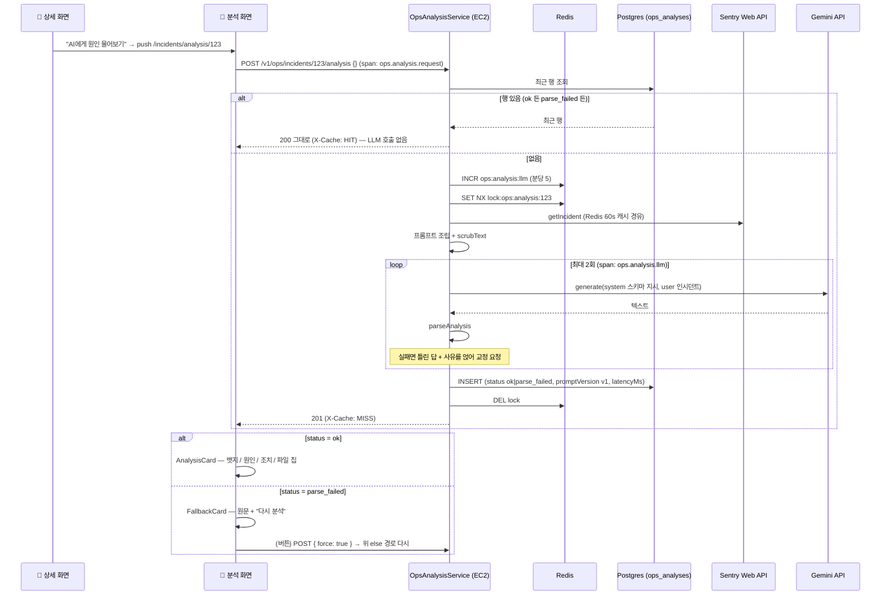

# AI 분석 — 스키마를 어겨도 깨지지 않게

> 대상: [1편](./01-rn-first-app.md)·[2편](./02-push-and-deeplink.md)·[3편](./03-observability-and-biometrics.md)을 읽었다고 본다. 거기서 설명한 용어(Metro, 개발 빌드, SecureStore, 딥링크, 소스맵, span 이전의 Sentry 개념 등)는 다시 풀지 않는다.
> 원본 설계: [`docs/roadmap/ops-companion-design.md`](../../roadmap/ops-companion-design.md) §3.4(AI 분석 파이프라인) · §4.3 S4 · §5.3 `ops_analyses` · §5.4(응답 스키마) · §6 "AI 호출 계측" · §9 Phase 3
> 재사용한 자산의 원본: [`docs/roadmap/ex-ai-assistant.md`](../../roadmap/ex-ai-assistant.md) (쇼핑몰 관리자 AI 어시스턴트 — `LlmClient`, `scrubText`, judge 파서)
> 짝지어 읽을 코드: [ops-analysis.service.ts](../../../backend/src/ops/ops-analysis.service.ts) · [analysis.dto.ts](../../../backend/src/ops/dto/analysis.dto.ts) · [ops-analysis.entity.ts](../../../backend/src/ops/entity/ops-analysis.entity.ts) · [analysis/[id].tsx](../../../ops-companion/app/%28tabs%29/incidents/analysis/%5Bid%5D.tsx) · [AnalysisCard.tsx](../../../ops-companion/src/features/analysis/AnalysisCard.tsx) · [queries.ts](../../../ops-companion/src/features/analysis/queries.ts) · [sentry.ts](../../../ops-companion/src/lib/sentry.ts)
> 작성 시점: 2026-09-21 (브랜치 `feat/ops-ai-analysis`, 커밋 전 — 실기기 DoD 통과. 남은 것은 운영 배포와 Sentry span 확인, 0-3 표 참고)

---

<br>

# 0장. 30초 요약

## 0-1. 한 문장

**인시던트 상세에서 버튼 하나를 누르면 백엔드가 LLM 에게 스택트레이스를 읽히고, 정해진 형식의 답만 카드로 그린다. 형식을 어기면 원문을 보여주고 다시 물을 수 있다.**

3편까지 앱은 "장애를 받아 보고, 자기 자신을 지키는 도구"였다. 이번 것은 처음으로 **판단을 돕는** 이야기다.

## 0-2. 무엇이 문제였나

- 푸시를 받고 상세를 열면 스택트레이스 30줄과 직전 행동 30건이 있다. 새벽 3시에 폰으로 그걸 읽고 원인을 짚는 것은 다른 일이다.
- 쇼핑몰에는 이미 관리자 AI 어시스턴트가 있다(Gemini, 프로바이더 비종속 `LlmClient`). **AI 호출부를 새로 짤 이유가 없다.**
- AI 는 시키는 대로 답하지 않는다. "JSON 만 내라"고 해도 코드펜스를 씌우고, 설명을 붙이고, 가끔은 산문만 낸다. **앱이 그때 깨지면 안 된다.** 이 방어가 이번 Phase 의 핵심이고, 설계 문서가 "포트폴리오 어필 포인트"라고 적어 둔 부분이다.
- 무료티어는 분당 15회다. 화면을 열 때마다 AI 를 부르면 하루 만에 막힌다.

## 0-3. 결과

| 무엇이 되는가 | 검증 |
|---|---|
| `POST /v1/ops/incidents/:id/analysis` — 상세 재사용 → 프롬프트 → LLM → 검증 → 저장 | ✅ 단위 15건(LLM 모킹) · **로컬 실인시던트 1건 실측**: Gemini flash-lite 가 1회 시도에 스키마를 지켰다(2.4초, `ok`) |
| 응답 파서 — 코드펜스·잡담을 벗기고, 허용값 밖이면 실패 | ✅ 단위 14건 |
| 스키마 위반 시 **사유를 실은 교정 재시도 1회**, 그래도 실패면 `parse_failed` 로 저장 | ✅ 단위 |
| `ops_analyses` 표 + `promptVersion` 저장(Phase 4 의 비교 축) | ✅ 마이그레이션 로컬 적용 · e2e 가 행을 직접 조회해 단언 |
| 같은 이슈를 다시 열면 저장된 행을 준다(`X-Cache: HIT`). AI 를 다시 부르는 것은 "다시 분석" 뿐 | ✅ e2e · 실측(두 번째 호출 HIT, 같은 id) |
| 분당 상한(기본 5) 초과 429 · 같은 이슈 동시 요청 409 · LLM 키 없음 503 | ✅ 단위 |
| S4 화면 — 스켈레톤 / 구조화 카드 / **fallback(원문 + 다시 분석)** / HTTP 에러 문구 6종 | ✅ **실기기**(개발 빌드 `8f91794d` + 로컬 백엔드, 2026-09-21): 뱃지 "보통" + "확신도 높음" · 원인 · 코드가 든 추천 조치 · 관련 파일 칩 |
| S3 의 "AI에게 원인 물어보기" CTA | ✅ 실기기 |
| 강제 실패 — `simulate:'parse_failed'`(비운영 전용) + 개발 빌드의 `[DEV]` 버튼 | ✅ 실기기: "구조화하지 못했습니다" + `[simulated parse_failed]` 원문 + "다시 분석" → 새 카드로 복귀. **앱이 죽지 않았다** |
| AI 호출 span — 앱 `ops.analysis.request` · 백엔드 `ops.analysis.llm` | ✅ 코드 · ⏳ Sentry Performance 에서 미확인(개발 모드는 Sentry 가 꺼져 있다 — preview + 운영 배포 뒤) |
| 운영 배포 | ⏳ **미배포**. 마이그레이션 1건이 있다(`run --rm … migrate.js`) |

**첫 실기기 분석의 내용은 그럴듯했지만 틀렸다**(6-8). DoD 는 "카드가 렌더된다"이지 "분석이 맞다"가 아니다 — 맞는지를 가리는 것이 Phase 4 다.

## 0-4. 무엇이 늘었나

3편이 "서버는 하나도 안 늘었다"였다면 이번은 반대다. 정직하게 센다.

| | 추가된 것 |
|---|---|
| DB 표 | **1** (`ops_analyses`) |
| 마이그레이션 | **1** |
| 외부 서비스 | **1** (LLM API — 현재 Gemini. 단, 쇼핑몰이 이미 쓰던 것이라 새 계정·새 키는 아니다) |
| 새 비밀값 | **0** (`GEMINI_API_KEY` 는 백엔드 `.env` 에 이미 있었다) |
| 앱 패키지 | **1** (`expo-clipboard` — 복사 버튼. `npx expo install` 로 SDK 호환 버전) |
| 앱에 들어간 비밀 | **0** — 앱은 여전히 백엔드만 부른다 |

<br>

---

<br>

# 1장. 이번 편에서 새로 나온 용어

## 1-1. LLM API 는 그냥 HTTP API 다

> **LLM(Large Language Model)**: 텍스트를 넣으면 텍스트를 내는 모델. Gemini, Claude 가 여기 속한다.

가장 큰 오해부터. LLM API 는 신비로운 것이 아니라 **JSON 을 보내고 JSON 을 받는 엔드포인트 하나**다([ex-ai-assistant §2-1](../../roadmap/ex-ai-assistant.md)). 웹에서 `fetch('/api/products')` 를 부르는 것과 구조가 같고, 다른 점은 응답이 **비결정적**이라는 것뿐이다. 같은 입력에 매번 같은 답이 오지 않는다.

그래서 우리 코드는 LLM 을 "믿을 수 없는 외부 입력"으로 다룬다. 사용자가 보낸 폼 값을 검증하듯 LLM 응답도 검증한다.

## 1-2. 프롬프트 — system 과 user

> **프롬프트(prompt)**: LLM 에 넣는 텍스트 전체. 역할·규칙을 적는 **system** 과 이번 질문을 적는 **user** 로 나뉜다.

우리 프롬프트는 이렇게 나뉜다.

| 부분 | 내용 | 바뀌나 |
|---|---|---|
| system | "너는 시니어 엔지니어다. 이 JSON 스키마로만 답하라. 지어내지 마라." | 안 바뀐다(프롬프트 버전으로 관리) |
| user | 인시던트 제목·예외·스택 20줄·직전 행동 15건 | 인시던트마다 |

[`LlmClient`](../../../backend/src/intrastructure/ai/llm-client.interface.ts) 가 system 을 `{ static, dynamic? }` 로 받는 이유는 캐싱 때문인데(어시스턴트 Phase 6), 우리는 static 만 쓴다.

## 1-3. 스키마 검증 — "관대하게 읽고 엄격하게 검증"

> **스키마(schema)**: 응답이 가져야 할 모양. 우리 것은 필드 다섯 개다(설계 §5.4).

```ts
{ severity: 'critical'|'high'|'medium'|'low', rootCause: string, suggestedFix: string,
  relatedFiles: string[], confidence: 'high'|'medium'|'low' }
```

LLM 은 이 모양을 **거의** 지킨다. 문제는 "거의"다. 3-2 에서 무엇이 어긋나는지, 어디까지 봐주는지 본다.

## 1-4. 프롬프트 버전

프롬프트 문구를 바꾸면 답의 품질이 바뀐다. 나중에 "v1 때 승인율 60%, v2 때 80%"라고 말하려면 **각 분석이 어느 프롬프트로 만들어졌는지** 남아 있어야 한다. 그래서 행마다 `promptVersion` 을 저장한다. Phase 4 의 평가 루프가 이 값을 축으로 쓴다. 지금은 전부 `v1` 이다.

## 1-5. RPM — 무료티어의 벽

> **RPM(requests per minute)**: 분당 요청 수 상한. Gemini 무료티어는 15.

한 번의 분석이 LLM 을 최대 2회 부른다(첫 시도 + 교정 재시도). 관리자 어시스턴트도 같은 키를 쓴다. 그래서 분석은 **분당 5건**으로 스스로 제한한다(2×5 = 10 < 15). 넘으면 429 를 돌려주고 앱은 "1분 뒤 다시"를 그린다.

## 1-6. span 과 트랜잭션 — "느렸다"를 남기는 단위

> **span**: Sentry 에서 "이 구간이 얼마나 걸렸고 어떻게 끝났나"를 기록하는 단위. **트랜잭션**은 최상위 span 이다.

3편까지 Sentry 는 "터졌다"만 남겼다. AI 응답은 몇 초씩 걸리고 실패 방식이 여럿이라(스키마 위반·429·타임아웃) **지연과 결과를 같은 자리에서** 봐야 한다. 그게 span 이다. 설계 §6 이 "AI 를 관측한다"고 부른 항목이 이것이고, 3-8 에서 쿼터를 지키며 켜는 방법을 본다.

<br>

---

<br>

# 2장. 지도 — 무엇이 늘었나

## 2-1. 백엔드

```
backend/src/ops/
├── ops.controller.ts               # + POST /incidents/:id/analysis
├── ops.module.ts                   # + OpsAnalysisEntity, OpsAnalysisService
├── ops-analysis.service.ts         # ★ 신규: 파이프라인 5단계
├── ops-analysis.service.spec.ts    # ★ 신규: 15건(LLM 모킹)
├── dto/analysis.dto.ts             # ★ 신규: 스키마 타입 + parseAnalysis + body DTO
├── dto/analysis.dto.spec.ts        # ★ 신규: 파서 14건
└── entity/ops-analysis.entity.ts   # ★ 신규: ops_analyses

backend/src/database/migrations/
├── 1789968335669-OpsAnalyses.ts    # ★ 신규
└── index.ts                        # + 등록 (글롭은 조용히 실패한다 — 1편부터의 규칙)

backend/src/intrastructure/redis/redis.service.ts   # + acquireLock / releaseLock
```

**건드리지 않은 것**: `intrastructure/ai/` 전부. LLM 을 부르는 코드는 한 줄도 새로 쓰지 않았다. [`LlmClient.generate`](../../../backend/src/intrastructure/ai/llm-client.interface.ts) 를 그대로 주입받는다.

## 2-2. 앱

```
ops-companion/
├── app/(tabs)/incidents/
│   ├── _layout.tsx                 # + analysis/[id] 스크린 등록
│   ├── [id].tsx                    # + 맨 아래 CTA "AI에게 원인 물어보기"
│   └── analysis/[id].tsx           # ★ 신규: S4 — 로딩 / 성공 / 실패 / HTTP 에러
└── src/
    ├── features/analysis/
    │   ├── queries.ts              # ★ 신규: useAnalysis(조회) · useReanalyze(재분석)
    │   └── AnalysisCard.tsx        # ★ 신규: 구조화 카드 · fallback 카드 · 메타 한 줄 · 복사 버튼(expo-clipboard)
    ├── lib/api.ts                  # + requestAnalysis + 타입
    ├── lib/sentry.ts               # + tracesSampler, traceAnalysisRequest
    └── theme.ts                    # + severityColor
```

## 2-3. 흐름 한 장

```
📱 상세 화면 ── "AI에게 원인 물어보기" ──▶ 📱 분석 화면 (스켈레톤)
                                              │ POST /ops/incidents/123/analysis
                                              ▼
                                   NestJS OpsAnalysisService
                                   ① 최근 행 있나? ── 있으면 그대로 반환 (HIT)
                                   ② 분당 상한 · 이슈별 락
                                   ③ getIncident (Redis 60s 캐시)
                                   ④ 프롬프트 조립 (scrubText)
                                   ⑤ LlmClient.generate ──▶ Gemini
                                   ⑥ parseAnalysis ── 실패 → 교정 재시도 1회
                                   ⑦ ops_analyses 저장 (ok | parse_failed)
                                              │
                                              ▼
                              📱 ok → 구조화 카드 / parse_failed → 원문 + 다시 분석
```

<br>

---

<br>

# 3장. 코드 읽기

## 3-1. 파이프라인 — 왜 OpsService 와 분리했나

[`ops-analysis.service.ts`](../../../backend/src/ops/ops-analysis.service.ts) 는 [`OpsService`](../../../backend/src/ops/ops.service.ts) 와 별개 클래스다. 합칠 수도 있었다.

```ts
constructor(
  private readonly opsService: OpsService,       // 상세 조회는 빌려 쓴다
  private readonly redisService: RedisService,
  private readonly config: ConfigService,
  @Inject(LLM_CLIENT) private readonly llm: LlmClient,
  @InjectRepository(OpsAnalysisEntity) private readonly analyses: Repository<OpsAnalysisEntity>,
) {
```

`OpsService` 는 "Sentry 를 읽어 축약한다"는 한 가지 일만 한다. 여기는 외부 LLM 호출, DB 쓰기, span, 락, 상한이 얽혀 **실패 모드가 전혀 다르다.** 조회 경로의 단순함을 지키려고 나눴다. `LLM_CLIENT` 는 어시스턴트 모듈과 같은 방식으로 주입받는다 — `AiModule.forRoot()` 가 전역이라 `OpsModule` 에 import 를 더할 필요가 없다.

## 3-2. 파서 — 어디까지 봐주고 어디서 끊나

[`parseAnalysis`](../../../backend/src/ops/dto/analysis.dto.ts) 가 이번 편의 심장이다. 원칙은 **관대하게 읽고 엄격하게 검증한다.**

**관대하게 읽는다** — 모델이 흔히 붙이는 장식을 벗긴다.

```ts
const fence = /^```(?:json)?\s*([\s\S]*?)\s*```\s*$/i.exec(t);
if (fence) t = fence[1].trim();
if (!t.startsWith('{') || !t.endsWith('}')) {
  const s = t.indexOf('{');
  const e = t.lastIndexOf('}');
  if (s === -1 || e <= s) return { ok: false, reason: 'JSON 객체를 찾을 수 없다' };
  t = t.slice(s, e + 1);
}
```

코드펜스, "분석 결과입니다." 같은 앞뒤 잡담, 객체를 배열로 감싼 것까지 읽는다. `severity: " HIGH "` 는 `high` 로 정규화한다. 이런 것으로 재호출을 보내면 쿼터만 쓴다. 벗기는 순서는 어시스턴트 eval 의 [judge 파서](../../../backend/eval/run-judge.ts)와 같다 — 이미 검증된 순서를 가져왔다.

**엄격하게 검증한다** — 의미가 걸린 것은 봐주지 않는다.

```ts
const severity = normalizeEnum(obj.severity, ANALYSIS_SEVERITIES);
if (!severity) return { ok: false, reason: `severity 는 ${ANALYSIS_SEVERITIES.join('|')} 중 하나여야 한다` };
```

`severity` 가 `urgent` 면 실패다. 앱이 뱃지 색을 고를 수 없기 때문이다. `rootCause`·`suggestedFix` 가 비어 있어도 실패다. 반면 `relatedFiles` 는 **없어도 통과**한다 — 앱이 "추정한 파일이 없습니다"로 그릴 수 있는 필드라서다. 어느 필드가 필수인지는 "앱이 그 값 없이 화면을 그릴 수 있는가"로 정했다.

실패의 **사유(`reason`)** 를 돌려주는 것이 중요하다. 3-3 에서 이 문장이 그대로 모델에게 간다.

## 3-3. 재시도는 반복이 아니라 교정이다

```ts
for (attempts = 1; attempts <= OpsAnalysisService.MAX_ATTEMPTS; attempts++) {
  lastRaw = await this.llm.generate({ system: { static: OpsAnalysisService.SYSTEM }, messages });
  const parsed = parseAnalysis(lastRaw);
  if (parsed.ok) { result = parsed.value; break; }
  messages.push(
    { role: 'assistant', content: lastRaw },
    { role: 'user', content: `위 응답은 스키마를 어겼다: ${parsed.reason}. 설명 없이 스키마에 맞는 JSON 객체 하나만 다시 출력하라.` },
  );
}
```

같은 질문을 두 번 던지는 것이 아니다. **틀린 답을 대화에 그대로 얹고, 무엇이 틀렸는지 적어서** 다시 묻는다. 웹의 폼 검증 에러 메시지를 사용자에게 보여주는 것과 같은 발상이다 — "다시 입력하세요"보다 "이메일 형식이 아닙니다"가 성공률이 높다.

시도는 총 2회다. 3회로 늘리면 실패 한 건이 RPM 을 3칸 먹는다. 1-5 의 계산(2×5=10)이 이 숫자에 걸려 있다.

두 번째도 실패하면 `parse_failed` 로 **저장한다**. 버리지 않는 이유가 둘이다. 앱이 원문이라도 보여줄 수 있고(3-7), Phase 4 에서 "어떤 인시던트에서 모델이 형식을 못 지키나"를 셀 수 있다.

## 3-4. JSON 모드를 쓰지 않은 이유

Gemini 에는 `responseMimeType: 'application/json'` 과 `responseSchema` 가 있다. 켜면 모델이 거의 확실히 JSON 만 낸다. 안 썼다.

`LlmClient` 인터페이스에 **프로바이더 어휘를 넣지 않는다**는 것이 어시스턴트 때부터의 원칙이다. Gemini 의 JSON 모드와 Claude 의 그것은 문법이 다르다. 인터페이스에 `responseFormat` 을 더하고 각 구현체에서 번역할 수도 있었지만, 인수인계 문서가 "그대로 재사용하라"고 못 박은 자산을 이번 Phase 에서 고치지 않기로 했다.

부수 효과가 하나 있다. JSON 모드를 켜면 "AI 가 스키마를 어겨도 안 깨진다"는 방어가 **거의 실행되지 않는 코드**가 된다. 지금은 실제 경로다.

## 3-5. 캐시의 의미 — parse_failed 도 그대로 준다

```ts
if (!dto.force && !dto.simulate) {
  const latest = await this.analyses.findOne({ where: { incidentId }, order: { createdAt: 'DESC' } });
  if (latest) return { item: OpsAnalysisService.toResponse(latest), cached: true };
}
```

`force` 없이 부르면 **최근 행을 상태와 무관하게** 준다. 실패한 행도 그대로 준다.

처음에는 "실패한 행이면 다시 시도해 주는 게 친절하지 않나" 싶었다. 하지만 그러면 화면을 열 때마다 몰래 LLM 을 부른다. 사용자는 아무것도 누르지 않았는데 쿼터가 줄고, 어느 요청이 429 를 맞을지 예측할 수 없게 된다. **비싼 동작은 사용자가 눌렀을 때만.** 그것이 "다시 분석" 버튼이고 `force: true` 다.

같은 이유로 `UNIQUE(incident_id)` 를 걸지 않았다. 재시도마다 행이 하나 더 생기고, 앱은 최신 행을 본다. 옛 행을 지우지 않아야 Phase 4 가 v1 과 v2 를 비교할 수 있다.

## 3-6. 상한과 락 — 두 겹의 문

```ts
const underLimit = await this.redisService.checkRateLimit(OpsAnalysisService.RATE_KEY, this.maxPerMinute, 60);
if (!underLimit) throw new HttpException('…1분 뒤 다시…', HttpStatus.TOO_MANY_REQUESTS);

const locked = await this.redisService.acquireLock(lockKey, OpsAnalysisService.LOCK_TTL_SEC);
if (!locked) throw new ConflictException('이 인시던트는 이미 분석 중입니다…');
```

**상한**은 로그인 레이트리밋이 쓰던 `checkRateLimit` 을 그대로 쓴다(Redis `INCR` + `EXPIRE`). 키가 하나(`ops:analysis:llm`)라 **사용자가 몇이든 서버 전체가 분당 5건**이다. 쿼터는 키 단위이지 사용자 단위가 아니기 때문이다.

**락**은 새로 더한 `acquireLock` 이다(`SET NX EX`). 같은 이슈를 두 곳에서 동시에 열면 LLM 을 두 번 부르고 행도 두 개 생긴다. 뒤에 온 쪽은 409 를 받고 "잠시 후 다시 열어주세요"를 본다. TTL 90초는 LLM 두 번 왕복보다 넉넉한 값이고, 잡은 쪽이 죽어도 스스로 풀린다.

`DemoAccountGuard` 는 걸지 않았다. 로컬 DB 의 관리자가 데모 계정이라 걸면 앱 개발이 막힌다. 쿼터는 상한이 지킨다.

## 3-7. 화면 — 조회와 재분석을 나누는 이유

[`queries.ts`](../../../ops-companion/src/features/analysis/queries.ts) 에 훅이 둘이다.

```ts
export function useAnalysis(incidentId: string) {
  return useQuery({ queryKey: analysisKey(incidentId), queryFn: () => requestAnalysis(incidentId), staleTime: Infinity, … });
}
export function useReanalyze(incidentId: string) {
  return useMutation({ mutationFn: (o) => requestAnalysis(incidentId, { force: true, ...o }),
    onSuccess: (data) => queryClient.setQueryData(analysisKey(incidentId), data) });
}
```

둘 다 같은 `POST` 를 부른다. 왜 나누나. `useQuery` 는 **자동**이다 — 화면이 열리면 부르고, 같은 키의 요청을 합치고, 실패하면 재시도한다. `useMutation` 은 **명시적**이다 — 부른 곳에서 한 번만 나간다. 조회는 자동이어도 된다(캐시 HIT 는 공짜다). 재분석은 LLM 을 부르므로 **사용자가 누른 그 한 번**만 나가야 한다. TanStack Query 에서 그 구분이 이 둘이다.

`onSuccess` 에서 `invalidate` 대신 `setQueryData` 를 쓰는 것도 같은 이유다. 무효화하면 조회 쿼리가 다시 `POST` 를 보내는데, 백엔드는 방금 만든 행을 HIT 로 돌려줄 뿐이다. 왕복 하나가 낭비다.

`staleTime: Infinity` 는 "분석 결과는 DB 에 고정된 값"이라는 뜻이다. 화면을 오가며 다시 당길 이유가 없다.

## 3-8. 방어 렌더링 — 카드는 어떤 값에도 던지지 않는다

[`AnalysisCard.tsx`](../../../ops-companion/src/features/analysis/AnalysisCard.tsx) 는 백엔드가 검증한 결과를 받지만 **검증을 믿지 않고** 그린다.

```tsx
const severity = typeof result?.severity === 'string' ? result.severity : null;
const files = Array.isArray(result?.relatedFiles) ? result.relatedFiles.filter((f) => typeof f === 'string') : [];
…
<Text>{nonEmpty(result?.rootCause) ?? '(원인 설명이 없습니다)'}</Text>
```

설계 §3.4 가 방어를 세 겹으로 적어 두었다 — (a) 백엔드 검증, (b) 앱의 optional 렌더링, (c) 실패 전용 UI. (a) 가 있는데 (b) 를 또 하는 이유는, 서버 검증 규칙이 바뀌거나 옛 행이 남아 있을 때 앱이 먼저 깨지기 때문이다. 앱은 배포가 느리다(스토어·APK). 백엔드보다 오래 산다고 가정하고 짠다.

(c) 는 `FallbackCard` 다. 원문을 고정폭으로 보여주고 "다시 분석" 버튼을 둔다. 아무것도 없는 것보다 읽을 수 있는 원문이 낫다.

**복사 버튼**(`CopyButton`, expo-clipboard)은 실기기 확인 중에 생겼다. 분석을 다른 AI 에게 이중 검증시키려면 텍스트를 옮겨야 하는데, 폰에서 길게 눌러 드래그하는 것은 고역이라 사용자가 결과를 손으로 옮겨 적었다. 섹션마다 "복사", 맨 위에 "전체 복사"(라벨 붙은 한 덩어리)를 뒀다. 6-8 의 틀린 분석을 되묻는 데 바로 쓰인다.

## 3-9. span — 이름으로 고른다

3편에서 `tracesSampleRate: 0` 으로 꺼 뒀던 성능 추적을 켜야 했다. 그런데 `tracesSampleRate: 0.2` 처럼 비율을 주면 SDK 기본 통합이 **앱 시작·화면 이동 트랜잭션까지** 만든다. 그것들도 에러와 같은 쿼터를 깎는다.

```ts
tracesSampler: ({ name }) => (name.startsWith(ANALYSIS_SPAN_PREFIX) ? 1 : 0),
```

비율 하나가 아니라 **이름으로 고른다.** 우리가 만든 `ops.analysis.request` 는 100%, 나머지는 0%. 3편의 `beforeSend` 가 에러에 하던 일을 트랜잭션에는 이 함수가 한다.

span 은 양쪽에 있다.

| 어디 | 이름 | 재는 것 | 속성 |
|---|---|---|---|
| 앱 | `ops.analysis.request` | 사용자가 체감한 왕복 | `ops.incident_id`, `ops.force`, `ops.analysis.status`(ok / parse_failed / http_429 …) |
| 백엔드 | `ops.analysis.llm` | LLM 왕복(재시도 포함) | `ops.prompt_version`, `gen_ai.request.model`, `ops.analysis.attempts`, `ops.analysis.latency_ms` |

속성에 **원문·프롬프트는 싣지 않는다.** span 속성은 `beforeSend` 를 거치지 않는다.

## 3-10. 강제 실패 — 운영에서는 절대 켜지지 않는다

DoD 에 "강제 실패 테스트 포함"이 있다. 진짜 LLM 이 형식을 어기기를 기다릴 수는 없다.

```ts
this.allowSimulation = (config.get<string>('NODE_ENV') ?? 'development') !== 'production';
…
if (dto.simulate === 'parse_failed' && this.allowSimulation) { /* LLM 없이 parse_failed 행 저장, model='simulated' */ }
```

body 에 `simulate: 'parse_failed'` 를 실으면 LLM 을 부르지 않고 실패 행을 만든다. **운영(`NODE_ENV=production`)에서는 이 옵션이 무시**된다 — 운영 DB 에 가짜 실패가 쌓이면 Phase 4 통계가 오염된다. 앱 쪽 버튼은 `__DEV__` 일 때만 보인다. 두 겹이다.

행에 `model: 'simulated'` 를 남겨 진짜 실패와 구분한다. e2e 는 이 값으로 자기 행을 지운다.

<br>

---

<br>

# 4장. 흐름 — 버튼에서 카드까지



<br>

---

<br>

# 5장. 앞 편과 달라진 점

| | 3편까지 | 이번 |
|---|---|---|
| 서버가 하는 일 | 읽어서 축약한다(무상태에 가깝다) | **만들고 저장한다.** 실패도 저장한다 |
| 외부 의존 | Sentry(읽기·쓰기), Expo Push, FCM | + **LLM API** |
| 응답의 확실성 | Sentry 응답은 형식이 고정 | LLM 응답은 **매번 다르고 형식을 어길 수 있다** → 검증·재시도·fallback |
| 쿼터 | Sentry 월 5,000 errors | + Gemini **분당 15** — 초 단위의 벽이 처음 생겼다 |
| 화면의 상태 | 로딩 / 성공 / 에러 | + **구조화 실패**(성공도 에러도 아닌 네 번째 상태) |
| Sentry 계측 | 에러만 | + **span**(지연) |

**1편 3-3 의 "앱이 들고 있는 비밀은 JWT 뿐"은 그대로다.** LLM 키는 백엔드에만 있고, 앱은 백엔드의 새 엔드포인트를 하나 더 부를 뿐이다.

<br>

---

<br>

# 6장. 실제로 밟은 함정

## 6-1. 전역 `enableImplicitConversion` 이 `'yes'` 를 `true` 로 바꾼다

e2e 에서 `{ force: 'yes' }` 가 400 이길 기대했는데 404 가 왔다. 검증을 **통과**해서 서비스까지 갔고, 이슈 id 1 이 없어 404 였다.

`main.ts` 의 전역 `ValidationPipe` 가 `transformOptions: { enableImplicitConversion: true }` 다. `@IsBoolean()` 필드에 문자열이 오면 먼저 불리언으로 바꾸고(비어 있지 않은 문자열은 `true`) 그 다음 검사한다. 프로젝트 전체 규칙이라 고치지 않고 **단언을 뺐다.** `simulate: 'boom'` 은 `@IsIn` 이라 여전히 400 이다.

**교훈**: 전역 파이프 설정은 새 DTO 를 쓸 때마다 다시 만난다. "이 값이 거부될 것"이라는 기대는 파이프 옵션까지 읽고 세워야 한다.

## 6-2. `@Inject` 가 붙은 생성자 인자의 타입은 `import type` 이어야 한다

```
error TS1272: A type referenced in a decorated signature must be imported with 'import type'
or a namespace import when 'isolatedModules' and 'emitDecoratorMetadata' are enabled.
```

`@Inject(LLM_CLIENT) private readonly llm: LlmClient` 에서 났다. `LlmClient` 는 인터페이스(런타임에 없다)인데 데코레이터 메타데이터가 타입을 런타임 값으로 남기려 하기 때문이다. `import type { LlmClient }` 로 바꾸면 끝이다. 어시스턴트 서비스는 같은 주입을 하는데 왜 안 났나 보니, 거기서는 `import { LlmClient, … }` 로 값 import 를 함께 하고 있어 컴파일러가 다른 경로를 탔다.

## 6-3. 파서에 죽은 분기가 있었다

처음 파서에 "파싱 결과가 배열이면 실패" 분기를 두고 테스트도 썼다. 테스트가 **통과했다** — 반대 방향으로. `[{…}]` 를 넣었더니 `ok: true` 가 나왔다. 앞 단계가 첫 `{` 부터 마지막 `}` 까지 잘라내니, `JSON.parse` 에 들어가는 문자열은 언제나 객체다. 배열 분기는 도달할 수 없었다.

→ 분기를 지우고, "배열로 감싸도 안의 객체를 읽는다"를 **관대함의 명세**로 테스트에 남겼다.

**교훈**: 방어 코드가 많다고 안전한 게 아니다. 도달 불가능한 분기는 읽는 사람에게 없는 경우를 걱정하게 만든다.

## 6-4. `simulate` 가 캐시에 막혔다

강제 실패 옵션을 넣고 e2e 시나리오를 짜다 보니 순서가 틀렸다. 캐시 확인(`!force` 면 최근 행 반환)이 `simulate` 확인보다 **앞**에 있어서, 이미 분석된 이슈에 `simulate` 를 보내면 저장된 `ok` 행이 돌아왔다. 강제 실패가 강제되지 않았다.

→ `if (!dto.force && !dto.simulate)`. simulate 는 "새 실패 행을 만들어 달라"는 뜻이니 force 와 같이 캐시를 건너뛴다.

## 6-5. `nx serve` 재시작 — 또

3편 6-4 와 같은 함정을 알고도 한 번 더 확인해야 했다. 새 라우트를 만들고 서버 로그에서 `Mapped {/v1/ops/incidents/:id/analysis, POST}` 를 본 뒤에야 스모크를 돌렸다. 확인 방법은 그때와 같다 — **시작 로그의 Mapped 줄.**

## 6-6. 로컬 jest 는 여전히 우회가 필요하다

Node 22 에서 `jest.config.ts` 파싱이 깨지는 것은 그대로다(메모리 `backend_jest_local_run`). 이번엔 preset 을 인라인으로 편 JSON 을 스크래치 폴더에 만들어 `npx jest --config` 로 돌렸다. `testMatch: ['**/src/ops/**/*.spec.ts']` 로 좁히면 7초다. e2e 는 `nx e2e` 가 정상 동작한다(Node 문제는 backend 의 config 파일에만 있다).

## 6-8. 첫 실기기 분석은 그럴듯했지만 틀렸다

실기기에서 처음 분석한 인시던트는 쇼핑몰 백엔드의 CORS 차단 이슈였다(`/blog/wordpress/wp-json/batch/v1` 로 들어오는 봇 요청). 모델의 답은 이랬다.

> 원인: CORS 허용 목록에 `api.ansmoon.dev` 가 없어 POST 가 차단된다.
> 조치: `app.enableCors({ origin: [..., 'https://api.ansmoon.dev'] })` 에 추가하라.
> 관련 파일: `/app/backend/dist/main.js` · 확신도 **높음**

문장은 매끄럽고 코드도 문법에 맞지만 **판단이 틀렸다.** `api.ansmoon.dev` 는 차단당한 출처가 아니라 **차단한 서버 자신**이다. 진짜 원인은 워드프레스 취약점을 훑는 봇이 허용되지 않은 출처로 두드린 것이고, 올바른 조치는 "아무것도 하지 않는다(CORS 가 제 일을 했다)" 또는 "봇 노이즈를 Sentry 에서 거른다"다. 모델이 제안한 조치를 그대로 따르면 **보안을 약화**시킨다.

왜 틀렸나. 모델이 받은 것은 예외 메시지와 breadcrumb 뿐이다. 우리 CORS 설정이 어떻게 생겼는지, `api.ansmoon.dev` 가 누구인지 모른다. 관련 파일이 `dist/main.js`(번들)로 나온 것도 같은 이유다 — 운영 백엔드의 스택은 원본 파일이 아니라 번들을 가리키고, 모델은 그 이상 볼 수 없다. **"확신도 높음"이 가장 위험한 부분**이다. 근거가 얇을 때 확신도를 낮추라고 프롬프트에 적어 뒀지만 지키지 않았다.

이것이 3편까지와 다른 종류의 결과다. 코드가 틀린 게 아니라 **코드는 설계대로 정확히 동작했고 내용이 틀렸다.** DoD("카드가 렌더된다")는 통과했고, 내용의 옳고 그름을 가리는 장치는 다음 Phase 의 몫이다.

- **Phase 4**: 이 분석을 사람이 **반려**한다. 반려된 답은 few-shot 에서 빠지고, 승인된 답만 다음 프롬프트의 예시가 된다.
- **보강 후보 1번(설계 §9)**: 소스 코드를 읽는 도구가 있었다면 `main.ts` 의 `enableCors` 를 열어 보고 "이 도메인은 백엔드 자신"임을 알 수 있었다.

**교훈**: LLM 의 출력은 문장이 매끄러울수록 더 의심해야 한다. 이 앱에서 "AI 가 말했다"는 "검토할 초안이 생겼다"는 뜻이지 그 이상이 아니다.

## 6-7. 콘솔의 한글이 깨져 보였다 — 데이터는 멀쩡했다

스모크 스크립트가 출력한 `rootCause` 가 `�ش� ������…` 로 보여 잠깐 인코딩 버그를 의심했다. DB 를 직접 조회하니 한글이 온전했다. Windows 콘솔의 코드페이지(cp949) 문제였지 저장 문제가 아니었다.

**교훈**: 화면에서 깨져 보이면 **저장소를 직접** 본다. 표시 계층의 문제와 데이터의 문제를 섞지 않는다.

<br>

---

<br>

# 7장. 실행과 확인

## 7-1. 로컬에서 끝까지 돌리기

```bash
# 1) 백엔드 .env 에 GEMINI_API_KEY · SENTRY_AUTH_TOKEN · SENTRY_ORG_SLUG 가 있어야 한다 (둘 중 하나라도 없으면 503)
# 2) 마이그레이션
yarn nx run @shopping-mall/backend:migration:run
# 3) 백엔드 — 고쳤으면 반드시 재시작. 시작 로그에서 Mapped {/v1/ops/incidents/:id/analysis, POST} 확인
yarn nx serve backend
# 4) 앱 .env 를 PC 의 LAN IP 로 → yarn start --clear (개발 빌드가 설치돼 있어야 한다. preview 는 Metro 에 못 붙는다)
```

## 7-2. 확인 체크리스트 (Phase 3 DoD)

| # | 확인 | 어디서 | 기대 |
|---|---|---|---|
| 1 | 상세 화면 맨 아래에 "AI에게 원인 물어보기" 버튼 | 앱 | 보인다. 누르면 "AI 분석" 헤더의 화면이 위에 쌓인다 |
| 2 | 첫 진입 | 앱 | 스켈레톤 + "보통 5~15초" 문구 → 몇 초 뒤 카드 |
| 3 | **구조화 카드** | 앱 | 심각도 뱃지 · 확신도 · 원인 · 추천 조치(고정폭, 코드 포함) · 관련 파일 칩 · 맨 위 메타 한 줄(모델 · v1 · 초 · n분 전) |
| 4 | 뒤로 갔다 다시 진입 | 앱 + 백엔드 로그 | 즉시 뜬다. 백엔드 로그에 `분석 ok:` 줄이 **다시 찍히지 않는다** (HIT) |
| 5 | "다시 분석" | 앱 | 버튼이 "다시 분석 중…" 으로 잠기고 기존 카드는 그대로 → 새 결과로 바뀐다. 로그에 `분석 ok:` 한 줄 추가 |
| 6 | **강제 실패** — `[DEV] 구조화 실패 시뮬레이션` | 앱(개발 빌드, 로컬 백엔드) | 주황 테두리 "구조화하지 못했습니다" + 원문(`[simulated parse_failed] …`) + "다시 분석" 버튼. **앱이 죽지 않는다** |
| 7 | 6 에서 "다시 분석" | 앱 | 실제 분석이 나가고 카드로 돌아온다 |
| 8 | 연타 | 앱 | 6번째부터 "요청이 잠시 몰렸습니다"(429). 1분 뒤 풀린다 |
| 9 | span | Sentry → ops-companion 프로젝트 → Performance | `ops.analysis.request` 트랜잭션. 앱 시작·화면 이동 트랜잭션은 **없어야** 한다 |
| 10 | 백엔드 span | Sentry → e-commerse-backend → Performance | `ops.analysis.llm`, 속성 `ops.analysis.attempts`·`status` |

9·10 은 개발 모드에서는 안 보인다(`enabled: !__DEV__`). preview 빌드 + 운영 백엔드에서 확인한다.

## 7-3. 안 될 때

| 증상 | 먼저 볼 것 |
|---|---|
| "AI 분석 미설정" | 백엔드 `.env` 의 `GEMINI_API_KEY`. 시작 로그에 `GEMINI_API_KEY 미설정 — AI 어시스턴트 비활성` 이 있으면 그것 |
| 상세는 되는데 분석만 404/에러 | 서버를 재시작했나. `Mapped {…/analysis, POST}` 가 시작 로그에 있나 |
| 계속 429 | 관리자 어시스턴트와 키를 나눠 쓴다. `OPS_ANALYSIS_MAX_PER_MIN` 을 줄이거나 1분 기다린다 |
| 카드 대신 fallback 만 온다 | 진짜 실패다. 로그의 `스키마 위반(1/2) …: <사유>` 를 본다. 사유가 매번 같으면 프롬프트를 고칠 때다(→ `PROMPT_VERSION` 을 올린다) |
| `[DEV]` 버튼이 없다 | 개발 빌드가 아니다(preview 는 `__DEV__=false`). 또는 운영 백엔드를 보고 있다(옵션 무시) |
| 시간 초과 | 앱 쪽 타임아웃은 45초다. 백엔드 로그에서 LLM 왕복이 얼마나 걸렸는지(`latency=`) 본다 |

<br>

---

<br>

# 8장. 다음 편 예고 — Phase 4, 평가 루프

이번에 저장한 `ops_analyses` 행 하나하나가 다음 편의 **평가 대상**이다.

- 스와이프 카드로 분석을 승인/반려하고 별점을 남긴다(`ops_reviews`, `(analysisId, reviewerId)` 유니크)
- 승인된 분석 상위 N개를 **few-shot** 으로 프롬프트에 넣는다 → `PROMPT_VERSION` 이 `v2` 가 된다
- 그리고 v1 과 v2 의 승인율을 비교한다 — 이번 편이 `promptVersion` 을 빠짐없이 저장한 이유가 거기서 드러난다
- 품질 비교의 수치화는 어시스턴트의 eval 하네스(`backend/eval/`)를 빌린다

이번 편의 `parse_failed` 행도 버리지 않은 덕에 "모델이 형식을 못 지키는 인시던트는 어떤 종류인가"도 함께 셀 수 있다.
