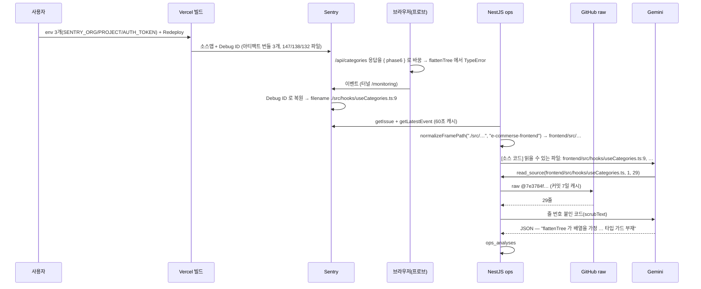

# 프론트 소스맵과 새 평가 세트 — 도구의 효과를 처음으로 잴 수 있는 재료

> 대상: [1편](./01-rn-first-app.md)~[6편](./06-source-reading.md)을 읽었다고 본다. 6편의 `read_source` 도구·`normalizeFramePath`·버전 규칙(v3 = 도구가 프롬프트에 들어간 분석, `.1` = 서비스 지도)과 5편의 평가 세트 스크립트는 다시 풀지 않는다.
> 원본 설계: [`docs/roadmap/ops-companion-design.md`](../../roadmap/ops-companion-design.md) §9 Phase 6(정의 · 결정 5건 · 실측 · 진행)
> 짝지어 읽을 코드: [source-reader.service.ts](../../../backend/src/ops/source-reader.service.ts)(`PROJECT_ROOTS` · `normalizeFramePath`) · [ops-analysis.service.ts](../../../backend/src/ops/ops-analysis.service.ts)(`buildSourceContext`) · [ops-review.service.ts](../../../backend/src/ops/ops-review.service.ts)(`getStats`) · [ops-review-set.ts](../../../backend/eval/ops-review-set.ts)(`list --readable` · `stats --after`) · [next.config.js](../../../frontend/next.config.js)(`withSentryConfig`)
> 작성 시점: 2026-09-22 (main `77c4f19` = PR #39 — **코드·세트·채점 14장·운영 배포·운영 확인까지 완료**)

---

<br>

# 0장. 30초 요약

## 0-1. 한 문장

**Vercel 에 Sentry 업로드 토큰을 넣어 쇼핑몰 프론트의 스택을 원본 좌표(`./src/hooks/useCategories.ts:9`)로 만들고, `normalizeFramePath` 에 "프로젝트 힌트" 한 인자를 더해 도구가 프론트 코드도 읽게 했다. 그리고 6편의 결론("옛 세트는 도구를 한 번도 안 불렀다")을 풀기 위해, 읽을 수 있는 프레임이 있는 인시던트 7건으로 평가 세트를 새로 짜 v1.1(지도만) vs v3.1(지도 + 도구)를 만들었다 — 도구 유무만 다른 첫 비교표의 재료다.**

## 0-2. 무엇이 문제였나

6편 6-4 의 표가 출발점이다. Phase 4 의 test 세트 6건은 프레임이 전부 번들·청크 좌표라 `read_source` 가 읽을 파일이 없었고, v3 의 "6/6 승인"은 코드를 읽은 답이 아니라 "읽을 수 없다고 확신도를 낮춘 답"이었다. 도구의 효과를 잰 적이 없다.

그중 프론트가 가장 큰 구멍이었다. 이슈 3건 모두 `app:///_next/static/chunks/8577-….js:12:123490` 이었고, 이유는 6편 6-2 — `next.config.js` 의 `withSentryConfig` 는 업로드 코드를 이미 갖고 있지만 Vercel 에 `SENTRY_AUTH_TOKEN` 이 없어 **조용히 스킵**됐다. 릴리즈 파일 API 는 빈 배열이었다.

## 0-3. 결과

| 무엇이 되는가 | 검증 |
|---|---|
| Vercel 빌드가 Sentry 에 소스맵을 올린다(사용자가 env 3개 + Redeploy) | ✅ 재배포(2026-09-22 01:53Z) 직후 `e-commerse-frontend` 에 **Debug ID 아티팩트 번들 3개**(147·138·132 파일). 릴리즈 파일 목록은 여전히 0 — 6-1 |
| 새 프론트 이벤트의 프레임이 원본 경로다 | ✅ 프로브 이벤트: `inApp=true filename=./src/hooks/useCategories.ts line=9`(`flattenTree`) · 라이브러리는 `../node_modules/axios/dist/browser/axios.cjs` · 릴리즈 `7e3784f…`(40자) |
| `normalizeFramePath(filename, project)` — 폴더 이름이 없는 프레임에 프로젝트 힌트로 `frontend/` 를 붙인다 | ✅ 단위 12건 추가(합 51 · ops 스위트 159) · 백엔드·앱 케이스는 기존 12건 그대로 |
| 프론트 인시던트를 v3.1 로 분석하면 `tool_calls` 에 `frontend/src/…` 가 남는다 — **DoD ②** | ✅ 분석 #53: `frontend/src/hooks/useCategories.ts:1-29 @7e3784f`(1회, 5.2초), rootCause "`flattenTree` 가 배열을 가정하고 `for…of` — API 응답이 배열이 아니면 `t is not iterable`, 9행 타입 가드 부재"(high/high). **맞다**(3-1) |
| `list --readable` — 이슈마다 읽을 수 있는 파일 수·읽는 커밋을 열로 | ✅ 15건 중 읽기 > 0 인 이슈 8건(프론트 6 · 백엔드 1 · 앱 1) — 3-3 |
| `stats --after <id>` — 새 세트만 집계(옛 v1.1·v3.1 행과 분리) | ✅ 단위 1건 · `getStats({minAnalysisId})` |
| 새 평가 세트 7건 × v1.1·v3.1 = 14건 생성 | ✅ 아래 표(#54~#67, 14/14 ok) · ✅ 실기기 블라인드 채점 14장(로컬 백엔드, 2026-09-22) |
| DoD ③ 도구 유무만 다른 첫 비교표 | ✅ `stats --after 54` — **승인율 v1.1 7/7 = v3.1 7/7(천장), 별점 3.43 → 4.29, 쌍별 v3.1 5승 1무 1패** — 아래 "채점 결과" |

**평가 세트(2026-09-22)** — `list --readable` 에서 읽기 > 0 인 이슈 8건 중 제목이 겹치는 쌍둥이 1건(`null.id` 상세 페이지 7747423783)을 빼고 7건. seed 는 두지 않는다(few-shot 팔이 없다 — 3-4).

| id | 프로젝트 | 읽기 | 릴리즈 | 제목 | v1.1 (sev/conf) | v3.1 (sev/conf) | v3.1 이 읽은 것 |
|---|---|---|---|---|---|---|---|
| 7747401267 | frontend | 2 | `7e3784f` | TypeError: t is not iterable — 카테고리 응답이 배열이 아님 | #54 (high/high) | #55 (medium/high) | `frontend/src/hooks/useCategories.ts:1-29` |
| 7747419604 | frontend | 1 | `7e3784f` | TypeError: Cannot read properties of null (reading 'id') — 상품 목록 항목이 null | #56 (high/high) | #57 (high/high) | `frontend/src/components/home/ProductSection.tsx:40-66` |
| 7747419820 | frontend | 1 | `7e3784f` | TypeError: a.find is not a function — `images` 가 배열이 아님 | #58 (medium/high) | #59 (medium/high) | `frontend/src/components/home/ProductCard.tsx:5-20` |
| 7747420327 | frontend | 1 | `7e3784f` | TypeError: x.map is not a function — `data` 가 배열이 아님 | #60 (high/high) | #61 (high/high) | `frontend/src/components/home/ProductSection.tsx:35-66` |
| 7747424036 | frontend | 1 | `7e3784f` | TypeError: (…).filter is not a function — 상세 페이지 연관 상품 | #62 (high/high) | #63 (high/high) | `frontend/src/app/(main)/products/[id]/RelatedProducts.tsx:10-50` |
| 7744504775 | ops-companion | 2 | HEAD | Sentry 연결 테스트(앱) — 6편의 스모크 인시던트 | #64 (low/high) | #65 (low/high) | `ops-companion/src/lib/sentry.ts:40-55` · `app/(tabs)/profile.tsx:30-45` · `sentry.ts:1-20`(3회 = 상한) |
| 7732523858 | backend | 1 | `00107b7` | Not allowed by CORS — ⚠ 4~6편의 함정 인시던트. 채점자가 답을 안다 | #66 (low/high) | #67 (low/high) | `backend/src/main.ts:50-70` |

**생성 결과(2026-09-22, flash-lite)**: 14/14 ok · v3.1 은 **7건 모두 도구를 실제로 호출**(`toolCalled` 7) — 6편의 test 세트(호출 0회)와 처음으로 다른 재료다. v1.1 평균 4.3초, v3.1 평균 13.0초(앱 건은 3회 읽어 32초). 확신도는 14건 전부 `high` — 6편 6-5 에서 "읽을 파일 없음"이 확신도를 낮췄던 것과 대칭으로, 읽을 파일이 있으면 도구 유무와 무관하게 high 다. severity 는 한 건(#54→#55, high→medium)만 달랐다. **판정은 채점이 정한다.**

**채점 결과(2026-09-22, 실기기 블라인드, 평가자 1명, `stats --after 54`)** — 도구 유무만 다른 첫 비교표.

| 팔 | 분석 | 승인 | 반려 | 승인율 | 평균 별점 | 도구 호출 |
|---|---|---|---|---|---|---|
| v1.1(지도만) | 7 | 7 | 0 | 100% | **3.43** | 0 |
| v3.1(지도 + 도구) | 7 | 7 | 0 | 100% | **4.29** | 7 |

| 인시던트 | v1.1 별점 | v3.1 별점 | 차이 |
|---|---|---|---|
| 7747401267 t is not iterable | 2 (#54) | 5 (#55) | **+3** |
| 7747419604 null.id | 3 (#56) | 3 (#57) | 0 |
| 7747419820 a.find | 4 (#58) | 5 (#59) | +1 |
| 7747420327 x.map | 4 (#60) | 5 (#61) | +1 |
| 7747424036 .filter(연관 상품) | 4 (#62) | 3 (#63) | **−1** |
| 7744504775 앱 Sentry 테스트 | 3 (#64) | 4 (#65) | +1 |
| 7732523858 CORS | 4 (#66) | 5 (#67) | +1 |

읽는 법 세 가지.

- **승인율은 축이 못 됐다.** 14장 전부 승인 — 읽을 파일이 있는 인시던트는 스택이 정확히 한 줄을 가리켜 v1.1 도 원인을 맞힌다(프로브 6건은 "형태가 깨진 응답" 한 부류라 특히 쉽다). 5편·6편의 승인율 차이가 여기서 사라진 것은 재료의 난이도가 낮아진 탓이지 도구가 무의미해서가 아니다.
- **별점은 도구 쪽에 붙었다 — 6편과 반대다.** 6편에서는 코드를 **지어낸** v1.1(#46)이 4점, 지어내지 않은 v3.1(#45)이 2점이었다. 이번엔 같은 CORS 에서 v1.1(#66)이 또 `allowedOrigins = [process.env.FRONTEND_URL]` 을 지어냈는데 4점, 실제 `main.ts` 65행을 짚은 v3.1(#67)이 5점이다. 가장 큰 차이는 카테고리 건(#54 2점 → #55 5점): v1.1 은 `flattenTree` 를 `reduce` 로 다시 쓴 "수정 예시"를 냈고(실제 코드는 `for…of`), v3.1 은 실제 함수를 그대로 인용하며 "`tree` 기본값 `[]` 가 있는데도 객체가 들어오면 터진다"까지 짚었다. **별점 = 구체성**이라는 5편·6편의 가설은 유지되고, "구체성"의 재료가 진짜 코드일 때 도구가 이긴다.
- **1패(#62 4점 → #63 3점)** 는 v3.1 이 26·29행을 정확히 인용한 건이다. 평가자 1명·별점의 흔들림 범위 안이고, 표본 7쌍으로는 어느 쪽도 단정하지 못한다 — 5편 6-7 과 같은 유보다.

`relatedFiles` 의 꼴도 달랐다 — v1.1 은 `src/hooks/…`·`./src/app/…`(프레임 문자열 그대로), v3.1 은 `frontend/src/…`(읽은 저장소 경로). 앱 카드의 "관련 파일"이 저장소 경로로 나오는 것은 도구 팔뿐이다.

**⚠ 타당성 한계(채점 직후 사용자 진술, 2026-09-22).** 평가자가 "제시된 상황과 해답을 전부 알 수 없어 임의로 승인한 부분이 많다"고 밝혔다. 즉 이 표의 승인 14/14 는 "맞다"가 아니라 **"틀렸다고 판단할 근거가 없었다"** 이고, 별점 차이도 "더 맞다"가 아니라 "더 구체적으로 보인다"일 수 있다. 채점 카드가 판단 근거(그 인시던트의 사실, 확인할 항목)를 주지 않은 설계의 문제이지 평가자의 문제가 아니다. 이 한계는 5편·6편의 채점에도 정도 차이로 걸려 있다 — 다만 그때는 CORS 처럼 평가자가 답을 아는 건이 섞여 있어 승인/반려가 갈렸다. 해소 방법은 8장과 설계 §9 Phase 7(채점 안내 + 재채점).

프론트 6건은 자연 발생이 아니라 **내가 만든 이벤트**다(3-2). 운영 API 응답을 헤드리스 브라우저 안에서만 바꿔 "형태가 깨진 응답"을 흘려 넣었고, 각 이슈는 실제로 우리 컴포넌트가 방어하지 못한 지점이다 — `flattenTree` 의 `for…of`, `ProductCard` 의 `product.id`·`images.find`, `ProductSection` 의 `products.map`. 즉 인시던트는 인위적이지만 **가리키는 코드의 결함은 진짜**다.

## 0-4. 무엇이 늘었나

| | 추가된 것 |
|---|---|
| DB | **0** |
| 엔드포인트 | **0** (`getStats` 에 선택 인자 하나 — 컨트롤러는 그대로) |
| 외부 연결 | **1**(Vercel 빌드 → Sentry 소스맵 업로드 — [infra-story 0-1](./infra-story.md#0-1-전체-지도-한-장) 에 선이 하나) |
| 새 비밀값 | **1** — Sentry 업로드 토큰, **Vercel 환경변수에만**(브라우저 번들에 안 들어간다 — `NEXT_PUBLIC_` 아님). infra-story 5장 |
| 환경변수(Vercel) | `SENTRY_ORG` · `SENTRY_PROJECT` · `SENTRY_AUTH_TOKEN` — 코드는 이미 읽고 있었다 |
| 백엔드 코드 | `PROJECT_ROOTS` + `normalizeFramePath` 두 번째 인자 · `getStats(filter)` · 스크립트 `--readable`·`--after` |
| 앱 패키지 | **0** · 앱 코드 변경 **0** |

<br>

---

<br>

# 1장. 이번 편에서 새로 나온 용어

## 1-1. 아티팩트 번들(artifact bundle) — 릴리즈 없이 소스맵을 짝짓는 방식

3편·6편의 소스맵은 "릴리즈 X 의 파일들"로 올라갔다고 생각하기 쉽다. 요즘 Sentry SDK(`@sentry/nextjs` 포함)는 **Debug ID**(infra-story 2-6)로 번들과 소스맵을 짝짓고, 파일은 릴리즈가 아니라 **아티팩트 번들**이라는 묶음으로 올린다. 그래서 `releases/<sha>/files/` 는 **0개**인데 `files/artifact-bundles/` 에는 147개짜리 묶음이 있다. "릴리즈 파일이 0 이니 업로드가 안 됐다"고 읽으면 틀린다(6-1).

## 1-2. 프로브(probe) — 내가 만드는 실제 이벤트

Sentry 는 실제 브라우저가 실행한 JS 가 보낸 것만 받는다. 새 프레임 꼴을 **추측하지 않고** 보려면 이벤트를 하나 만들어야 했고, 그 도구가 프로브다 — 헤드리스 Chrome 으로 운영 페이지를 열고, 특정 API 응답만 브라우저 안에서 바꿔(`page.route`) 컴포넌트가 에러를 던지게 한다. 서버·DB 는 아무것도 바뀌지 않는다. 3편의 "Sentry 연결 테스트" 버튼이 앱 쪽 프로브였다면, 이번은 프론트 쪽이다(3-2).

## 1-3. 프로젝트 힌트 — 파일 경로에 없는 정보를 옆 필드에서 가져오기

같은 저장소라도 프로젝트마다 빌드 cwd 가 다르다. 백엔드는 모노레포 루트에서 webpack 을 돌려 프레임에 `backend/src/…` 가 들어 있고, Next.js 는 `frontend/` 안에서 빌드하므로 프레임이 `./src/…` 로 시작한다 — **폴더 이름이 없다**. 저장소 경로를 만들려면 "이 이벤트가 어느 프로젝트인가"를 다른 데서 가져와야 하고, 그것이 Sentry 프로젝트 slug(`e-commerse-frontend`)다. 파일 경로 하나로 안 되면 옆 필드를 힌트로 쓴다(3-1).

<br>

---

<br>

# 2장. 지도 — 무엇이 늘었나

## 2-1. 백엔드

```
backend/src/ops/
├── source-reader.service.ts        # + PROJECT_ROOTS · normalizeFramePath(filename, project?)
├── source-reader.service.spec.ts   # + 프론트 프레임 12건(실이벤트 꼴 그대로)
├── ops-analysis.service.ts         # buildSourceContext 가 incident.project 를 넘긴다 (한 줄)
├── ops-review.service.ts           # getStats({ minAnalysisId? })
├── ops-review.service.spec.ts      # + 1건
└── dto/incident-detail.dto.ts      # filename 주석에 프론트 꼴 추가

backend/eval/ops-review-set.ts      # list --readable(읽기·릴리즈 열) · stats --after <id>
```

## 2-2. 프론트·Vercel

코드 변경 **0**. `next.config.js` 의 `withSentryConfig({ org, project, widenClientFileUpload: true, … })` 는 6편 이전부터 있었다. 바뀐 것은 **Vercel 환경변수 3개**(사용자가 대시보드에서) 와 Redeploy 한 번이다.

## 2-3. 흐름 한 장

```
Vercel 빌드(main 푸시 또는 Redeploy)
   │  next build → withSentryConfig → SENTRY_AUTH_TOKEN 있음 → 소스맵 + Debug ID 업로드(아티팩트 번들)
   ▼
브라우저에서 에러 → Sentry 가 Debug ID 로 원본 좌표 복원
   │  frames[].filename = "./src/hooks/useCategories.ts", lineNo 9, inApp true
   ▼
GET /ops/incidents/:id → IncidentDetail { project: "e-commerse-frontend", release: "7e3784f…", frames }
   ▼
buildSourceContext → normalizeFramePath("./src/hooks/useCategories.ts", "e-commerse-frontend")
   │  폴더 이름 없음 → PROJECT_ROOTS["e-commerse-frontend"] = "frontend" → "frontend/src/hooks/useCategories.ts" → checkPath ✓
   ▼
프롬프트 [소스 코드] 절: "스택에서 읽을 수 있는 파일: frontend/src/hooks/useCategories.ts:9, frontend/src/components/…/CategorySelect.tsx:13"
   ▼
모델 → read_source(frontend/src/hooks/useCategories.ts, 1, 29) → GitHub raw @7e3784f → 답
```

<br>

---

<br>

# 3장. 코드 읽기

## 3-1. `normalizeFramePath` — 폴더 이름이 있으면 그대로, 없으면 힌트

6편 3-3 의 함수는 "허용 폴더 이름이 처음 나오는 자리부터 자른다"였다. 그 규칙은 그대로 두고, **실패했을 때만** 두 번째 단계를 탄다.

```ts
static readonly PROJECT_ROOTS = { 'e-commerse-frontend': 'frontend', 'e-commerse-backend': 'backend', 'ops-companion': 'ops-companion' };

static normalizeFramePath(filename, project?) {
  …(기존: /backend/src/ 등 마커를 찾아 자른다)
  if (best >= 0) { … return checkPath(candidate).ok ? candidate : null; }

  // 폴더 이름이 없는 프레임: 프로젝트 힌트로 저장소 폴더를 앞에 붙인다
  const root = project ? PROJECT_ROOTS[project] : undefined;
  if (!root) return null;
  const relative = unified.startsWith('./') ? unified.slice(2) : unified;
  if (relative.startsWith('/') || /^[a-z]+:/i.test(relative) || relative.startsWith('../')) return null;
  const candidate = `${root}/${relative}`;
  return checkPath(candidate).ok ? candidate : null;
}
```

세 가지를 의도했다.

- **기존 케이스 불변.** 백엔드 `webpack://shopping-mall/backend/src/main.ts` 는 project 가 무엇이든 첫 단계에서 끝난다. 단위 테스트에 "폴더 이름이 있으면 힌트보다 우선"을 고정했다.
- **`./` 하나만 접는다.** 실이벤트의 라이브러리 프레임은 `../node_modules/axios/…` 다 — 프론트 폴더 밖이다. 이걸 `frontend/../node_modules/…` 로 만들면 `checkPath` 가 `..` 를 거절하지만, 그 전에 `../` 로 시작하면 바로 null 을 준다. 두 겹이다.
- **힌트는 "붙이기"만 한다.** 허용 여부는 여전히 `checkPath`(`ALLOWED_PREFIXES`·`DENIED_NAME`)가 정한다. `./.env.local` + 프론트 힌트 → `frontend/.env.local` → 허용 폴더 `frontend/src/` 밖 → null. 힌트가 방어선을 우회하지 못한다.

**실이벤트를 먼저 보고 짰다.** 인수인계 문서가 `webpack://_N_E/./src/…` · `app:///src/…` · `./src/…` 세 후보를 적어 두었는데, 실제는 세 번째(`./src/hooks/useCategories.ts`)였고 `absPath` 는 `app:///_next/static/chunks/app/(main)/src/hooks/useCategories.ts` 였다. `absPath` 에는 라우트 그룹(`app/(main)/`)이 끼어 있어 신뢰할 수 없고, `filename` 을 쓴다. 테스트의 입력 문자열은 그 이벤트에서 복사했다.

분석 #53 이 낸 답을 코드와 맞춰 보면 — [useCategories.ts](../../../frontend/src/hooks/useCategories.ts) 8~16행의 `flattenTree(nodes)` 는 `for (const node of nodes)` 로 시작하고, 19행 `const { data: tree = [] } = useQuery(…)` 는 `data` 가 **`undefined` 일 때만** 기본값을 준다. 프로브가 흘린 `{ phase6: 'probe-garbage' }` 는 `undefined` 가 아니라 객체라 그대로 `flattenTree` 에 들어가고, 객체는 iterable 이 아니다. 모델의 "9행 타입 가드 부재"는 정확하다. 이 결함은 이 Phase 의 범위 밖이지만 실제 수정 후보다(8장).

## 3-2. 프로브 — 응답을 브라우저 안에서만 바꾼다

스크립트는 저장소에 넣지 않았다(일회성, 스크래치패드). 핵심은 20줄이다.

```js
const browser = await chromium.launch({ channel: 'chrome', headless: true });   // 설치된 Chrome
await page.route('**/api/products?**', (route) =>
  route.fulfill({ status: 200, contentType: 'application/json', body: JSON.stringify({ data: [null], meta: {…} }) }));
await page.goto('https://shopping-mall-frontend-dusky.vercel.app/');
```

`page.route` 는 브라우저가 보내려는 요청을 가로채 **서버에 닿기 전에** 응답을 꾸며 준다. 그래서 운영 백엔드·DB 에는 요청조차 가지 않고, Sentry 만 "이 브라우저에서 TypeError 가 났다"를 받는다(터널 `/monitoring` 200). 페이로드는 세 종류를 썼다 — 항목이 `null`, `images` 가 문자열, `data` 가 문자열. 각각 `ProductCard`·`getProductImageUrl`·`ProductSection` 의 다른 줄에서 터져 **다른 이슈**가 된다(Sentry 는 스택으로 그룹을 나눈다).

왜 "`/api/*` 를 통째로 끊기"가 아닌가는 6-2·6-3 에 있다.

## 3-3. `list --readable` — 고르기 전에 "읽을 수 있나"를 본다

5편 3-9 의 `list` 는 제목·횟수만 찍었고, 그래서 6-4 의 세트가 나왔다. 이번엔 이슈마다 상세를 한 번 더 받아(`ops.getIncident`, Redis 60초 캐시라 반복 실행이 싸다) 프레임을 `normalizeFramePath` 에 통과시켜 **살아남는 경로의 개수**와 **읽는 커밋**을 찍는다.

```
  id            project                횟수   level    읽기  릴리즈    제목
  7732523858    e-commerse-backend       780  error       1  00107b7   Error: Not allowed by CORS: https://api.ansmoon.dev
  7742806116    e-commerse-frontend       13  error       0  7e3784f   AxiosError: Network Error
  7744504775    ops-companion              5  error       2  HEAD      Error: [ops-companion] Sentry 연결 테스트 …
  7747401267    e-commerse-frontend        1  error       2  7e3784f   TypeError: t is not iterable
  …
```

`Network Error` 는 소스맵이 올라간 뒤에도 **0** 이다 — 6-2. 릴리즈 열의 `HEAD` 는 앱처럼 릴리즈가 커밋 꼴이 아니어서 `main` 을 읽는 경우다(6편 결정 ②).

## 3-4. 팔 선택과 `stats --after` — 무엇과 무엇을 비교하나

세트는 **v1.1 vs v3.1** 두 팔이다. 둘 다 서비스 지도를 포함하고(운영 기본), 차이는 `read_source` 도구 하나다. few-shot(v2.1)은 넣지 않았다 — 승인 풀에 이미 v3.1 의 답이 섞여 있어 "예시 효과인지 도구 효과인지" 가릴 수 없다. few-shot 팔이 없으니 **seed 도 없다**. 5편의 seed 는 승인 풀을 만들기 위한 것이었다.

문제는 이름표다. v1.1·v3.1 은 Phase 5 의 CORS 재현(#45·#46)과 부작용 측정(#47~#52)에도 쓰였고, 그 행들은 이미 채점돼 있다. `stats` 가 버전별로 합산하면 옛 행이 섞인다. 그래서 `getStats` 에 `minAnalysisId` 를 더하고 스크립트가 `--after 54` 로 넘긴다 — 이번 세트의 첫 행부터만 센다.

```ts
async getStats(filter: { minAnalysisId?: number } = {}) {
  const params: unknown[] = [];
  let extraWhere = '';
  if (typeof filter.minAnalysisId === 'number' && Number.isFinite(filter.minAnalysisId)) {
    params.push(Math.floor(filter.minAnalysisId));
    extraWhere = ` AND a.id >= $${params.length}`;
  }
  … WHERE ${NOT_SIMULATED}${extraWhere} …, params
```

컨트롤러(`GET /ops/analyses/stats`)는 인자 없이 부르므로 앱·e2e 는 그대로다.

<br>

---

<br>

# 4장. 흐름 — 빌드에서 "읽을 수 있는 파일"까지



<br>

---

<br>

# 5장. 앞 편과 달라진 점

| | 6편(Phase 5) | 이번(Phase 6) |
|---|---|---|
| 번들 좌표 복원 | 백엔드 — **서버 자신**이 `--enable-source-maps` 로 | 프론트 — **Sentry 에 업로드**(앱과 같은 방식, 토큰 필요) |
| `normalizeFramePath` | filename 하나 | filename + **project 힌트** |
| 평가 세트 | Phase 4 의 6건(전부 읽기 0) | 읽기 > 0 인 7건, **seed 없음** |
| 비교 팔 | v1·v2·v3(→ v3.1 부작용) | **v1.1 vs v3.1** — 도구만 다르다 |
| `stats` | 버전 전체 합산 | `--after` 로 세트만 |
| 새 비밀값 | 0 | 1(Vercel 에만) |

<br>

---

<br>

# 6장. 실제로 밟은 함정

## 6-1. 릴리즈 파일이 0개인데 소스맵은 올라가 있었다

재배포 후 `GET /organizations/ansmoon/releases/<sha>/files/` 를 다시 불렀더니 여전히 **빈 배열**이었다. 6편 6-2 가 이 API 로 "업로드된 적 없음"을 판정했으니 그대로 읽으면 "토큰이 안 먹었다"다. 그런데 `files/artifact-bundles/` 에는 재배포 시각(01:53Z)의 번들 3개가 있었다. `@sentry/nextjs` 는 Debug ID 방식이라 릴리즈에 파일을 매지 않는다(1-1). **6편의 판정 기준은 "필요조건"이 아니었다** — 아티팩트 번들 API 를 함께 봐야 한다. 진짜 판정은 그다음 실이벤트의 프레임이었다.

## 6-2. Network Error 에는 우리 코드 프레임이 없다

첫 프로브는 `/api/*` 를 통째로 끊어 `AxiosError: Network Error` 를 냈다. 프레임은 원본 경로로 복원됐지만 `../node_modules/axios/dist/browser/axios.cjs:2879`(`onerror`) 와 `@sentry/browser/…/helpers.js` 뿐이었다 — **`inApp=false` 만 있고 우리 파일이 없다**. axios 가 XHR `onerror` 에서 에러 객체를 만들고, 우리 `reportApiError` 는 그 객체를 그대로 `captureException` 하기 때문이다. 스택은 "누가 던졌나"이고, 던진 쪽은 axios 다. 그래서 `Network Error` 계열은 소스맵이 있어도 영원히 "읽기 0" 이다. 같은 이유로 5xx 응답도 안 된다. **우리 컴포넌트가 직접 던져야** 우리 프레임이 생긴다.

## 6-3. 어디를 깨도 같은 이슈가 났다 — 레이아웃이 먼저 죽는다

`/api/*` 전체를 깨진 JSON 으로 바꾸자 어느 페이지를 열어도 `TypeError: t is not iterable` 하나만 나왔다. `(main)` 레이아웃의 검색바 `CategorySelect` → `useCategories` → `flattenTree` 가 **모든 페이지에서 가장 먼저** 카테고리를 받아 죽고, React 가 그 서브트리를 통째로 내리니 다른 컴포넌트는 렌더되지 않는다. 이슈를 늘리려면 카테고리는 살려 두고 **엔드포인트 하나만** 골라 깨야 했다(`**/api/products?**`).

## 6-4. 대부분의 페이지는 클라이언트에서 API 를 안 부른다

`/products` 와 `/products/:id` 에 `**/api/products**` 라우트를 걸었더니 `apiHits=0` 이었다. 목록·상세는 서버 컴포넌트가 미리 받아 hydrate 하므로 브라우저는 요청을 안 보낸다. 클라이언트 요청이 실제로 나가는 곳은 홈의 상품 섹션들과 상세의 연관 상품(`RelatedProducts`)이었다. 프로브가 `apiHits` 를 찍게 한 이유다 — 0 이면 아무것도 깨지지 않은 것이다.

## 6-5. 빈 객체로는 안 죽는다 — 방어 코드가 있는 곳과 없는 곳

홈 컴포넌트는 `result?.data ?? []` 로 응답 자체가 이상해도 빈 목록을 그린다. 깨진 **배열**이 아니라 깨진 **항목**이어야 `ProductCard` 안에서 터진다(`product.id` on null · `images.find` on string). 반대로 `useCategories` 는 `= []` 기본값이 `undefined` 에만 걸려 객체를 못 막는다. 어디가 방어돼 있고 어디가 아닌지를 프로브가 그대로 드러냈다 — 그 자체가 이번 세트의 인시던트들이다.

## 6-6. Git Bash 가 `/` 인자를 경로로 바꾼다

`node probe.js abort /` 가 `https://…vercel.appc/Program Files/Git/` 로 갔다. MSYS 가 `/` 로 시작하는 인자를 Windows 경로로 변환한다. 인자는 앞 슬래시 없이 받고 스크립트 안에서 붙였다. 6편의 "heredoc 안 파이썬 패치" 와 같은 부류의 함정이다.

## 6-7. Playwright 브라우저 버전과 설치된 Chrome

`ms-playwright` 캐시에 chromium 1169·1217 이 있었지만 방금 설치한 playwright 1.58 은 1208 을 찾았다. 새로 내려받는 대신 `channel: 'chrome'` 으로 **설치된 Google Chrome** 을 썼다. Sentry 입장에서는 실제 사용자의 브라우저와 같은 엔진이라 오히려 자연스럽다.

## 6-8. 부수 발견 — CSP 가 Sentry Replay 의 워커를 막고 있다

프로브 콘솔마다 `Creating a worker from 'blob:…' violates the following Content Security Policy` 가 찍혔다. `next.config.js` 의 CSP 에 `worker-src` 가 없어 `default-src 'self'` 가 적용되고, Session Replay 의 압축 워커(blob URL)가 차단된다. Replay 는 압축 없이 동작하므로 이벤트가 유실되진 않지만 페이로드가 커진다. 고치려면 `worker-src 'self' blob:` 한 줄이다 — 이 Phase 범위 밖이라 기록만 한다(8장).

## 6-9. Sentry 이슈 API 의 `statsPeriod` 는 값이 정해져 있다

`statsPeriod=1h`·`2h` 는 400 을 준다. `24h`·`14d`·`30d` 는 된다. 프로브 확인 스크립트가 처음에 여기서 죽었다.

<br>

---

<br>

# 7장. 실행과 확인

## 7-1. 로컬에서 끝까지 돌리기

```bash
# 0) (사용자) Vercel 환경변수 SENTRY_ORG=ansmoon · SENTRY_PROJECT=e-commerse-frontend · SENTRY_AUTH_TOKEN=<sntrys_ 또는 개인 토큰(Release Admin·Project Read·Org Read)> → Redeploy

# 1) 업로드 확인 — 릴리즈 파일이 아니라 아티팩트 번들을 본다 (6-1)
curl -H "Authorization: Bearer $SENTRY_AUTH_TOKEN" "https://sentry.io/api/0/projects/ansmoon/e-commerse-frontend/files/artifact-bundles/?per_page=5"

# 2) 프론트 이벤트 하나 — 우리 컴포넌트가 던지게 (6-2·6-3). 최신 이벤트의 frames[].filename 이 ./src/… 이어야 한다
#    (스크래치패드 probe.js: page.route('**/api/products?**') → { data:[null] } → 홈 열기)

# 3) 단위 (Node 22 는 jest 설정 우회 — 4편 6-6)
node ../node_modules/jest/bin/jest.js --config <인라인 config> src/ops     # 6 스위트 159건

# 4) 재료 고르기
cd backend
TS_NODE_PROJECT=eval/tsconfig.eval.json node -r ts-node/register/transpile-only eval/ops-review-set.ts list --period 30d --readable > /tmp/list.txt 2>&1

# 5) 세트 생성 — v3.1 은 5 예약이라 --delay 31000 (6편 6-7)
… ops-review-set.ts test --ids 7747401267,7747419604,7747419820,7747420327,7747424036,7744504775,7732523858 --arms v1.1,v3.1 --delay 31000 > /tmp/test.txt 2>&1

# 6) 채점 — 앱 .env 를 PC LAN IP 로(분석은 로컬 DB 에 있다) → yarn start --clear → 평가 탭에서 14장 블라인드
# 7) 집계 — 이번 세트만
… ops-review-set.ts stats --after 54
```

## 7-2. 확인 체크리스트 (Phase 6 DoD)

- [x] 새 프론트 이벤트의 `exception.frames[].filename` 이 원본 경로(`./src/hooks/useCategories.ts`)이고, `normalizeFramePath(그 값, 'e-commerse-frontend')` 가 `frontend/src/hooks/useCategories.ts` 를 돌려준다 — 단위 + 실이벤트 — **DoD ①**
- [x] 프론트 인시던트 1건을 v3.1 로 분석해 `tool_calls` 에 `frontend/src/…` 가 남는다(#53, #55, #57 …) — **DoD ②**
- [x] 읽을 수 있는 인시던트 ≥ 4건으로 새 test 세트(7건) × v1.1·v3.1 생성
- [x] 블라인드 채점 14장 → `stats --after 54` → **도구 유무만 다른 첫 비교표**(승인율 7/7 = 7/7 · 별점 3.43 → 4.29 · `toolCalled` 0 → 7) — **DoD ③**
- [x] e2e `mobile-token-and-ops` 22/22(새 번들의 로컬 4000)
- [x] 백엔드 배포 — main `77c4f19`(PR #39), 2026-09-22, 마이그레이션 없음, health `77c4f19`
- [x] 운영에서 프론트 인시던트 1건을 v3.1 로 분석 → "AI 가 읽은 코드" `frontend/src/hooks/useCategories.ts:1-29`(실기기, 운영 API, 2026-09-22). 조치는 맞고 원인 서술은 반쯤 맞다 — 8장

## 7-3. 안 될 때

| 증상 | 원인 | 조치 |
|---|---|---|
| 재배포했는데 프레임이 여전히 `_next/static/chunks/…` | 이벤트가 재배포 **이전** 번들에서 왔다(탭이 옛 JS 를 들고 있음) | 새 탭에서 다시 유발. 릴리즈(커밋)가 재배포 커밋인지 본다 |
| 릴리즈 파일 0개 | 정상 — Debug ID 방식(1-1) | `files/artifact-bundles/` 를 본다 |
| `list --readable` 이 프론트 이슈에 0 | `Network Error`·5xx 류(6-2) 또는 소스맵 이전 이벤트 | 우리 컴포넌트가 던지는 이슈만 세트에 넣는다 |
| 프로브 `apiHits=0` | 그 페이지는 서버 컴포넌트가 받는다(6-4) | 클라이언트 요청이 있는 페이지·엔드포인트로 |
| 프로브가 매번 같은 이슈 | 레이아웃이 먼저 죽는다(6-3) | 카테고리는 살리고 엔드포인트 하나만 깬다 |
| `stats` 승인율이 이상하다 | 옛 v1.1·v3.1 행이 섞였다 | `--after <세트 첫 id>` |

<br>

---

<br>

# 8장. 다음 — 첫 비교표는 나왔고, 축은 별점이었다

- **운영 첫 프론트 읽기에서 본 것.** 배포 후 같은 인시던트(7747401267)를 운영에서 분석하자 모델이 `useCategories.ts` 1~29줄을 읽고 `Array.isArray(tree) ? tree : []` 를 제안했다 — 조치는 맞다. 그런데 원인에 "`useQuery` 의 `data` 가 `undefined` 일 수 있는데 방어가 없다"를 섞었다. 19행 `data: tree = []` 가 바로 그 방어이고, 실제로 깨진 것은 `undefined` 가 아니라 **배열이 아닌 객체**다. 코드를 읽고도 틀린 세부를 자신 있게 말한 것이고, 안내 없는 채점(승인/반려)으로는 이런 "반쯤 맞은 답"을 가를 수 없다. Phase 7 의 확인 항목 ①(원인이 사실 메모와 같은가)이 잡아야 할 정확한 예다.

- **결과 한 줄.** 승인율은 7/7 = 7/7 로 갈리지 않았고, 별점은 3.43 → 4.29(쌍별 5승 1무 1패). 도구의 몫은 6편의 결론("지어내지 않는다")에 더해 **"실제 줄을 인용한 답이 더 쓸모 있어 보인다"** 로 좁혀졌다. 승인율만으로는 도구 효과가 안 보인다 — 다음 측정은 별점을 주축으로 두거나, 승인/반려보다 고운 척도(예: "조치를 그대로 적용할 수 있는가")가 필요하다.
- **표본과 인위성.** 7건 중 6건이 프로브 이벤트라 "형태가 깨진 응답" 한 부류에 몰려 있고, 승인율 천장이 그 증거다. 자연 발생 인시던트(특히 스택이 한 줄을 안 가리키는 것)가 쌓이면 같은 두 팔로 다시 잰다. 평가자도 1명이다.
- **채점자에게 근거를 준다(Phase 7).** 위 "타당성 한계"의 해소. 정답지를 주는 게 아니라 인시던트별 **사실 메모**(무엇이 어떻게 깨졌나 — 두 팔에 똑같이 붙으므로 블라인드는 유지)와 **확인 항목 4개**(원인이 메모의 파일·함수를 가리키나 · 조치 코드가 실제 파일의 식별자만 쓰나 · 그대로 적용 가능한가 · 확신도가 근거에 비해 과한가)를 카드에 보여주고, 항목 체크에서 승인/반려를 파생한다. 도메인 지식 없이도 확인할 수 있는 항목(②)이 6편 이후 도구의 실제 몫("지어내지 않음")과 정확히 겹친다. 평가는 upsert 라 같은 14장을 다시 채점할 수 있고, 안내 전후의 차이가 "안내 없는 채점은 무엇을 쟀나"의 답이 된다. 메모가 쌓이면 어시스턴트 트랙의 골든셋 + LLM judge(ex-ai-assistant Phase 7)로 넘어갈 수 있다.
- **"도구가 좋아지면 채점이 덜 필요한가"** — 아니다. 4편 오답 → 5편 반려 → 6편 #43 반려 → #45 승인이라는 서사 자체가 채점 기록이고, 지도·프롬프트를 고칠 때마다 같은 세트로 회귀를 잡는 것도 채점이다. 바뀌어야 하는 것은 척도(승인/반려 → 항목)와 재료(쉬운 프로브 → 자연 발생·원인이 다른 파일)다. CORS 는 파일을 더 읽어서 풀린 것이 아니라(그 사실은 저장소 밖) 지도로 풀렸으므로, 도구의 "다른 파일 읽기"가 그 부류를 해결한다는 기대는 접어야 한다.
- **코드 수정 후보(범위 밖, 기록)**: `useCategories.flattenTree` 의 배열 가드 · `ProductCard` 의 null 항목 방어 · CSP `worker-src 'self' blob:`(6-8). 이번 세트의 인시던트들이 곧 그 근거다.
- **배포.** `normalizeFramePath` 변경은 백엔드 이미지 재배포가 필요하다(마이그레이션 없음). 그 전까지 운영의 프론트 인시던트 분석은 v3.1 이지만 "읽을 수 있는 파일 없음"으로 돈다.

## 부록. 배포에서 밟은 함정 — 로컬 디스크가 가득 차면 Docker 빌드가 EOF 로 죽는다

PR #39 머지 후 이미지 빌드가 `COPY . .` 단계에서 두 번 연속 `failed to receive status: rpc error: code = Unavailable desc = error reading from server: EOF` 로 끝났다. 코드 문제가 아니라 **C 드라이브 여유가 1GB** 였다. Docker Desktop(Windows)은 데이터를 C 드라이브의 가상 디스크 파일(`docker_data.vhdx`) 하나에 담고, 빌드 컨텍스트를 복사하며 그 파일이 커지려다 실패하면 데몬 연결이 끊긴다. 에러 문구에 "디스크"라는 말이 없어 원인을 짐작하기 어렵다.

- 조치: `docker builder prune -f --keep-storage 8GB`(최근 캐시 8GB 만 남김, 14GB 회수 — 가상 디스크 **안쪽**이 비어 빌드가 파일을 키울 필요가 없어진다) + 사용자가 재부팅으로 호스트 9GB 확보 → 빌드 성공.
- 가상 디스크 파일은 **스스로 줄지 않는다**. 이미지·캐시를 지워도 호스트 여유는 그대로이고, 돌려받으려면 Docker 를 끄고(`wsl --shutdown`) diskpart `compact vdisk` 로 압축해야 한다(Windows Home 은 `Optimize-VHD` 없음).
- 확인 명령: `docker system df`(안쪽 사용량) vs `docker_data.vhdx` 파일 크기(호스트 차지분). 이번엔 42.5GB 파일 안에서 21.6GB 만 쓰고 있었다.
