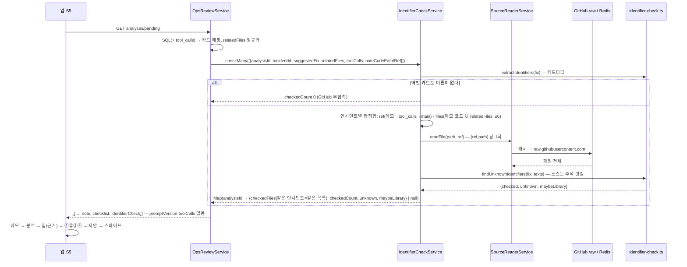

# 9편. 고리 닫기 — 이름 대조는 코드가, 결정은 사람이, 그리고 실제로 고친다

> 설계 문서 §9 **Phase 8**. 작성 시점 커밋: main `d370e03`(PR #41 squash, 2026-09-23). 브랜치 `feat/ops-closing-loop` 의 코드·문서가 이 한 커밋이다.
> 앞 편: [8편 채점 안내](./08-guided-review.md). 이 편은 8편의 결론("안내는 방향이 틀린 답은 잡고 이름이 틀린 답은 못 잡는다")에서 시작한다.

## 0-1. 한 문장

AI 조치 코드의 **이름**(변수·함수·환경변수)을 실제 소스와 기계가 대조해 카드에 근거 칩으로 붙였고, 그 카드들이 가리킨 프론트 버그 5건을 **실제로 고쳐** 같은 조건의 재현에서 0건을 확인했다 — 그리고 고치는 도중 프로브가 아무도 적지 않은 네 번째 호출 지점을 찾아냈다.

## 0-2. 무엇이 문제였나

8편 재채점에서 사람은 CORS "허용 목록에 추가"(방향이 틀린 답)는 반려했지만, `process.env.FRONTEND_URL`(실제는 `CORS_ORIGINS`)을 쓴 #66 은 별점 4 → 5 로 **통과**시켰다. 카드에 "흔한 오답 (2) `FRONTEND_URL`"이라고 적혀 있었는데도. 이름 대조는 단어 단위의 기계적인 일이라 사람이 하면 빠진다(8편 6-5).

그리고 지금까지 앱이 낸 분석대로 **실제로 고친 적이 없었다**. 평가 재료(프로브가 만든 인시던트)를 지키려고 미뤘기 때문이다. 재채점이 끝났으니 고리를 닫을 차례였다.

## 0-3. 결과

| 무엇이 되는가 | 검증 |
|---|---|
| **이름 대조 칩** — 대기 카드의 분석 아래에 "⚠ 실제 코드에 없는 이름: `FRONTEND_URL`" / "✓ 이름 N개가 모두 실제 코드에 있음" / "조치에 코드 이름 없음" / "대조할 코드 없음". 판정 제안(`suggestVerdict`)은 그대로 — 칩은 ② 의 **근거**다 | ✅ 단위 40(`identifier-check.spec` 규칙 + 14장 실제 텍스트 픽스처 · `identifier-check.service.spec`) · e2e F 절(pending 키에 `identifierCheck`, 픽스처 "조치 없음" → `checkedCount 0`, GitHub 무접촉) · `chips --after 54` 실 API(GitHub raw + Redis) 14장 아래 표 · 앱 tsc · ⏳ 실기기(7장) |
| 대조 파일은 **인시던트 단위 합집합**(메모 코드 파일 ∪ 두 팔의 relatedFiles) — 두 팔이 같은 `checkedFiles` 를 받는다(블라인드) | ✅ 단위(같은 인시던트의 두 카드 = 같은 파일 목록, 파일은 한 번만 읽음 · 이름 0 인 카드도 같은 목록) |
| **DoD (A)1** — 14장 표. v1.1 에서 **4건**(#58·#60·#62·#66) 잡힘 · v3.1 unknown **0**, 라이브러리 꼴 1(#67 `ForbiddenException`) | ✅ 아래 표(실측 = 픽스처 expected) |
| **프로브를 저장소로** `scripts/probe/probe.mjs` — 케이스 5개 · Sentry 전송 기본 차단 · 판정 BROKEN/OK/NO_HIT · 수정 후 화면 확인 | ✅ 로컬 전/후 아래 표 |
| **버그 5건 수정**(+ CSP `worker-src`) — 배열 가드 4파일 + 프로브가 찾은 **네 번째 호출 지점** 1파일 | ✅ 수정 전 **5/5 BROKEN** → 수정 후 **5/5 OK**(화면 확인 5/5 pass) · 프론트 tsc · ✅ **운영**(2026-09-23, main `d370e03` Vercel 배포 후): Sentry 차단 프로브 5/5 OK → `--allow-sentry` 1회 5/5 OK → Sentry 5개 이슈 `count`·`lastSeen` 불변, 프론트 프로젝트에 프로브 시각 이후 새 이슈 0 |
| DB 변경 **0** · 새 외부 연결 0 · 새 비밀값 0 · 새 의존성 1(`playwright-core`, 루트 devDependency — 브라우저를 내려받지 않고 설치된 Chrome 을 쓴다) | — |
| B-4 앱에서 "해결됨" 처리 | ⏭ **건너뜀** — Sentry 토큰이 읽기 전용(`event:read`)이라 `event:write` 토큰 발급이 먼저다. Sentry 웹에서 수동 Resolve(7장) |

**이름 대조 14장(2026-09-23, `chips --after 54`, 실측 — 인수인계의 "예상"과 비교)**

| # | 팔 | 인수인계 예상 | 실측 unknown | 라이브러리 꼴 | 메모 |
|---|---|---|---|---|---|
| 54 | v1.1 | 없음(다시 쓴 코드) | 없음 — 이름 수 0 | | 조치가 `const flattenTree = (nodes) => …` 로 **전부 스스로 선언**한 이름이라 대조할 것이 없다. 한계 그대로 |
| 55 | v3.1 | 없음 | 없음 | | `CategoryTreeNode` 1개 대조 |
| 56 | v1.1 | `data`(JSX 속성) | **없음** | | 파일에 `data` **변수**가 있다(`const { data, … } = useProducts.Paginate`). 단어 대조는 "그 이름이 prop 으로 쓰였나"를 모른다 — **한계 2** |
| 57 | v3.1 | 없음 | 없음 | | |
| 58 | v1.1 | `DEFAULT_IMAGE_URL` | **`DEFAULT_IMAGE_URL`** | | 조치 전체가 `// 수정 후: …` **주석**이었다 — 주석 규칙(3-1)이 없었으면 놓쳤다 |
| 59 | v3.1 | 없음 | 없음 | | |
| 60 | v1.1 | 없음 | **`ProductItem`** | | 예상에 없던 진짜 지어낸 이름(실제 컴포넌트는 `ProductCard`). 사람 사전 점검도 놓쳤다 |
| 61 | v3.1 | 없음 | 없음 | | `<p className=…>상품이 없습니다.</p>` — 소문자 태그·`className`·한글 문자열은 이름이 아니다 |
| 62 | v1.1 | `currentId` | **`currentId`** | | 실제는 `currentProductId` |
| 63 | v3.1 | 없음 | 없음 | | |
| 64 | v1.1 | 없음 | 없음 | | `console.warn('테스트 모드…')` — 한글 문자열이 있어도 코드 줄이다 |
| 65 | v3.1 | 없음 | 없음 | | `// NOTE: … Sentry …` 산문 주석은 걸리지 않는다 · `Alert` 는 import 에 있다 |
| 66 | v1.1 | `FRONTEND_URL`, `callback` | **`FRONTEND_URL`** | | `callback` 은 조치의 화살표 매개변수라 **잡지 않는다**(규칙 4 — 자기 완결적 이름). `FRONTEND_URL` 은 `main.ts` 52행 **주석**에 있어서 소스 쪽 주석을 벗기지 않으면 "코드에 있다"로 통과한다(6-1) |
| 67 | v3.1 | `ForbiddenException`(거짓 양성 후보) | 없음 | **`ForbiddenException`** | NestJS 클래스 — `…Exception` 꼴은 따로 낸다(약한 표시) |

읽는 법. v1.1 7장 중 4장이 걸렸고 v3.1 은 0장 — 8편에서 사람이 두 팔 모두 ② ✗ 0 으로 채점한 것과 대비된다. **도구가 코드를 읽은 팔은 이름을 지어내지 않았다**는 6편의 관찰이 이번엔 기계 대조로 잡혔다. 못 잡는 것 둘(#54 다시 쓴 코드 · #56 다른 뜻으로 존재하는 이름)은 구조 비교의 영역이라 이 칩의 범위 밖이다.

**프로브 전/후(2026-09-23, 로컬 `yarn nx dev frontend` + 백엔드 4000, Sentry 전송 차단)**

| 케이스 | 이슈 | 수정 전 | 수정 후 | 화면 확인 |
|---|---|---|---|---|
| `categories-object` | 7747401267 | ✗ `nodes is not iterable`(hits 1) | ✓(hits 1) | 홈 헤더 pass |
| `products-null-item` | 7747419604 | ✗ `Cannot read properties of null (reading 'id')`(hits 3) | ✓(hits **4**) | "상품이 없습니다" pass |
| `products-string-data` | 7747420327 | ✗ `products.map is not a function`(hits 3) | ✓(hits **4**) | "상품이 없습니다" pass |
| `images-string` | 7747419820 | ✗ `images.find is not a function`(hits 3) | ✓(hits 4) | 기본 이미지 카드 pass |
| `related-string` | 7747424036 | ✗ `response.filter is not a function`(hits 1) | ✓(hits 1) | 연관 상품 섹션 조용히 빠짐 pass |

hits 가 3 → 4 로 는 것이 이번 편의 부수 발견이다(6-2).

## 0-4. 무엇이 늘었나

- 백엔드: `ops/identifier-check.ts`(순수 함수) · `ops/identifier-check.service.ts`(파일 읽기·인시던트 단위 합집합) · `SourceReaderService.readFile`(파일 전체) · `listPending` 에 `identifierCheck` · `dto/review.dto.ts` `IdentifierCheckView` · 픽스처 `ops/__fixtures__/identifier-check.phase8.json`(14장 실제 텍스트 + 8파일 원문).
- 앱: `features/review/GuidancePanel.tsx` `IdentifierChip` · `review.tsx` 카드 순서 "메모 → 분석 → **칩** → 항목" · `api.ts` 타입.
- 스크립트: `ops-review-set.ts chips --ids|--after` · `scripts/probe/probe.mjs`(+README).
- 프론트: `useCategories.ts` · `ProductSection.tsx` · `ProductCard.tsx` · `RelatedProducts.tsx` · **`CategoryTabSection.tsx`** · `next.config.js`(CSP `worker-src`).
- DB 0 · 새 비밀값 0(infra-story 갱신 없음).

## 1장. 이번 편의 용어

### 1-1. 식별자 대조(identifier check)

조치 텍스트에서 코드로 보이는 부분의 이름을 뽑아 소스의 이름 집합에 있는지 보는 것. 타입 검사도, 구조 비교도 아니다 — "이 단어가 그 파일에 한 번이라도 나오는가". 그래서 빠르고, 그래서 못 잡는 것이 있다(0-3 표의 #54·#56).

### 1-2. 선언한 이름(declared name)

조치 코드가 **자기 안에서** 붙인 이름 — `const acc`, `function f(nodes)`, `(product) =>`, `catch (e)`, `import { X }`. 이건 지어낸 이름이 아니다. 파일에 없어도 조치는 자기 완결적이다. #66 의 `callback` 이 여기 걸려 잡히지 않는다 — 인수인계 예상과 다른 점이고, 의도한 결과다.

### 1-3. 라이브러리 꼴(library-like)

`…Exception`·`…Module`·`…Service` 처럼 프레임워크 클래스 이름 모양. 파일에 없어도 라이브러리에 있을 수 있어 "없는 이름"과 구분해 약하게 표시한다(#67 `ForbiddenException`).

### 1-4. 프로브(probe)

7편 1-2 그대로 — 헤드리스 Chrome 이 페이지를 열고 `page.route` 로 **특정 API 응답만** 바꿔 컴포넌트가 던지게 한다. 이번엔 스크래치가 아니라 저장소(`scripts/probe/`)에 있고, 전/후 판정과 수정 후 화면 확인이 붙었다.

## 2장. 구조

```
backend/src/ops/
├── identifier-check.ts            ← 순수 함수: extractIdentifiers · buildSourceIndex · findUnknownIdentifiers
├── identifier-check.service.ts    ← I/O: 인시던트 단위 파일 합집합 → SourceReaderService.readFile → 순수 함수
├── source-reader.service.ts       ← + readFile(path, ref): 파일 전체(줄 번호·scrubText 없음 — 서버 안에서만 쓴다)
├── ops-review.service.ts          ← listPending: SELECT 에 tool_calls(응답엔 없음) → checkMany → identifierCheck 부착
├── dto/review.dto.ts              ← IdentifierCheckView · PendingReviewItem.identifierCheck
└── __fixtures__/identifier-check.phase8.json   ← 14장 실제 조치 + 8파일 원문(그 커밋)

ops-companion/src/features/review/GuidancePanel.tsx   ← IdentifierChip (네 상태)
ops-companion/app/(tabs)/review.tsx                   ← 메모 → 분석 → 칩 → 항목

scripts/probe/probe.mjs            ← 케이스 5 · Sentry 차단 · 전/후 판정 · JSON 기록
backend/eval/ops-review-set.ts     ← chips --ids|--after (카드와 같은 계산을 채점 끝난 분석에도)
```

흐름은 4장. 8편과 비교하면 늘어난 상자는 `IdentifierCheckService` 하나고, 그것이 `OpsReviewService` 와 `SourceReaderService` 사이에 끼었다. `OpsAnalysisService`(LLM 쪽)는 건드리지 않았다 — 칩은 **채점 쪽** 도구다.

## 3장. 코드 읽기

### 3-1. 코드 구간 고르기 — `identifier-check.ts` `extractCodeSegments`

조치 텍스트는 한국어 산문과 코드가 섞여 있고, 팔마다 모양이 다르다. v3.1 은 코드펜스, v1.1 은 펜스 없이 코드 줄을 흘리거나 **주석만** 남긴다(#58 전체가 `// 수정 후: …`).

```ts
if (trimmed.startsWith('//')) { segments.push(trimmed); continue; }          // 주석만 있는 줄도 구간
const { code } = splitCodeAndComments(trimmed, true);                          // 문자열·주석을 뺀 나머지로
if (!HANGUL_RE.test(code) && CODE_LIKE_LINE_RE.test(code)) { segments.push(trimmed); continue; }
for (const m of trimmed.matchAll(/`([^`\n]+)`/g)) if (!HANGUL_RE.test(m[1])) segments.push(m[1]);  // 산문 줄은 인라인 백틱만
```

왜 "문자열·주석을 뺀 나머지"에 한글이 없어야 코드인가: `console.warn('테스트 모드에서만…')`(#64)은 문자열 안에 한글이 있지만 코드 줄이다. 반대로 `ProductCard.tsx에서 데이터를 사용하는 부분에 …`(#58 첫 줄)은 영어 단어가 있어도 산문이다. 문자열을 먼저 지우고 나서 한글을 보면 둘이 갈린다.

주석은 버리지 않는다. `codeFromComment` 가 "한글 머리말 + 콜론"(`수정 후:`) 뒤를 표현식 꼴(`식별자.`·`식별자(`·`||`)일 때만 코드로 읽는다. `// NOTE: 다음 함수 호출은 Sentry …`(#65)·`// Error 대신 …`(#67)은 표현식 꼴이 아니라 걸리지 않고, `// src/main.ts` 는 경로를 지운 뒤 아무것도 남지 않는다.

### 3-2. 빼는 이름 — `declaredNames` · `RESERVED` · `BUILTINS` · `REACT_BUILTINS`

```ts
return referenced.filter((name) => !declared.has(name) && !isExcluded(name));
```

세 겹이다. 예약어와 내장(`Array`·`isArray`·`map`·`console`·`process`·`env` …)은 목록으로, React/RN 기본(`useState`·`key`·`className`·`__DEV__`)도 목록으로, **조치가 스스로 선언한 이름**은 정규식으로(`const|let|var` · `function f(params)` · `(a, b) =>` · `x =>` · `catch (e)` · `class|type|interface` · `import`). 한 글자 이름도 뺀다.

내장 목록에 `name`·`value`·`error` 같은 흔한 단어가 들어 있는 것은 의도한 느슨함이다 — 거짓 양성(v3.1 이 억울하게 걸리는 것)이 놓침보다 비싸다고 봤다. 그만큼 이 이름들을 지어낸 조치는 못 잡는다(0-3 한계에 적어 둔다).

### 3-3. 소스 쪽은 주석을 벗긴다 — `buildSourceIndex`

```ts
const { code } = splitCodeAndComments(text ?? '', false);   // 주석 제거, 문자열은 남김
for (const m of code.match(IDENT_RE) ?? []) out.add(m);
```

이 한 줄이 #66 을 살렸다. `backend/src/main.ts@00107b7` 52행은 `// CORS_ORIGINS: … (이메일 링크용 FRONTEND_URL과 분리)` — `FRONTEND_URL` 이 **주석에** 있다. 주석을 남기면 "코드에 있는 이름"이 되어 통과한다(6-1). 문자열은 남긴다 — 문자열 안 단어까지 지우면 거짓 양성이 늘 뿐 잡히는 것이 늘지 않았다.

### 3-4. 인시던트 단위 합집합 — `identifier-check.service.ts` `checkMany`

```ts
const groups = new Map<string, IdentifierCheckInput[]>();   // incidentId → 카드들
…
const ref = IdentifierCheckService.pickRef(group, this.sourceReader.getDefaultRef());   // 메모 ref → tool_calls 첫 성공 ref → main
const files = IdentifierCheckService.pickFiles(group);                                  // 메모 코드 파일 ∪ 카드들의 relatedFiles(정규화, 상한 6)
```

팔마다 relatedFiles 가 다르다(v3.1 은 도구가 읽은 파일, v1.1 은 프레임에서 추정한 파일 — 8편에서 꼴을 맞췼지만 **집합**은 여전히 다를 수 있다). 팔마다 따로 대조하면 "대조한 파일 2개" vs "1개"가 카드에 보여 팔을 짐작하게 한다. 그래서 같은 인시던트의 카드는 하나의 파일 집합을 받고, 이름이 없는 카드도 같은 `checkedFiles` 를 받는다(#54 v1.1 은 이름 0, #55 v3.1 은 1 — 파일 수는 둘 다 2).

```ts
if (!needsFiles || !this.sourceReader.isEnabled()) { … return; }   // 아무 카드도 이름이 없으면 GitHub 를 부르지 않는다
```

e2e 픽스처의 조치는 `'조치 없음'`이다. 이름이 0 이면 파일을 읽지 않으므로 e2e 가 GitHub 에 닿지 않는다 — 8편의 "코드 없는 메모는 GitHub 를 부르지 않는다"와 같은 원칙.

### 3-5. 카드에 붙이기 — `ops-review.service.ts` `listPending`

```ts
`SELECT …, a."createdAt", a.tool_calls, …`                       // 읽는 커밋을 고르는 데만 쓴다
…
identifierCheck: null,                                             // 기본값 — 대조가 실패해도 카드는 나간다
try { const checks = await this.identifierCheck.checkMany(…); for (const item of items) item.identifierCheck = checks.get(item.analysisId) ?? null; }
catch (e) { this.logger.warn(`이름 대조 실패 — 칩 없이 내려준다: …`); }
```

`tool_calls` 는 SELECT 에 들어왔지만 응답에는 없다 — v3.1 에만 있어 팔을 드러내는 필드다(8편 함정 3). 단위 테스트가 응답 키에 `toolCalls` 가 없음을 고정한다. 대조 서비스가 던져도 카드는 나간다 — 칩은 부가물이다.

### 3-6. 네 상태의 칩 — `GuidancePanel.tsx` `IdentifierChip`

```ts
if (check === null)            title = '대조할 코드 없음 — 관련 파일을 읽지 못했습니다';
else if (check.checkedCount === 0) title = '조치에 대조할 코드 이름이 없습니다';
else if (check.unknown.length > 0) { tone = 'warn'; title = `⚠ 실제 코드에 없는 이름: ${check.unknown.join(' · ')}`; }
else                           { tone = 'ok';   title = `✓ 조치 코드의 이름 ${check.checkedCount}개가 모두 실제 코드에 있습니다`; }
```

`undefined`(옛 백엔드) 면 아무것도 그리지 않는다. 훅(`useState`)은 early return **앞에** 둔다 — 백엔드 버전에 따라 훅 순서가 흔들리면 안 된다. 칩은 `suggestVerdict` 에 들어가지 않는다 — ② 에 ✗ 를 누르는 것은 여전히 평가자다. 문구 끝에 한계를 적어 둔다("다시 쓴 코드나 다른 뜻으로 파일에 있는 이름은 잡지 못합니다").

### 3-7. 프로브 — `scripts/probe/probe.mjs`

```js
const LIST_RE = /\/(api|v1)\/products\?/;             // 로컬은 /v1, 운영은 Vercel rewrites /api
await page.route(SENTRY_RE, (route) => route.abort());  // 기본 차단 — 로컬 프로브가 운영 Sentry 에 이벤트를 만들지 않게
await page.route(c.route, (route) => route.fulfill({ status: 200, contentType: 'application/json', body: JSON.stringify(c.body) }));
```

케이스마다 페이지·깨뜨릴 응답·기대 에러·**수정 후 확인**(문구 있음/없음, 셀렉터)이 있다. `pageerror` 는 메시지에 우리 파일의 첫 프레임을 붙인다 — 같은 메시지가 다른 컴포넌트에서 날 수 있다는 것을 이번에 배웠다(6-2). 브라우저는 `playwright-core` + `channel: 'chrome'` — 패키지가 브라우저를 내려받지 않는다(7편 6-7 의 버전 함정을 피하는 쪽으로 정착).

### 3-8. 수정 자체 — 배열 가드 다섯 곳

전부 한 모양이다: `?? []` 는 `null`/`undefined` 만 막는다. 배열이 아닌 **값**(객체·문자열)과 배열 **안의** `null` 은 그대로 통과한다.

```ts
// useCategories.ts
if (!Array.isArray(nodes)) return result;                                    // flattenTree 진입
const tree = Array.isArray(data) ? data : EMPTY;                             // roots 도 flat 도 같은 곳에서
// ProductSection.tsx · CategoryTabSection.tsx
const products = Array.isArray(result?.data) ? result.data.filter((p) => p != null) : [];
// ProductCard.tsx
const images = Array.isArray(product.images) ? product.images : [];
// RelatedProducts.tsx
const response: any[] = Array.isArray(raw) ? raw : [];
```

각 줄의 주석에 Sentry 이슈 id 와 그 줄을 짚은 분석 번호를 남겼다 — 코드에서 "왜 이 가드가 있나"를 되짚을 수 있게. 사실 메모의 "정답 조치의 방향"과 같은 방향이고, v3.1 분석(#55·#57·#59·#61·#63)이 제안한 코드와도 같다. **AI 가 제안한 대로 고쳤다**가 아니라, 사람이 메모로 확인한 방향을 AI 답과 대조한 뒤 고친 것이다.

## 4장. 흐름



버그 수정 쪽 흐름은 짧다: `probe.mjs`(수정 전, 5 BROKEN) → 가드 5파일 → `probe.mjs`(수정 후, 5 OK) → PR → Vercel → `probe.mjs --allow-sentry`(운영, 이벤트 0 확인) → Sentry Resolve(수동).

## 5장. 앞 편과 달라진 점

- 카드 순서에 한 칸이 늘었다: **메모 → 분석 → 칩 → 항목**. 8편의 "코드는 기본 접힘, ② 를 볼 때 펴라"는 안내는 남아 있지만, 이제 그 대조의 1차 결과가 펴기 전에 보인다.
- 대기 응답(`PendingReviewItem`)에 `identifierCheck` 키가 늘었다. e2e 의 `PENDING_KEYS` 도 그만큼 늘었다.
- `SourceReaderService` 에 `readFile`(전체) 이 생겼다. `read`(줄 범위·scrubText)는 LLM 도구 그대로다 — 둘의 차이는 "어디로 가는 텍스트인가"다.
- 프로브가 스크래치에서 저장소로 옮겨졔고 케이스가 코드로 고정됐다. 7편의 프로브는 이벤트를 **만들려고** 돌렸고, 이번 프로브는 이벤트가 **안 나는지** 확인하려고 돈다. 같은 도구, 반대 목적.
- 프론트 4파일 + 1파일이 실제로 바뀌었다. 6~8편 내내 "이 결함은 범위 밖, 수정 후보"로 미뤄 온 것들이다.

## 6장. 실제로 밟은 함정

### 6-1. `FRONTEND_URL` 은 진짜 파일에 있었다 — 주석에

첫 구현으로 14장을 돌리기 전에 손으로 예측하다 걸렸다. `git show 00107b7:backend/src/main.ts | grep FRONTEND_URL` → 52행 `// CORS_ORIGINS: … (이메일 링크용 FRONTEND_URL과 분리)`. 소스 이름 집합을 그냥 정규식으로 만들면 `FRONTEND_URL` 이 들어가고, 이 Phase 의 첫 번째 표적(#66)이 "모두 있음"으로 통과한다. `\b` 는 한글 앞에서도 경계로 잡히니 `FRONTEND_URL과` 도 매치된다.

해법은 소스 쪽에서 **주석을 벗기는** 것(3-3). 문자열까지 벗길지도 봤는데 — `'Not allowed by CORS'` 같은 문자열 안 단어는 조치가 참조하는 이름이 아니어서 잡히는 것이 늘지 않았고, 거짓 양성만 늘 위험이 있어 남겼다. 단위 테스트에 이 사례를 그대로 넣었다.

### 6-2. 수정 후 프로브가 홈에서 같은 에러를 다시 냈다 — 네 번째 호출 지점

배열 가드 4파일을 넣고 프로브를 돌렸는데 `products-null-item`·`products-string-data` 두 케이스가 그대로 `BROKEN`. 메시지는 같았다(`products.map is not a function`). 그런데 `hits` 가 3 에서 **4** 로 늘었다.

이유: 홈에는 `ProductSection` 세 개 말고 **`CategoryTabSection`** 이 하나 더 있고, 같은 `useProducts.Paginate` 응답을 같은 `products.map` 으로 그린다. 수정 전에는 첫 `ProductSection` 이 렌더 중 던지면 React 가 트리를 통째로 내려 `CategoryTabSection` 이 마운트되지 않았다 — 요청 3개, 에러 1개. `ProductSection` 을 고치자 트리가 살아 네 번째 요청이 나가고, 그 컴포넌트가 던졌다.

Sentry 스택은 `ProductSection` 만 가리켰고(첫 크래시가 두 번째를 가렸다), 사실 메모도 AI 분석 14장 중 어느 것도 이 파일을 적지 않았다. **고쳐 보지 않았으면 몰랐다**. 프로브의 `pageerror` 에 우리 파일의 첫 프레임을 붙이게 된 계기다(3-7) — 같은 메시지가 다른 파일에서 날 수 있다.

### 6-3. `(nodes: T[], result: T[] = []): T[] {` 다음 줄의 `=>` 를 삼켰다

`declaredNames` 의 화살표 매개변수 정규식 `\(([^()]*)\)\s*(?::\s*[^=]*?)?=>` — 반환 타입 부분 `(?::\s*[^=]*?)?` 이 줄을 넘어갈 수 있었다. `function flattenTree(nodes, result): CategoryTreeNode[] {}` 의 `)` 뒤에서 `: CategoryTreeNode[] {}\nnodes.reduce((acc2, node) ` 를 반환 타입으로 삼고 다음 줄의 `=>` 에 붙었다. 그 결과 `(acc2, node)` 가 선언으로 안 잡혀 `acc2`·`node` 가 대조 대상이 됐다. 14장에서는 우연히 걸리지 않았고 단위 테스트가 잡았다. 반환 타입은 `[^=(){}\n]` 로 — 같은 줄 안에서만.

### 6-4. 병렬 셸 호출이 작업 디렉터리를 바꿨다 — `yarn add` 가 다른 package.json 에 들어갔다

Claude Code 의 Bash 호출을 여러 개 동시에 내면 한 호출의 `cd` 가 다른 호출에도 적용된다. `cd backend && jest …` 와 `cd . && yarn add -D playwright-core` 를 같이 냈더니 **`backend/package.json`** 의 devDependencies 에 들어갔다. `git diff` 로 보고 `git checkout -- backend/package.json` 뒤 루트에서 다시 넣었다. 같은 이유로 `TS_NODE_PROJECT=eval/tsconfig.eval.json` 상대경로가 `ops-companion/eval/…` 를 찾다 죽었다. 이후로 이 세션의 명령은 전부 절대경로다. 8편 6-4(Git Bash 의 `node -e` 따옴표)와 같은 부류 — 도구의 셸이 내 셸이 아니다.

### 6-5. `node_modules/.bin/jest` 는 셸 스크립트다

`node ../node_modules/.bin/jest` → `SyntaxError: missing ) after argument list`. `.bin/jest` 는 `#!/bin/sh` 래퍼라 node 로 실행하면 안 된다. `node ../node_modules/jest/bin/jest.js` 로. 메모리의 "인라인 config 우회법"에 이 한 줄을 더한다.

### 6-6. 인수인계의 사전 점검은 셋이 틀렸다

사람이 14장을 읽고 예상한 표(인수인계 A 절)와 실측이 다른 곳: ① `callback`(#66)은 매개변수라 잡지 않는다(규칙) ② `data`(#56)는 파일에 변수로 있어 잡을 수 없다(한계) ③ `ProductItem`(#60)은 예상에 없었는데 잡혔다(사람이 놓침). 셋 다 "기계 대조는 사람 예측과 다르다"의 사례라 0-3 표에 그대로 남겼다. 특히 ③ — 사람이 정답을 알고 조치를 읽어도 `ProductItem` 을 지나쳤다. 8편 6-5 의 결론을 한 번 더 확인한 셈이다.

## 7장. 실행과 확인

### 7-1. 로컬에서 끝까지

```bash
# 0) 인프라(postgres/redis) + 백엔드 4000 + 프론트 3000
yarn nx build backend && (cd backend && node --enable-source-maps dist/main.js)   # nx serve 는 옛 번들로 뜰 수 있다
yarn nx dev frontend

# 1) 이름 대조 14장 표(채점 끝난 분석도) — GitHub raw + Redis 캐시
cd backend && TS_NODE_PROJECT=eval/tsconfig.eval.json node -r ts-node/register/transpile-only eval/ops-review-set.ts chips --after 54

# 2) 단위(로컬 Node 22 는 인라인 config, 메모리 backend_jest_local_run) — ops 9 스위트 213
node ../node_modules/jest/bin/jest.js -c <인라인 config> src/ops

# 3) e2e F 절(백엔드 4000 이 떠 있어야)
yarn nx e2e @shopping-mall/backend-e2e --testPathPatterns=mobile-token-and-ops -t "F\."

# 4) 프로브 — 수정 전/후 비교는 git stash 로 재현할 수 있다
node scripts/probe/probe.mjs --json probe-after.json

# 5) 타입
node node_modules/typescript/bin/tsc --noEmit -p frontend/tsconfig.json
(cd ops-companion && node ../node_modules/typescript/bin/tsc --noEmit -p tsconfig.json)
```

### 7-2. 확인 체크리스트(Phase 8 DoD)

| 항목 | 상태 |
|---|---|
| (A)1 14장 표 — v1.1 ≥3건 · v3.1 거짓 양성 0(라이브러리 꼴 1) | ✅ 4건 / 0(+1) — 0-3 표 |
| (A)2 단위 테스트 — 규칙 + 14장 실제 텍스트 픽스처 | ✅ 40건(+ 서비스 8건) |
| (A)3 실기기에서 칩이 보인다 | ⏳ **사용자**: 앱 `.env` 를 LAN IP 로 → Metro `--clear` → **앱 강제 종료 후 재실행**(8편 6-7) → 평가 탭. 대기 카드가 없으면 인시던트 상세에서 분석을 하나 새로 만든다(그 카드엔 메모가 없어도 칩은 붙는다 — relatedFiles 만으로 대조) |
| (A)4 재채점 | ⏭ 하지 않음(인수인계) |
| (B)1 수정 전 5건 재현 · 수정 후 0건 — 로컬 | ✅ 0-3 표 |
| (B)1 운영(수정 후만) | ✅ 2026-09-23 — 머지 직후 첫 프로브는 옛 번들이라 5/5 깨짐(콘솔 에러의 변수가 `t`·`x`·`a` 로 축약 = Sentry 제목과 같은 꼴 — 배포 전 신호). Vercel `success` 뒤 차단 프로브 5/5 OK → `--allow-sentry` 1회 5/5 OK → Sentry 이슈 5개 불변·새 이슈 0 |
| (B)2 PR 에 근거 표 | ✅ `PR_DRAFT.md` |
| (B)3 Sentry 5건 resolved → 앱 목록에서 사라짐 | ⏳ **사용자**: Sentry 웹에서 7747401267·7747419604·7747420327·7747419820·7747424036 Resolve(토큰이 읽기 전용이라 앱 버튼 없음) |
| (B)4 앱에서 해결 처리 | ⏭ 건너뜀 — `event:write` 토큰 발급 뒤 별도 |

### 7-3. 안 될 때

| 증상 | 이유 | 조치 |
|---|---|---|
| 칩이 전부 "대조할 코드 없음" | GitHub raw 상한(60/h/IP) 또는 `OPS_SOURCE_READ_ENABLED=false` | 백엔드 로그 `GitHub 요청 상한` 확인 · 잠시 뒤 · Redis 캐시가 있으면 커밋 파일은 7일간 재요청 없음 |
| 칩이 안 그려진다(빈 자리) | 옛 백엔드(`identifierCheck` 필드 없음) | 백엔드 재배포 — 앱은 `undefined` 면 그리지 않게 돼 있다 |
| 프로브 `NO_HIT` | 그 페이지는 서버 컴포넌트가 받는다(7편 6-4) | 홈·상세의 연관 상품처럼 클라이언트 요청이 있는 곳으로 |
| 프로브가 Chrome 을 못 연다 | `playwright-core` 는 브라우저를 내려받지 않는다 | Google Chrome 설치 또는 `channel` 조정 |
| `products-*` 만 BROKEN 인데 hits 가 늘었다 | 다른 컴포넌트가 같은 응답을 쓴다(6-2) | `pageerror` 뒤의 `@ 파일:줄` 프레임을 본다 |

## 8장. 다음

이력서 전 마지막 Phase 다. 남은 것은 운영 반영(PR → Vercel/EC2 → 운영 프로브 1회 → Sentry Resolve)과 실기기 확인이고, 그다음은 README·포트폴리오 정리(범위 밖)다.

기록으로 남기는 후보(하지 않는다): 항목 ①④ 의 LLM judge · 다시 쓴 코드(#54)를 잡는 구조 비교 · `event:write` 토큰 뒤의 "해결됨" 버튼 · 범용화 3단계(설계 §9 Phase 8 확장 메모).
