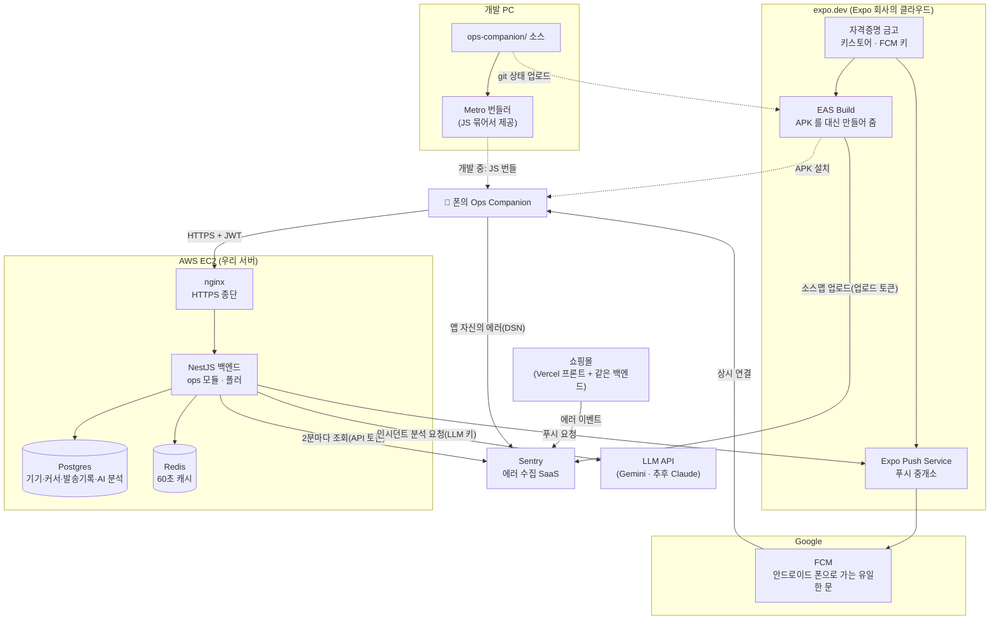
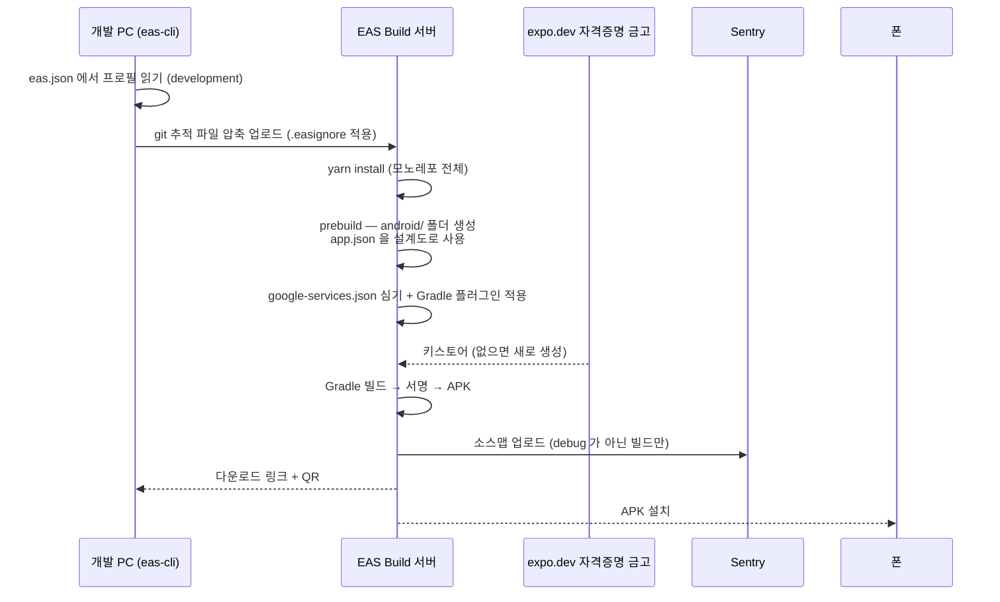
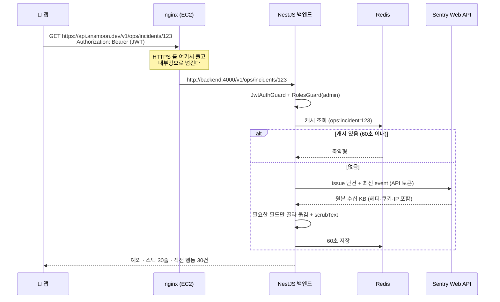
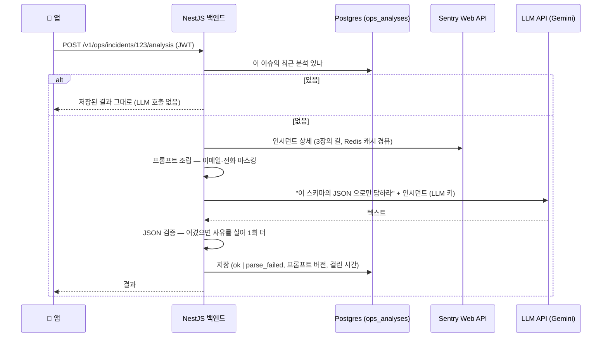
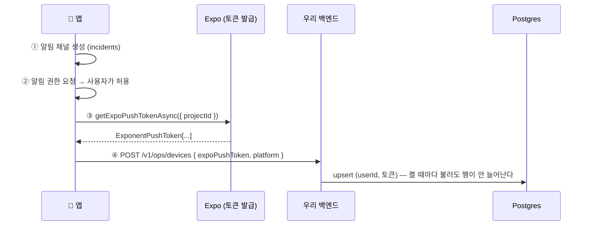
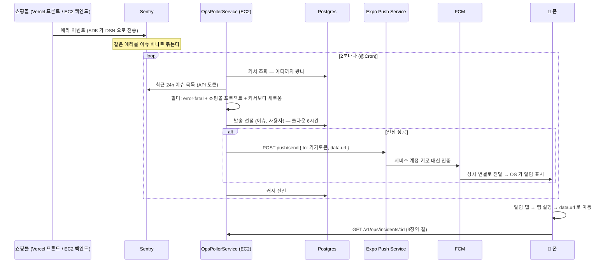

# 인프라 이야기 — 우리 앱은 누구와 어떻게 일하는가

> 대상: **React Native 와 모바일 인프라를 처음 접한다고 가정**한다. 용어는 처음 나올 때 풀고, 맨 끝 [용어 사전](#용어-사전)에 다시 모았다.
> 성격: **살아 있는 문서**다. 편 번호가 붙은 학습 노트(1편·2편…)는 Phase 가 끝난 시점의 기록이지만, 이 문서는 인프라가 늘거나 바뀔 때마다 고쳐 쓴다. 갱신 규칙은 [README](./README.md#부록--살아-있는-문서) 에 있다.
> 짝지어 읽을 것: [2편 — 푸시 알림과 딥링크](./02-push-and-deeplink.md) · [3편 — 관측성 심화와 생체 인증](./03-observability-and-biometrics.md) · [4편 — AI 분석](./04-ai-analysis.md)(코드 중심) · [설계 문서](../../roadmap/ops-companion-design.md) §3(아키텍처) · [관측 지도](../../roadmap/ex-observability-map.md)
> 기준 시점: 2026-09-22 (Phase 4, 커밋 전)

---

<br>

# 0장. 왜 이 문서가 필요한가

Phase 0 까지 이 앱은 단순했다. **폰의 앱이 우리 백엔드에 묻고, 백엔드가 대답한다.** 남의 서비스는 Sentry 하나뿐이었고 그마저 백엔드 뒤에 숨어 있었다.

Phase 1 에서 갑자기 이름이 쏟아졌다. Firebase, FCM, Expo Push Service, EAS, 개발 빌드, 키스토어, Metro… 하나하나는 검색하면 나오지만, **"그래서 이것들이 서로 무슨 사이인가"** 는 어디에도 안 나온다.

그 이유는 단순하다. **푸시 알림은 우리 서버만으로는 절대 만들 수 없는 첫 기능**이었다(2장에서 설명한다). 남의 인프라를 빌려야 했고, 빌리는 순간 계정·자격증명·빌드 방식이 줄줄이 딸려 왔다.

이 문서는 표로 나열하지 않고 **시간 순서로** 푼다. 앱의 하루를 네 장면으로 나눠, 각 장면에서 어떤 인프라가 어떤 순서로 일하는지 따라간다.

| 장면 | 질문 | 등장 인프라 |
|---|---|---|
| 1장. 코드를 짜는 시간 | 고친 코드가 어떻게 폰에 도착하나 | Metro · Expo Go · 개발 빌드 |
| 2장. 앱을 만드는 시간 | 설치 파일은 어디서 어떻게 만들어지나 | EAS Build · 키스토어 · Firebase(설정 파일) · **소스맵 업로드** |
| 3장. 앱을 쓰는 시간 | 목록·상세 화면의 데이터는 어디서 오나, **AI 분석은 누가 부르나** | nginx · 백엔드(EC2) · Redis · Sentry API · **LLM API(Gemini)** |
| 4장. 장애가 나는 시간 | 에러가 어떻게 폰을 울리나 | Sentry · 폴러 · Postgres · Expo Push · FCM |

<br>

## 0-1. 전체 지도 한 장

먼저 큰 그림이다. 지금은 눈에 안 들어와도 된다. 각 장을 읽고 돌아오면 선마다 이유가 보인다.



<br>

---

<br>

# 1장. 코드를 짜는 시간 — 고친 코드가 어떻게 폰에 도착하나

## 1-1. 앱은 두 겹이다

이것 하나를 이해하면 Metro·Expo Go·개발 빌드가 한 번에 정리된다.

```
┌──────────────────────────────────────────┐
│ ① 네이티브 껍데기  (APK 로 설치됨)         │
│    · 안드로이드 앱 본체, 패키지 이름, 권한  │
│    · JS 엔진 Hermes                       │
│    · 네이티브 모듈: 알림·SecureStore 등     │
├──────────────────────────────────────────┤
│ ② JS 번들  (우리가 짠 화면 코드 전부)       │
└──────────────────────────────────────────┘
```

우리가 짜는 코드(`app/`, `src/`)는 전부 **JavaScript** 다. 폰은 JS 를 직접 못 돌리므로, APK 안에 **JS 를 읽어서 실행해 주는 해석기**(Hermes 엔진)가 들어 있다. 그게 ①이고, 해석할 대상이 ②다.

웹에 빗대면 ①은 **브라우저**, ②는 **그 안에서 도는 `main.js`** 다. 브라우저를 다시 깔지 않아도 사이트가 바뀌는 것처럼, ①을 다시 설치하지 않아도 ②만 갈면 앱이 달라진다.

## 1-2. Metro — ②를 만들어 폰에 건네는 도구

> **Metro**: React Native 의 **번들러**. 웹의 webpack·Vite 와 같은 역할이다. 수백 개의 소스 파일을 읽어 하나의 JS 파일로 묶는다.

`yarn start` 를 치면 PC 에서 Metro 가 8081 포트를 열고 기다린다. 폰의 앱이 켜지면 **평범한 HTTP 로** 번들을 요청한다.

```
PC:  yarn start → Metro 가 8081 에서 대기
                        ↑ HTTP GET  (같은 Wi-Fi)
폰:  앱 실행 → http://172.30.1.85:8081/…/entry.bundle?platform=android
                        ↓
     받은 JS 를 Hermes 가 실행 → 화면이 그려짐
```

특별한 기술이 아니다. 브라우저가 서버에서 JS 를 받아 실행하는 것과 같다. 코드를 저장하면 Metro 가 바뀐 부분만 폰에 밀어 넣어 화면이 즉시 바뀐다(**Fast Refresh**).

**Metro 는 인프라가 아니다.** 내 PC 에서만 도는 개발 도구이고, 사용자 폰에 배포되는 앱과는 무관하다. 그래도 이 문서에 넣은 이유는 Phase 1 에서 **가장 오래 헤맨 문제가 Metro 에서 났기 때문**이다.

> **실제로 겪은 일.** 앱이 아무 메시지 없이 **흰 화면**만 보였다. 앱 코드를 아무리 봐도 단서가 없었는데, 원인은 Metro 였다. 모노레포라 감시 범위를 저장소 루트로 열어 뒀더니 2.9GB 짜리 `.yarn/cache` 까지 훑다가 240초 제한을 넘겨 실패했고, 번들 요청이 HTTP 500 으로 떨어졌다. 앱은 받을 JS 가 없으니 흰 화면만 띄운 것이다.
> 해결은 [`metro.config.js`](../../../ops-companion/metro.config.js) 의 `blockList`(감시 제외 목록). 자세한 경위는 [2편 6-9](./02-push-and-deeplink.md#6-9-흰-화면의-원인이-앱이-아니라-번들러였다).

**`.env` 가 "묶을 때" 새겨지는 이유**도 여기서 나온다. `EXPO_PUBLIC_` 으로 시작하는 값은 Metro 가 번들을 만드는 순간 JS 안에 글자 그대로 박힌다. 실행 중에 읽는 설정이 아니다. 그래서 [`.env`](../../../ops-companion/.env.example) 를 바꾼 뒤에는 `yarn start --clear` 로 **다시 묶어야** 반영된다.

## 1-3. Expo Go — 남이 만들어 둔 ①

> **Expo**: React Native 위에 얹는 도구 묶음. 카메라·알림·보안 저장소 같은 네이티브 기능을 JS 로 쓸 수 있게 미리 만들어 뒀고, 빌드·배포 서비스도 제공한다.
> **Expo Go**: Expo 회사가 만들어 Play 스토어에 올려 둔 앱. **범용 껍데기(①)** 다.

Expo Go 를 깔고 QR 을 찍으면, Expo Go 가 우리 PC 의 Metro 에서 ②를 받아 실행한다. **안드로이드 개발 환경을 하나도 설치하지 않고** 폰에서 내 코드를 돌릴 수 있다. 첫 RN 프로젝트에서 이보다 빠른 시작은 없다.

**우리는 어디까지 썼나.** Phase 0 전체와 Phase 1 의 첫 단계(인시던트 상세 화면)까지다. 로그인, 목록, 토큰 자동 갱신, 상세 화면을 전부 Expo Go 로 확인했다.

**왜 졸업했나.** 비유하면 Expo Go 는 **남의 집에 세 들어 사는 것**이다.

| | Expo Go | 우리 앱(개발 빌드) |
|---|---|---|
| 패키지 이름 | `host.exp.exponent` (Expo 것) | `dev.ansmoon.opscompanion` (우리 것) |
| 서명 | Expo 의 키 | 우리 키스토어 |
| 네이티브 모듈 | Expo 가 미리 넣어 둔 것만 | 우리가 고른 것 + 우리 설정 |
| 원격 푸시 | ❌ | ✅ |

푸시 알림은 "패키지 이름 + FCM 설정"이라는 **우편함 주소**로 온다. 세입자는 집주인의 우편함을 쓸 수 없다. 실제로 SDK 53 부터 안드로이드 Expo Go 에서 원격 푸시 기능이 제거됐고, 공식 문서가 개발 빌드를 요구한다.

Expo Go 는 최종 결과물에 들어가지 않는다. 하지만 **"첫 화면을 가장 빨리 띄우는 발판"** 으로서 제 역할을 했다. 네이티브 설정이 필요 없는 화면 작업이라면 지금도 쓸 수 있다.

## 1-4. 개발 빌드 — 내 이름으로 만든 ①

> **개발 빌드(development build)**: 우리 프로젝트 전용으로 만든 ①. 안에 **런처**(어느 Metro 서버에 붙을지 고르는 화면)가 들어 있다.

APK 를 한 번 설치하고 나면 쓰는 법은 Expo Go 와 똑같다. `yarn start` → 앱에서 서버 선택 → JS 를 받아 실행. 겉모습이 Expo Go 와 닮은 것은 같은 런처 UI 를 쓰기 때문이다. **껍데기의 주인이 다를 뿐이다.**

**①을 다시 만들어야 하는 때**는 네이티브 쪽이 바뀔 때뿐이다.

- 네이티브 모듈을 새로 설치했다 (`expo-notifications` 같은 것)
- `app.json` 의 플러그인·패키지 이름·`googleServicesFile` 을 바꿨다
- 안드로이드 권한을 추가했다

화면 코드(②)만 고쳤다면 리로드로 끝난다. Phase 1 에서 고친 `Unmatched Route`, 흰 화면, 로그아웃 버튼 잘림은 전부 **재빌드 없이** 반영됐다.

> **컨테이너를 바꾸면 입력이 바뀐다.** Expo Go 는 앱을 켤 때 초기 경로를 **빈 문자열**로 주고, 개발 빌드는 **`/`** 를 준다. 같은 코드인데 개발 빌드에서만 `Unmatched Route` 가 난 이유다. → [`app/index.tsx`](../../../ops-companion/app/index.tsx) · [2편 6-8](./02-push-and-deeplink.md#6-8-앱을-켤-때의-초기-경로가-실행-환경마다-다르다)

<br>

---

<br>

# 2장. 앱을 만드는 시간 — 설치 파일은 어디서 만들어지나

## 2-1. 왜 클라우드에서 빌드하나

①을 만들려면 Android SDK, JDK, Gradle(안드로이드 빌드 도구)이 필요하다. 설치만 수 GB 이고 버전 맞추기가 까다롭다. 이 PC 에는 JDK 만 있고 Android SDK 가 없었다.

> **EAS(Expo Application Services)**: Expo 회사의 클라우드 서비스 묶음. 그중 **EAS Build** 는 소스를 받아 **Expo 의 서버에서** APK 를 만들어 준다.
> **expo.dev**: 그 서비스들의 웹 대시보드 주소이자 계정.

```bash
eas build --platform android --profile development
```

이 한 줄이 하는 일은 이렇다.



## 2-2. `android/` 폴더가 저장소에 없는 이유

보통의 안드로이드 프로젝트는 `android/` 폴더에 `build.gradle` 같은 설정 파일을 직접 들고 있다. 우리 저장소에는 그 폴더가 없다(`.gitignore` 가 막아 둔다).

> **CNG(Continuous Native Generation)** · **prebuild**: 네이티브 폴더를 **빌드할 때마다 새로 생성**하는 방식. [`app.json`](../../../ops-companion/app.json) 이 설계도다.

그래서 Firebase 콘솔이 "build.gradle 에 플러그인을 추가하세요"라고 안내해도 **건너뛴다.** 우리에겐 고칠 파일이 없다. 대신 `app.json` 에 한 줄을 적으면 EAS 가 prebuild 때 처리한다.

```json
"android": {
  "package": "dev.ansmoon.opscompanion",
  "googleServicesFile": "./google-services.json"
}
```

**이점**: 네이티브 설정이 코드 리뷰 가능한 JSON 한 파일에 모인다. Expo SDK 를 올릴 때 네이티브 폴더를 손으로 병합할 일이 없다.
**대가**: 네이티브 코드를 직접 고쳐야 하는 특수한 경우에는 "config plugin" 을 따로 짜야 한다. 우리는 아직 그럴 일이 없었다.

## 2-3. 키스토어 — 앱에 찍는 인감도장

> **키스토어(keystore)**: 비대칭키 한 쌍이 담긴 파일. APK 에 **서명**할 때 쓴다.

안드로이드는 설치할 때 서명을 보고 두 가지를 판단한다.

1. **위조 여부** — 서명이 내용과 안 맞으면 누군가 APK 를 뜯어고친 것이다. 설치를 거부한다.
2. **같은 앱인가** — 이미 깔린 앱과 **같은 도장**일 때만 덮어 설치(업데이트)를 허용한다.

2번이 없다면 남이 `dev.ansmoon.opscompanion` 이라는 이름으로 악성 앱을 만들어 기존 앱을 갈아치우고, 그 앱이 저장한 데이터(우리 경우 SecureStore 의 토큰)까지 가져갈 수 있다.

**우리는 키스토어를 직접 만들지 않았다.** EAS 가 생성해 금고에 보관한다. expo.dev 의 웹 마법사가 키스토어 업로드 폼을 보여 주지만, 그건 이미 키를 가진 사람용이다.

> **실제로 겪은 일.** expo.dev 에서 Android 자격증명을 한 번 삭제했더니 키스토어가 같이 사라졌고, `eas credentials` 로 **새 도장**을 만들었다. 이미 설치된 앱은 멀쩡했다 — 서명 검사는 **설치하는 순간**에만 한다. 다만 다음에 만든 APK 는 도장이 달라서 **기존 앱을 지우고** 설치해야 한다. 개발 단계라 손해가 없었지만, 스토어에 출시한 뒤라면 업데이트가 막히는 사고다.

## 2-4. 빌드 프로필 셋

[`eas.json`](../../../ops-companion/eas.json) 에 세 가지가 있다. **②를 어디서 가져오느냐**가 갈린다.

| 프로필 | ②(JS)의 위치 | 런처 | 소스맵 업로드 | versionCode | 쓰임 |
|---|---|---|---|---|---|
| `development` | PC 의 Metro 에서 받아옴 | 있음 | ❌ | 고정 | 평소 개발. 코드 수정이 즉시 반영된다 |
| `preview` | **APK 안에 내장** | 없음 | ✅ | **+1씩 증가** | 진짜 앱처럼 동작. PC 없이 돈다. 데모 영상용 |
| `production` | APK 안에 내장 | 없음 | ✅ | **+1씩 증가** | 스토어 제출용(`.aab`). v1 범위 밖 |

`preview`·`production` 은 `.env` 가 아니라 `eas.json` 의 `env` 를 본다. 우리는 거기에 운영 주소(`https://api.ansmoon.dev/v1`)를 박아 뒀다.

> **개발 빌드로는 "앱이 꺼져 있어도" 를 정직하게 시험할 수 없다.** 앱이 죽었다 켜질 때 PC 의 Metro 에서 ②를 다시 받아야 하기 때문이다. PC 가 꺼져 있으면 런처에서 멈춘다. 그 장면은 preview 빌드의 몫이다.

## 2-5. `.easignore` — 첫 빌드가 214MB 를 올린 이유

EAS 는 git 이 추적하는 파일을 통째로 올린다. 모노레포라 백엔드·프론트·문서까지 다 올라갔고, 그중 `docs/` 가 97MB(포트폴리오 이미지)였다. [`.easignore`](../../../.easignore) 로 빼서 **18MB** 로 줄였다.

두 가지를 조심해야 한다.

- `.easignore` 가 있으면 EAS 는 **`.gitignore` 를 무시하고 이 파일만** 본다. 기존 규칙을 전부 옮겨 적어야 한다.
- 워크스페이스 폴더(`backend/` `frontend/`)를 통째로 빼면 안 된다. 루트 `package.json` 의 workspaces 목록과 어긋나 설치가 죽는다.

> **`.env` 도 올라가지 않는다.** 비밀값이 빌드 서버로 가지 않게 하려는 의도지만, `EXPO_PUBLIC_*` 처럼 앱에 들어가야 하는 값까지 같이 빠진다. 그래서 그런 값은 `eas.json` 의 `env` 에 적는다.

## 2-6. 소스맵 — 빌드가 Sentry 에 남기는 흔적

빌드가 끝날 때 EAS 가 Sentry 로 파일을 하나 올린다. 이 문서에서 **expo.dev 와 Sentry 가 직접 연결되는 유일한 지점**이다.

> **소스맵(source map)**: 압축된 번들의 좌표(`index.android.bundle:1:452103`)를 원본 파일·줄(`src/lib/sentry.ts:48:43`)로 되돌리는 대응표.
> **Debug ID**: 번들과 소스맵 양쪽에 심는 같은 표식. 도착한 에러와 올려둔 소스맵을 짝짓는 열쇠다.

세 조각이 각각 다른 파일에 있어야 성립한다.

| 조각 | 어디에 | 하는 일 |
|---|---|---|
| org·project | `app.json` 의 Sentry 플러그인 | prebuild 가 `android/sentry.properties` 로 떨어뜨린다 |
| Debug ID | `metro.config.js` 의 `getSentryExpoConfig` | 번들·소스맵에 같은 표식을 심는다 |
| 업로드 | SDK 의 `sentry.gradle` | **debug 가 아닌 빌드**에서만 `sentry-cli` 로 올린다 |

마지막 줄 때문에 **개발 빌드로는 복원을 확인할 수 없다.** preview 가 필요하다.

업로드에는 **새 비밀값**이 하나 필요하다. Sentry 의 **Organization Token**(`sntrys_`)이고 EAS 환경 변수에 `secret` 으로 둔다. 백엔드가 폴링에 쓰는 개인 토큰(`sntryu_`)과 다른 토큰이다 — 릴리즈·소스맵 업로드만 되고 이슈 조회는 안 된다.

이 토큰은 **빌드 서버의 셸에만** 존재하고 APK 에는 들어가지 않는다(`EXPO_PUBLIC_` 접두어가 없는 값은 번들에 박히지 않는다). Sentry 플러그인의 `authToken` 옵션에 적으면 저장소와 APK 양쪽에 남으므로 쓰지 않는다 — SDK 자신이 경고를 띄운다.

## 2-7. versionCode — Sentry 가 빌드를 구분하는 유일한 수단

안드로이드 앱에는 버전이 둘이다. `version`(`1.0.0`, 사람용)과 `versionCode`(`1`, 정수, 기계용)다. Sentry 는 이 둘을 합쳐 **릴리즈 이름**을 만든다.

```
dev.ansmoon.opscompanion @ 1.0.0 + 1
└── 패키지 이름 ────────┘  └version┘ └versionCode
```

쇼핑몰은 이 문제가 없다. Sentry SDK 가 **git 커밋 SHA** 를 릴리즈로 쓰기 때문에 배포마다 저절로 갈린다(`f54ba5ec9078…`). 앱은 자기가 어느 커밋으로 만들어졌는지 모른다 — APK 안에 git 이 없다. 그래서 네이티브 빌드 정보에 기댄다.

`versionCode` 가 고정이면 모든 빌드가 Sentry 에서 **한 덩어리**가 되고, "이번 빌드가 저번보다 안정적인가"를 물을 수 없다. 그래서 `eas.json` 의 preview·production 에 `autoIncrement` 를 켰다. development 는 일부러 뺐다 — 반복이 잦아 의미 없는 릴리즈만 는다.

<br>

---

<br>

# 3장. 앱을 쓰는 시간 — 화면의 데이터는 어디서 오나

여기는 Phase 0 부터 있던 길이다. Phase 1 에서 상세 API 가, Phase 3 에서 AI 분석(3-4)이 더해졌지만 **"앱은 백엔드만 부른다"** 는 구조는 같다.



## 3-1. 왜 앱이 Sentry 를 직접 부르지 않나

가장 중요한 설계 결정이다. 이유가 셋이다.

**① 보안.** Sentry API 를 부르려면 인증 토큰이 필요하다. 앱에 넣으면 앱은 사용자 기기에 설치되는 프로그램이라 분해해서 꺼낼 수 있다. 그러면 남이 우리 조직의 모든 에러 로그를 읽는다. 그래서 토큰은 백엔드 환경변수에만 둔다.

**② 가공.** 실무적으로는 이게 더 크다. Sentry 원본 응답에는 요청 헤더, `Cookie: refreshToken=...`, 구매자 이메일, IP 가 들어 있었다. 그대로 넘기면 필요 없는 개인정보가 기기까지 흘러간다. 백엔드가 **필요한 필드만 골라 옮기고**(화이트리스트) 자유 텍스트는 이메일·전화번호를 마스킹한다.

**③ 완충.** 백엔드가 60초 캐시를 두므로, 목록을 당겨 새로고침을 연타해도 Sentry 를 때리지 않는다.

## 3-2. nginx 와 EC2 — 앱이 실제로 말을 거는 곳

> **EC2**: AWS 의 가상 서버. 우리 백엔드·DB·Redis 가 Docker 컨테이너로 돈다.
> **nginx**: 웹 서버이자 리버스 프록시. 바깥의 HTTPS 요청을 받아 안쪽의 백엔드로 넘긴다.
> **TLS 종단**: HTTPS 의 암호화를 nginx 가 풀어 주는 것. 그 뒤 내부망은 평문 HTTP 로 통신한다.

이게 앱의 **선행조건**이었다. 안드로이드는 평문 HTTP 를 기본으로 막는다. 백엔드가 `https://api.ansmoon.dev` 로 열리기 전에는 실기기에서 앱이 성립하지 않았다.

웹 쇼핑몰은 **Vercel** 을 거쳐 백엔드에 닿지만, 앱은 Vercel 을 거치지 않고 nginx 에 직접 붙는다. 그래서 CORS 도 앱과 무관하다(모바일은 `Origin` 헤더를 보내지 않는다).

> **배포할 때마다 nginx 를 리로드해야 하는 이유.** nginx 는 백엔드 컨테이너의 IP 를 **시작할 때 한 번만** 기억한다. 백엔드를 새 이미지로 다시 만들면 IP 가 바뀌어, 리로드 전까지 옛 IP 로 보내다 502 가 난다.

## 3-3. 앱이 들고 있는 것은 JWT 하나뿐

> **JWT**: 로그인하면 받는 서명된 토큰. 요청마다 `Authorization: Bearer …` 로 실어 보낸다.
> **SecureStore**: 기기의 보안 저장소(안드로이드 Keystore 기반). 토큰은 여기에만 둔다.

앱 안에 있는 비밀값은 **우리 로그인 토큰이 전부**다. Sentry 토큰도, FCM 키도, LLM 키도 앱에는 없다. 이 원칙이 5장의 비밀값 지도로 이어진다.

### 생체 잠금은 이 그림을 바꾸지 않는다

지문으로 앱을 잠그는 기능이 있지만, **인프라가 하나도 늘지 않았다.** 흔한 오해라 분명히 적어 둔다.

> **기기 보안 칩**: 폰 안의 격리된 영역(Android StrongBox / iOS Secure Enclave). 등록된 지문·얼굴 정보가 여기 갇혀 있고 대조도 여기서 일어난다. 앱은 그 안을 들여다볼 수 없다.

```
[앱]  "이 사람이 주인인지 확인해 줘"
  ↓
[보안 칩]  센서 입력 ↔ 등록 정보 대조        ← 네트워크를 타지 않는다
  ↓
[앱]  true / false 만 받음
```

생체 데이터는 앱에도, 우리 백엔드에도, Sentry 에도 가지 않는다. 그래서 **서버 요청 0건, DB 테이블·컬럼 0개**다. "생체 잠금을 쓸지" 설정조차 SecureStore(기기)에만 둔다 — 서버에 동기화하는 순간 이 기능이 서버와 얽히고, 설계가 피하려던 것이 정확히 그것이다.

잠금이 하는 일을 정확히 말하면 "서버에 재로그인"이 아니라, **이미 SecureStore 에 있는 JWT 를 꺼내 쓰기 전에 거치는 로컬 관문**이다.

<br>

---

<br>

## 3-4. AI 분석 — 앱이 아니라 백엔드가 LLM 을 부른다

> **LLM(Large Language Model)**: 텍스트를 넣으면 텍스트를 내는 모델. 우리는 Gemini 를 HTTP API 로 부른다(추후 Claude 로 바꿀 수 있게 백엔드가 `LlmClient` 라는 한 겹을 두고 있다).

상세 화면의 "AI에게 원인 물어보기"는 3-1 과 같은 이유로 **백엔드를 경유**한다. 다른 점은 백엔드가 읽기만 하는 게 아니라 **만들고 저장한다**는 것이다.



세 가지가 3-1 의 원칙을 그대로 잇는다.

- **① 키 은닉** — LLM 키는 백엔드 `.env` 에만 있다. 쇼핑몰 관리자 어시스턴트가 쓰던 바로 그 키라 새 비밀값은 늘지 않았다(5장).
- **② 가공** — 무료티어로 보낸 입력은 학습에 쓰일 수 있다. 그래서 LLM 에 넣기 **전에** 제목·예외 메시지의 이메일·전화를 마스킹한다. 나가는 방향의 마스킹이 처음 생겼다.
- **③ 완충** — 분석은 한 이슈에 한 번만 만들고 표에 저장한다. 같은 이슈를 다시 열면 LLM 을 부르지 않는다. Gemini 무료티어는 **분당 15회**라, 60초 캐시로는 부족해 백엔드가 분당 5건으로 스스로 제한한다.

> **프롬프트 버전**: 저장된 각 분석이 어느 문구의 지시로 만들어졌는지 남기는 표식(지금은 전부 `v1`). Phase 4 에서 "문구를 바꿨더니 승인율이 올랐나"를 비교하는 축이다.

> **few-shot**: 프롬프트 앞에 "이렇게 답한 예시"를 붙이는 것. 모델을 학습시키는 게 아니라 매 요청의 입력에 끼워 넣는다. 우리 예시는 **사람이 승인한 과거 분석**이다.

**분석은 저장으로 끝나지 않는다 — 사람이 채점하고, 그 채점이 다음 분석의 입력이 된다.** 앱의 평가 탭이 저장된 분석을 카드로 보여주고, 오른쪽으로 밀면 승인·왼쪽은 반려가 `ops_reviews` 에 남는다. 다음 분석 요청 때 백엔드는 승인된 분석 3개를 골라(별점순, 지금 분석하는 이슈 자신은 제외) 프롬프트의 규칙 뒤에 예시로 붙인다. 예시가 실제로 들어간 분석만 프롬프트 버전이 `v2` 다. 평가 카드에는 버전이 실리지 않는다(블라인드) — 채점자가 "v2 니까" 하고 후하게 줄 수 없게 백엔드가 응답에서 뺀다. 버전별 승인율은 `GET /v1/ops/analyses/stats` 가 낸다.

**Postgres 표가 둘 늘었다.** 4-5 의 표 셋(푸시)에 `ops_analyses`(분석 결과)와 `ops_reviews`(사람의 판정)가 더해져 다섯이다. `ops_analyses` 는 Sentry 이슈 id 로만 이어지고 사용자 FK 가 없다 — 분석은 누가 요청했든 같은 이슈의 같은 답이기 때문이다. `ops_reviews` 는 반대로 **평가자 FK 가 있다** — 판정은 사람의 것이고, 한 사람이 한 분석에 남기는 판정은 하나다(유니크). 인프라는 늘지 않았다: 새 서비스도, 새 비밀값도, 앱의 새 네이티브 패키지도 없다.

<br>

---

<br>

# 4장. 장애가 나는 시간 — 에러가 어떻게 폰을 울리나

## 4-1. 서버는 폰에 직접 말을 걸 수 없다

Phase 1 에서 인프라가 늘어난 **근본 원인**이 이것이다.

웹에서는 브라우저가 먼저 요청을 연다. 앱도 같다. 그런데 푸시는 **앱이 꺼져 있을 때도 도착해야** 한다. 세 가지가 막는다.

1. **주소가 없다.** 폰은 이동통신망·공유기 뒤에 있어 고정 IP 가 없다. 서버가 "그 폰"을 지목할 방법이 없다.
2. **받을 주체가 없다.** 앱이 죽어 있으면 코드가 돌지 않는다.
3. **OS 가 막는다.** 배터리 때문에 앱이 상시 연결을 유지하는 것을 허용하지 않는다.

해법은 하나다. **OS 제조사가 유지하는 연결을 빌려 쓴다.** 안드로이드 폰은 켜져 있는 동안 구글 서버와 연결 하나를 항상 열어 둔다. 그 통로로 들어온 신호만이 잠든 앱을 깨운다.

> **FCM(Firebase Cloud Messaging)**: 그 통로의 이름. 안드로이드 폰으로 가는 **유일한 문**이다. iOS 에서는 **APNs**(애플)가 같은 역할을 한다.

## 4-2. Firebase — 문 하나를 쓰려고 건물에 입주 신고

**우리는 Firebase 를 "쓰는" 게 아니다.** Firebase 에는 DB·인증·호스팅 등 제품이 열 개 넘게 있지만 우리가 쓰는 것은 **FCM 하나**다. 구글이 안드로이드 푸시 게이트웨이를 Firebase 안에 넣어 둬서, 문 하나를 쓰려면 프로젝트를 만들어야 한다.

FCM 은 두 가지를 확인한다. 그래서 파일이 둘이다.

| 확인 | 무엇으로 | 받은 파일 | 어디에 두나 |
|---|---|---|---|
| "이 앱이 진짜 네 앱이냐" | 앱 안에 박힌 설정 | [`google-services.json`](../../../ops-companion/google-services.json) | 저장소(공개 식별자뿐이라 커밋 가능) |
| "보내는 쪽이 앱 주인이냐" | 서버가 내미는 열쇠 | 서비스 계정 비공개 키 | **expo.dev 금고에만.** 저장소·백엔드 어디에도 없다 |

하나는 **앱의 신분증**, 하나는 **발송자의 열쇠**다. 후자가 유출되면 남이 우리 앱 이름으로 푸시를 보낼 수 있다.

## 4-3. Expo Push Service — 중개소를 둔 이유

백엔드가 FCM 에 직접 보낼 수도 있다(Expo 공식 문서도 안내한다). 그러면 이렇게 된다.

| 직접 FCM 으로 | Expo 를 거치면 |
|---|---|
| 서비스 계정 키를 **우리 백엔드**에 보관 | Expo 에 한 번 올리고 끝 |
| 그 키로 OAuth 2.0 액세스 토큰을 발급·갱신하는 코드 | 불필요 |
| 안드로이드용 + iOS 용 코드 따로 (APNs 는 HTTP/2 + JWT 서명) | 한 가지 API |
| 플랫폼마다 다른 기기 토큰 형식 | `ExponentPushToken[...]` 하나 |

우리 쪽 코드는 [`expo-push.client.ts`](../../../backend/src/ops/expo-push.client.ts) 가 `https://exp.host/--/api/v2/push/send` 로 JSON 배열을 POST 하는 것이 전부다.

**선택한 이유**는 3-1 과 같은 방향이다 — **비밀값을 우리 서버에서 한 겹 덜어낸다.** 앱에 Sentry 토큰을 넣지 않은 것처럼, 백엔드에 FCM 키를 두지 않는다.

**되돌릴 수 있다.** 직접 발송으로 바꾸려면 앱에서 `getDevicePushTokenAsync()` 로 토큰 종류를 바꾸고 백엔드에 OAuth 발급 코드를 넣으면 된다. 교체 지점은 저 파일 하나다.

## 4-4. 기기 토큰 — 폰이 먼저 알려 주는 주소

> **기기 토큰(Expo push token)**: "이 폰의 이 앱"을 가리키는 주소. `ExponentPushToken[8_5Dik...]` 형태다.

서버가 폰을 찾아갈 수 없으니, 반대로 **폰이 먼저 "나한테 보낼 땐 이 주소를 써라"고 등록**한다.



- **`projectId`** 는 `eas init` 이 발급해 `app.json` 에 적어 준 값이다. 토큰은 이 프로젝트에 묶인다. expo.dev 가 "빌드 공장"이면서 동시에 "앱의 신원"인 이유다.
- **순서에 이유가 있다.** 안드로이드 13+ 는 채널이 하나라도 있어야 권한 대화상자를 띄운다. 그래서 ①이 ②보다 먼저다.
- 토큰은 **기기에** 붙는다. 앱을 지웠다 깔거나 기기를 바꾸면 값이 달라진다. 한 사람이 폰·태블릿을 쓰면 토큰이 둘이고 둘 다 울린다.
- **요청을 식별하는 용도가 아니다.** 앱 → 서버의 신분 증명은 JWT 다. 기기 토큰은 반대 방향(서버 → 폰) 통로에만 쓴다.

> 쇼핑몰 백엔드에 이미 있는 `x-device-id` 헤더와 헷갈리기 쉽다. 그건 **로그인 세션을 기기별로 구분**하는 값(폰 → 서버)이고 `refresh_tokens` 표에 쓰인다. 푸시와 무관하다.

## 4-5. 전체 흐름 — 에러에서 상세 화면까지



**왜 Sentry 가 우리를 부르지 않고(webhook) 우리가 묻나(폴링).** Sentry 의 서드파티 통합은 유료 플랜이고, 실제로 무료 전환 뒤 Slack 연동이 조용히 끊긴 적이 있다. 폴링은 공개 수신 엔드포인트도 서명 검증도 필요 없다. 잃는 것은 최대 2분의 지연뿐이다.

**Postgres 표 셋의 역할.**

| 표 | 답하는 질문 | 없으면 |
|---|---|---|
| `ops_device_tokens` | 누구의 어느 기기에 보낼까 | 보낼 곳을 모른다 |
| `ops_poll_state` | Sentry 를 어디까지 봤나 | 매 주기 같은 이슈를 새 것으로 오인 → **푸시 무한 반복** |
| `ops_push_log` | 이 장애를 이 사람에게 이미 보냈나 | 중복 발송을 못 막는다 |
| `ops_analyses` (3-4) | 이 이슈를 AI 가 뭐라고 했나 | 열 때마다 LLM 을 다시 부른다(쿼터) · 채점할 대상이 없다 |
| `ops_reviews` (3-4) | 그 답을 사람이 뭐라고 판정했나 | 다음 프롬프트에 넣을 예시가 없다 · v1 vs v2 를 잴 수 없다 |

커서를 Redis 가 아니라 DB 에 두는 이유는 Redis 가 재시작되면 커서를 잃기 때문이다.

## 4-6. Sentry 는 두 가지 역할로 등장한다

같은 Sentry 가 방향이 다른 두 일을 한다. 헷갈리기 쉬운 지점이다.

| | 역할 A — **읽는다** | 역할 B — **쓴다** |
|---|---|---|
| 누가 | 우리 백엔드 | 쇼핑몰 프론트·백엔드, 그리고 **이 앱 자신** |
| 무엇으로 | **API 토큰**(비밀) | **DSN**(공개돼도 되는 주소) |
| 하는 일 | 이슈 목록·상세 + **릴리즈별 crash-free** 를 조회해 앱에 전달 | 에러 + **세션**(앱이 열리고 닫힌 기록)을 Sentry 로 보고 |
| 코드 | [`sentry-api.client.ts`](../../../backend/src/ops/sentry-api.client.ts) | [`sentry.ts`](../../../ops-companion/src/lib/sentry.ts) |

**Release Health 는 두 역할이 한 바퀴 도는 예다.** 앱이 세션을 보내고(B), 백엔드가 그 집계를 읽어(A), 앱의 목록 화면 상단 카드로 돌아온다.

> **세션**: 앱을 한 번 열어서 쓰는 동안. **crash-free sessions** 는 그중 크래시 없이 끝난 비율이다.

세션은 우리가 계측한 것이 아니다. SDK 의 `enableAutoSessionTracking` 이 기본으로 켜져 있어 **이미 보내고 있었다.** 새로 만든 것은 그걸 읽어 보여주는 `GET /v1/ops/release-health` 뿐이고, 여기서도 비밀값은 **이미 있던 API 토큰** 하나다.

조회할 때 빠뜨리면 안 되는 것이 둘이다. 둘 다 에러 없이 **틀린 답**이 온다.

| 빠뜨리면 | 무슨 일이 | 실측 |
|---|---|---|
| **프로젝트 지정** | 조직 전체가 합산돼 쇼핑몰 웹 세션이 섞인다 | 지정 시 그룹 1개, 생략 시 9개 |
| **집계 단위(`interval`)** | 세션이 적은 **새 릴리즈가 응답에서 빠진다** | `14d` 미지정·`1h` → 새 릴리즈 누락 / `6h`·`1d` → 정상 |

두 번째가 특히 고약하다. 새 빌드는 배포 직후라 세션이 가장 적고, 카드가 가장 보여주고 싶은 것도 새 빌드다. 기간이 길수록 데이터 포인트가 많아져 Sentry 가 작은 그룹부터 떨구는 것으로 보인다. 시계열을 그리지 않고 합계만 쓰므로 가장 굵은 `1d` 로 고정했다.

> **DSN**: "에러를 어디로 보낼지" 적힌 주소. 쓰기 전용이라 유출돼도 남이 우리 데이터를 읽을 수 없다. 그래서 앱 번들에 넣어도 된다.

Sentry 프로젝트는 셋이다: `e-commerse-frontend`, `e-commerse-backend`, `ops-companion`. **폴러는 앞의 둘만 본다.** 앱 자신을 넣으면 이런 고리가 생긴다.

```
앱 크래시 → Sentry 기록 → 폴러가 발견 → 앱에 푸시 → 탭 → 앱 켜짐 → 또 크래시 → …
```

개발 모드에서는 앱의 Sentry 가 꺼져 있다(`enabled: !__DEV__`). 월 5,000건 쿼터를 개발 중 에러로 태우지 않기 위해서다.

<br>

---

<br>

# 5장. 누가 어떤 비밀을 들고 있나

이 구조 전체를 한 줄로 요약하면 **"앱에는 비밀을 두지 않는다"** 다. 앱 바이너리는 분해될 수 있기 때문이다.

| 비밀값 | 어디에 있나 | 앱에 있나 | 유출되면 |
|---|---|---|---|
| Sentry **API 토큰**(개인, `sntryu_`) | 백엔드 `.env` (EC2) | ❌ | 조직의 모든 에러 로그를 읽힌다 |
| Sentry **업로드 토큰**(조직, `sntrys_`) | expo.dev 환경 변수(secret) | ❌ (빌드 서버에만) | 남이 우리 프로젝트에 가짜 릴리즈·소스맵을 올릴 수 있다. 이슈 조회는 불가 |
| FCM **서비스 계정 키** | expo.dev 금고 | ❌ (백엔드에도 없다) | 남이 우리 앱 이름으로 푸시 발송 |
| **키스토어** | expo.dev 금고 | ❌ | 남이 우리 앱의 "업데이트"를 만들 수 있다 |
| JWT 서명 키 · DB 비밀번호 | 백엔드 `.env` (EC2) | ❌ | 인증 전체가 무너진다 |
| **LLM API 키**(`GEMINI_API_KEY`) | 백엔드 `.env` (EC2) — 쇼핑몰 어시스턴트와 **같은 키** | ❌ | 남이 우리 쿼터로 LLM 을 쓴다(무료티어면 분당 15회를 소진시켜 분석·어시스턴트가 막힌다) |
| 사용자 **JWT** | 폰의 SecureStore | ✅ (그 사용자 것만) | 그 사용자 권한만큼 |
| `google-services.json` | 저장소 · 앱 | ✅ | 공개 식별자뿐 — 무해 |
| Sentry **DSN** | 앱 · 프론트 | ✅ | 쓰기 전용 — 무해(가짜 이벤트로 쿼터를 깎을 수는 있다) |
| EAS `projectId` | `app.json` | ✅ | 식별자일 뿐 — 무해 |
| **지문·얼굴 정보** | 기기 보안 칩 | — | **앱이 애초에 만질 수 없다.** 서버로도 가지 않는다(3-3) |

**판별법**: "이 값으로 **읽거나 대신 행동**할 수 있는가" 면 비밀이고, "**어디로 보낼지**만 알려 주는가" 면 공개해도 된다.

> **"앱에 비밀을 두지 않는다"를 정확히 읽는 법.** 업로드 토큰은 EAS 빌드 서버에서 쓰이므로 "앱 바깥 어딘가"에는 존재한다. 원칙이 막는 것은 **APK 안에 들어가는 것**이다 — 설치 파일은 누구나 받아 풀어볼 수 있고, 그 안의 문자열은 `grep` 한 줄로 쏟아진다. `EXPO_PUBLIC_` 접두어가 붙은 값만 번들에 박히고, 나머지는 빌드 머신의 셸에만 잠깐 존재하다 사라진다. 그래서 DSN·API 주소는 APK 안에서 평문으로 발견되지만 업로드 토큰은 흔적조차 없다.

<br>

---

<br>

# 6장. 무엇이 죽으면 무엇이 멈추나

의존성이 늘면 장애 지점도 는다. 정직하게 적어 둔다.

| 죽는 것 | 멈추는 것 | 그대로 되는 것 |
|---|---|---|
| **개발 PC / Metro** | 개발 빌드 앱(번들을 못 받는다) | preview·운영 빌드, 운영 서비스 전부 |
| **Expo Push Service** | 푸시 발송 | 앱으로 직접 조회 |
| **FCM** | 안드로이드 푸시 수신 | 위와 같음 |
| **Sentry** | 인시던트 조회·푸시·에러 수집·crash-free 카드·**AI 분석**(상세를 못 읽는다) 전부 | 쇼핑몰 자체 |
| **LLM API**(Gemini) 또는 키 만료·쿼터 소진 | **AI 분석만**(503 또는 실패). 이미 저장된 분석은 그대로 보인다 | 목록·상세·푸시·crash-free 전부. 관리자 어시스턴트는 같이 멈춘다(같은 키) |
| **expo.dev 업로드 토큰 만료** | 새 빌드의 소스맵 업로드(스택이 압축 좌표로 남는다) | 나머지 전부. 빌드 자체는 성공한다 |
| **Redis** | 캐시(매번 Sentry 를 부른다), 로그인 레이트리밋 | 조회 자체 |
| **EC2 / 백엔드** | **앱의 모든 기능 + 푸시** | — |

마지막 줄이 이 설계의 **구조적 한계**다. 앱은 반드시 백엔드를 경유하므로, 백엔드가 죽는 **가장 심각한 장애에서 온콜 앱이 먹통**이 된다.

> **UptimeRobot**: 외부에서 5분마다 `https://api.ansmoon.dev/v1/health` 를 찔러 보는 감시 서비스. 죽으면 메일을 보낸다.

이 한계를 없애려면 앱이 UptimeRobot 을 직접 불러야 하는데, 그러면 API 키가 앱에 들어가 5장의 원칙을 깬다. 그래서 **한계를 받아들이고 UptimeRobot 메일을 1차 통로로 유지**한다. 우리 인프라 밖에 있는 유일한 감시자이기 때문이다(실측 탐지 5분 33초 — [관측 지도](../../roadmap/ex-observability-map.md)).

**생체 잠금은 이 표에 줄을 더하지 않는다.** 기기 안에서 끝나므로 무엇이 죽어도 영향을 받지 않고, 반대로 잠금이 고장 나도 다른 것이 멈추지 않는다. 지문이 아예 안 읽히는 경우를 위해 잠금 화면에 로그아웃 버튼을 뒀다.

**운영하다 밟기 쉬운 것 하나.** 로컬 백엔드와 운영 백엔드를 동시에 켜 두면 둘이 같은 Sentry 를 각자 폴링한다. 커서와 발송 기록이 **DB 별로 따로**라서, 같은 기기 토큰이 양쪽에 등록되면 알림이 두 번 온다.

<br>

---

<br>

# 7장. 선택의 이유 — 기각한 대안들

| 결정 | 택한 것 | 기각한 것 | 이유 |
|---|---|---|---|
| 앱 프레임워크 | **Expo**(관리형) | 순수 React Native | 첫 RN 프로젝트다. 네이티브 설정을 `app.json` 하나로 다루고, 첫 화면까지의 거리가 짧다 |
| 개발 컨테이너 | Expo Go → **개발 빌드** | Expo Go 유지 | SDK 53+ 안드로이드에서 원격 푸시가 빠졌다. 선택이 아니라 강제였다 |
| 빌드 장소 | **EAS 클라우드** | 로컬 빌드 | PC 에 Android SDK 가 없다. 키스토어 보관까지 맡길 수 있다. 빌드 수가 모자라면 그때 로컬로 옮긴다 |
| 푸시 경로 | **Expo Push Service** | FCM 직접 | 백엔드에 서비스 계정 키·OAuth 코드·플랫폼별 분기를 두지 않는다. 파일 하나로 되돌릴 수 있다 |
| 장애 감지 | **폴링**(2분) | Sentry webhook | webhook 통합은 유료 플랜. 폴링은 공개 엔드포인트·서명 검증이 필요 없다 |
| Sentry 접근 | **백엔드 경유** | 앱이 직접 | 토큰 은닉 + 개인정보 가공 + 캐시 |
| 쿼터 방어 | **중복 억제**(60초 1건) | 무작위 샘플링 | 새 이슈의 **첫 이벤트**가 버려지면 그 이슈로 도는 푸시를 놓친다 |
| LLM 호출 위치 | **백엔드 경유** + 결과 저장 | 앱이 직접 | 키 은닉 · 보내기 전 마스킹 · 같은 이슈를 두 번 묻지 않음 · 저장해야 Phase 4 평가가 성립 |
| LLM 응답 형식 | 프롬프트 지시 + **백엔드 검증·재시도·fallback** | 프로바이더 JSON 모드 | `LlmClient` 에 프로바이더 어휘를 넣지 않는다. 검증 경로가 실제로 실행되는 코드로 남는다 |

**비용.** 전부 무료 등급 안에서 돈다.

- Firebase FCM: 무료
- Expo Push Service: 무료 계정에서 사용. 프로젝트당 초당 600건, 한 요청에 100건 한도(우리는 기기 한두 대라 닿지 않는다)
- EAS Build: 무료 등급에 월 빌드 수 제한이 있다(정확한 수는 expo.dev 요금 페이지에서 확인)
- Sentry: 조직 공용 월 5,000 errors. **쇼핑몰과 앱이 나눠 쓴다**
- Gemini: 무료티어 **분당 15회**. 관리자 어시스턴트와 앱의 AI 분석이 나눠 쓴다(분석은 분당 5건으로 자체 제한)

<br>

---

<br>

# 8장. 앞으로 바뀔 것

이 문서가 살아 있는 이유다. Phase 마다 아래가 더해질 예정이고, 그때 해당 장을 고친다.

| Phase | 더해질 인프라·연결 | 이 문서에서 고칠 곳 |
|---|---|---|
| 미정 | **소스 코드 읽기(tool use)** — 백엔드가 GitHub 에서 스택의 파일:줄을 읽어 LLM 에 넘긴다. 새 외부 연결(GitHub API) + 토큰이 하나 는다 | 0-1 지도 · 3-4 · 5장 · 6장 |
| 미정 | **LLM 을 Claude 로 전환** — 백엔드 `LLM_PROVIDER` 한 줄. 키가 하나 바뀐다 | 3-4 · 5장 |
| 미정 | **preview/운영 빌드 배포** — 내부 배포 링크 또는 스토어 | 2-4 |
| 미정 | **EAS Update**(설치 없이 JS 만 원격 교체하는 Expo 서비스) — 쓸지 아직 정하지 않았다 | 1장 |

<br>

---

<br>

# 용어 사전

가나다·알파벳 순. 본문에서 처음 나온 장을 괄호에 적었다.

| 용어 | 뜻 |
|---|---|
| **APK** | 안드로이드 앱 설치 파일. 스토어 제출용은 `.aab`(App Bundle)다 (2장) |
| **APNs** | Apple Push Notification service. iOS 의 FCM 에 해당한다 (4-1) |
| **CNG / prebuild** | 네이티브 폴더(`android/`)를 저장소에 두지 않고 빌드 때마다 `app.json` 으로부터 생성하는 방식 (2-2) |
| **cold start** | 앱이 완전히 종료된 상태에서 켜지는 것. 알림 탭으로 켜질 때 처리 방식이 다르다 (2-4) |
| **Debug ID** | 번들과 소스맵 양쪽에 심는 같은 표식. 도착한 에러와 올려둔 소스맵을 짝짓는 열쇠 (2-6) |
| **DSN** | Sentry 로 에러를 **보낼** 주소. 쓰기 전용이라 공개돼도 된다 (4-6) |
| **EAS** | Expo Application Services. 빌드(EAS Build)·자격증명 보관 등 Expo 의 클라우드 서비스 묶음 (2-1) |
| **EAS 환경 변수** | expo.dev 에 저장해 빌드 때만 쓰는 값. `secret` 으로 두면 로그·UI 어디에도 안 보인다 (2-6) |
| **EC2** | AWS 의 가상 서버. 우리 백엔드·DB·Redis·nginx 가 돈다 (3-2) |
| **Expo** | React Native 위에 얹는 도구·서비스 묶음 (1-3) |
| **Expo Go** | Expo 가 스토어에 올려 둔 범용 껍데기 앱. 설치 없이 내 JS 를 돌려 볼 수 있다 (1-3) |
| **Expo Push Service** | FCM·APNs 를 대신 상대해 주는 푸시 중개소 (4-3) |
| **expo.dev** | EAS 의 웹 대시보드이자 계정. 빌드 목록·자격증명·프로젝트 신원이 여기 있다 (2-1) |
| **Fast Refresh** | 코드를 저장하면 바뀐 부분만 폰에 밀어 넣어 즉시 반영하는 기능 (1-2) |
| **FCM** | Firebase Cloud Messaging. 안드로이드 폰으로 푸시를 보내는 유일한 통로 (4-1) |
| **Firebase** | 구글의 앱 개발 플랫폼. 우리는 그중 FCM 만 쓴다 (4-2) |
| **Gradle** | 안드로이드 빌드 도구. 우리는 직접 만지지 않는다(EAS 가 돌린다) (2-1) |
| **Hermes** | React Native 용 JS 엔진. APK 안에서 우리 JS 를 실행한다 (1-1) |
| **JWT** | 로그인하면 받는 서명된 토큰. 앱이 가진 유일한 비밀값 (3-3) |
| **LLM** | Large Language Model. 텍스트를 넣으면 텍스트를 내는 모델. 우리는 Gemini 를 HTTP API 로 부른다 (3-4) |
| **Metro** | React Native 번들러. 소스를 하나의 JS 로 묶어 폰에 건넨다 (1-2) |
| **nginx** | 리버스 프록시. HTTPS 를 받아 풀고 백엔드로 넘긴다 (3-2) |
| **projectId** | EAS 가 발급한 프로젝트 식별자. 푸시 토큰이 이 값에 묶인다 (4-4) |
| **RPM** | requests per minute. Gemini 무료티어는 15. 초 단위의 벽이라 60초 캐시로는 부족하다 (3-4) |
| **Sentry** | 에러 수집 SaaS. 같은 에러를 "이슈"로 묶어 준다 (4-6) |
| **TLS 종단** | HTTPS 암호화를 nginx 가 풀어 주는 것 (3-2) |
| **UptimeRobot** | 외부에서 주기적으로 서버를 찔러 보는 감시 서비스 (6장) |
| **versionCode** | 안드로이드가 쓰는 정수 버전. 큰 쪽이 새 빌드. Sentry 릴리즈 이름의 `+N` 이 이 값이다 (2-7) |
| **Vercel** | 쇼핑몰 프론트(Next.js)가 배포된 곳. 앱은 여기를 거치지 않는다 (3-2) |
| **crash-free sessions** | 세션 중 크래시 없이 끝난 비율. 에러 '건수'와 달리 사용자가 겪는 빈도를 나타낸다 (4-6) |
| **개발 빌드** | 우리 프로젝트 전용 껍데기. JS 는 Metro 에서 받아온다 (1-4) |
| **기기 보안 칩** | 폰 안의 격리 영역. 지문·얼굴 대조가 여기서만 일어나고 앱은 결과만 받는다 (3-3) |
| **기기 토큰** | Expo push token. "이 폰의 이 앱"을 가리키는 푸시 주소 (4-4) |
| **네이티브 모듈** | JS 로는 할 수 없는 기능(알림·보안 저장소 등)을 안드로이드 코드로 구현해 둔 것. APK 에 들어 있어야 쓸 수 있다 (1-1) |
| **멱등** | 같은 작업을 여러 번 해도 결과가 한 번과 같은 성질. "같은 장애로 알림이 두 번 오지 않는다" (4-5) |
| **릴리즈** | Sentry 가 '어느 빌드에서 일어난 일인가'를 가리키는 이름표. 쇼핑몰은 커밋 SHA, 앱은 `패키지@버전+versionCode` (2-7) |
| **번들** | 여러 소스 파일을 하나로 묶은 JS 파일 (1-1) |
| **세션** | 앱을 한 번 열어서 쓰는 동안. SDK 가 자동으로 Sentry 에 보고한다 (4-6) |
| **소스맵** | 압축된 번들 좌표를 원본 파일·줄로 되돌리는 대응표 (2-6) |
| **서비스 계정 키** | FCM 에 "내가 이 앱의 주인"임을 증명하는 비밀 열쇠. expo.dev 에만 둔다 (4-2) |
| **알림 채널** | 안드로이드에서 알림의 소리·중요도를 정하는 묶음. 없으면 알림이 표시되지 않는다 (4-4) |
| **키스토어** | 앱 서명용 키가 든 파일. 같은 키로 서명된 APK 만 덮어 설치된다 (2-3) |
| **폴링** | 상대가 알려 주길 기다리지 않고 주기적으로 물어보는 방식. webhook 의 반대 (4-5) |
| **프롬프트** | LLM 에 넣는 텍스트. 역할·규칙(system)과 이번 질문(user)으로 나뉜다 (3-4) |
| **프롬프트 버전** | 각 분석이 어느 문구로 만들어졌는지 남기는 표식. `v1`=예시 없음, `v2`=승인된 예시 포함 (3-4) |
| **few-shot** | 프롬프트에 "이렇게 답한 예시"를 붙이는 것. 우리 예시는 사람이 승인한 과거 분석 (3-4) |
| **블라인드 평가** | 채점자가 어느 프롬프트의 답인지 모르게 하는 것. 평가 카드에 버전이 없다 (3-4) |

<br>

---

## 갱신 기록

| 날짜 | 커밋 | 무엇이 바뀌었나 |
|---|---|---|
| 2026-09-20 | `37ca6b0` | 첫 작성 — Phase 1 종료 시점. Metro · Expo Go · 개발 빌드 · EAS · Firebase/FCM · Expo Push · Sentry(역할 A·B) · nginx/EC2 · UptimeRobot |
| 2026-09-21 | `bd9f8b4` | Phase 3 구현. **LLM API(Gemini) 노드**(0-1 지도) · **3-4 신설**(AI 분석 흐름 — 키 은닉·나가는 마스킹·저장으로 완충) · 비밀값 지도에 LLM 키(새 키는 아님) · 의존성 표에 LLM 행(분석만 멈춘다) · 7장에 호출 위치·응답 형식 결정 · Gemini RPM 비용 · 용어 4개(LLM·RPM·프롬프트·프롬프트 버전) · 8장에서 Phase 3 행 제거, Claude 전환 행 추가 |
| 2026-09-22 | (커밋 전) | Phase 4. **3-4 에 평가 루프 문단**(스와이프 → `ops_reviews` → few-shot → `v2`, 블라인드) · 4-5 표에 `ops_analyses`·`ops_reviews` 두 줄(표 다섯) · 용어 3개(프롬프트 버전 정의 갱신·few-shot·블라인드 평가) · 8장에서 Phase 4 행 제거, 소스 코드 읽기(tool use) 행 추가. 인프라·비밀값·의존성 표는 변화 없음(새 서비스 0·새 키 0) |
| 2026-09-21 | `4ead4ca` | Phase 2 종료. **expo.dev → Sentry 소스맵 업로드 선 추가**(0-1 지도 · 2장 흐름 · 2-6 신설) · **versionCode/릴리즈**(2-7 신설) · 빌드 프로필 표에 소스맵·versionCode 열 · **Release Health** 를 역할 A·B 순환으로(4-6) · **생체 잠금은 인프라를 늘리지 않는다**(3-3) · 비밀값 지도에 업로드 토큰·지문 정보 2줄 + "앱에 비밀을 두지 않는다"의 정확한 뜻 · 의존성 표에 업로드 토큰 만료 · 용어 8개 추가. sessions 조회에서 프로젝트·집계 단위를 빠뜨리면 틀린 답이 오는 것(4-6) |
